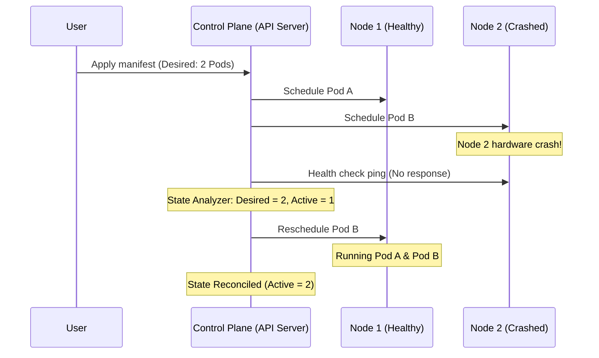

# 📊 Day 1: Infrastructure Architecture Diagrams

Below are the Mermaid diagrams illustrating the key architectural concepts of Day 1.

---

## 1. Bare Metal vs. VM vs. Container Architectures

### Bare Metal Architecture

```mermaid
graph TD
    subgraph Physical Server
        OS[Host Operating System]
        Lib[Shared Libs / Binaries]
        App1[Application A]
        App2[Application B]
        Hardware[Physical Hardware: CPU, RAM, NIC]
        
        Hardware --> OS
        OS --> Lib
        Lib --> App1
        Lib --> App2
    end
    
    style Hardware fill:#2a2b36,stroke:#3b82f6,stroke-width:2px;
    style OS fill:#1a1b26,stroke:#8b5cf6,stroke-width:2px;
    style App1 fill:#1f2937,stroke:#ef4444,stroke-width:1px;
    style App2 fill:#1f2937,stroke:#ef4444,stroke-width:1px;
```

### VM Architecture (Guest OS Tax)

```mermaid
graph TD
    subgraph Server Node
        Hardware[Physical Hardware]
        Hypervisor[Hypervisor: KVM, ESXi]
        
        subgraph VM 1
            OS1[Guest OS]
            Lib1[Shared Libs]
            App1[Application A]
        end
        
        subgraph VM 2
            OS2[Guest OS]
            Lib2[Shared Libs]
            App2[Application B]
        end
        
        Hardware --> Hypervisor
        Hypervisor --> OS1
        Hypervisor --> OS2
        OS1 --> Lib1 --> App1
        OS2 --> Lib2 --> App2
    end
    
    style Hardware fill:#2a2b36,stroke:#3b82f6,stroke-width:2px;
    style Hypervisor fill:#1a1b26,stroke:#f59e0b,stroke-width:2px;
    style OS1 fill:#111827,stroke:#ef4444,stroke-width:1px;
    style OS2 fill:#111827,stroke:#ef4444,stroke-width:1px;
```

### Container Architecture (Shared Kernel)

```mermaid
graph TD
    subgraph Server Node
        Hardware[Physical Hardware]
        OS[Host OS Kernel]
        Runtime[Container Runtime: containerd]
        
        subgraph Container 1
            Lib1[Libs]
            App1[App A]
        end
        
        subgraph Container 2
            Lib2[Libs]
            App2[App B]
        end
        
        Hardware --> OS --> Runtime
        Runtime --> Lib1 --> App1
        Runtime --> Lib2 --> App2
    end
    
    style Hardware fill:#2a2b36,stroke:#3b82f6,stroke-width:2px;
    style OS fill:#1a1b26,stroke:#8b5cf6,stroke-width:2px;
    style Runtime fill:#111827,stroke:#10b981,stroke-width:2px;
```

---

## 2. Kubernetes Orchestration Architecture

This diagram shows how K8s manages multiple nodes, mapping applications across hosts dynamically.

```mermaid
graph TD
    subgraph Control Plane
        API[kube-apiserver]
        ETCD[(etcd database)]
        SCHED[kube-scheduler]
        CM[kube-controller-manager]
        
        API <--> ETCD
        API <--> SCHED
        API <--> CM
    end

    subgraph Node 1
        K1[kubelet]
        KP1[kube-proxy]
        C1[Pod A]
        C2[Pod B]
        
        K1 --> C1
        K1 --> C2
    end

    subgraph Node 2
        K2[kubelet]
        KP2[kube-proxy]
        C3[Pod C]
        
        K2 --> C3
    end

    API <--> K1
    API <--> K2
    
    style Control Plane fill:#1e1b4b,stroke:#8b5cf6,stroke-width:2px;
    style Node 1 fill:#111827,stroke:#3b82f6,stroke-width:1px;
    style Node 2 fill:#111827,stroke:#3b82f6,stroke-width:1px;
    style ETCD fill:#312e81,stroke:#a855f7,stroke-width:1.5px;
```

---

## 3. Desired State Reconciliation Loop

The basic loop driving self-healing.

```mermaid
graph LR
    Observe[1. Observe current state] --> Analyze[2. Analyze diff against desired state]
    Analyze --> Act[3. Act to correct state]
    Act --> Observe
    
    style Observe fill:#1f2937,stroke:#3b82f6,stroke-width:2px;
    style Analyze fill:#1f2937,stroke:#f59e0b,stroke-width:2px;
    style Act fill:#1f2937,stroke:#10b981,stroke-width:2px;
```

---

## 4. Failure Recovery (Self-Healing) Timeline

What happens when a node fails:

