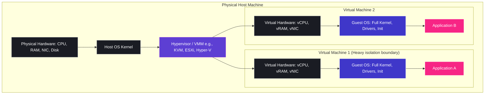
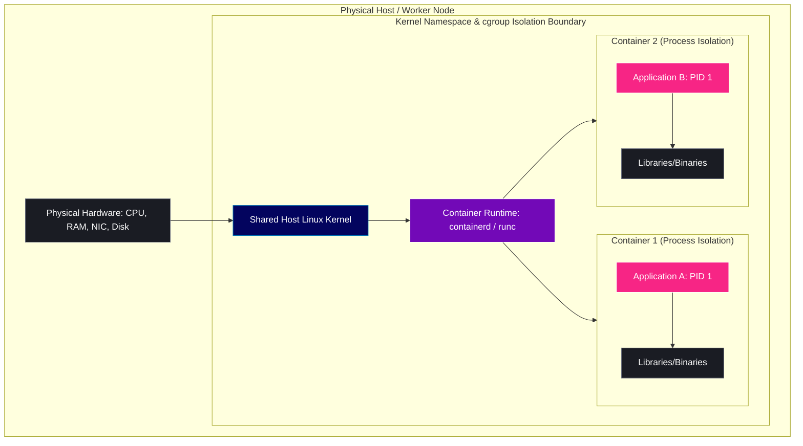
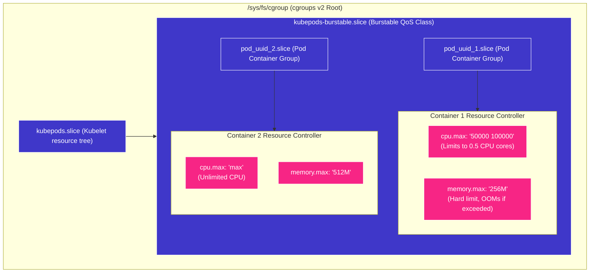
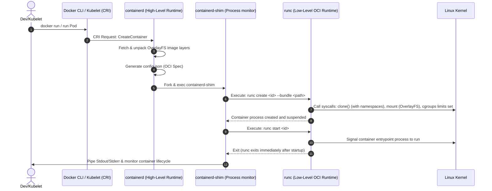
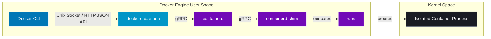
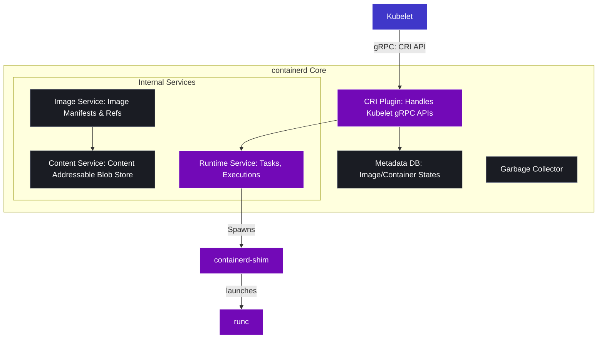
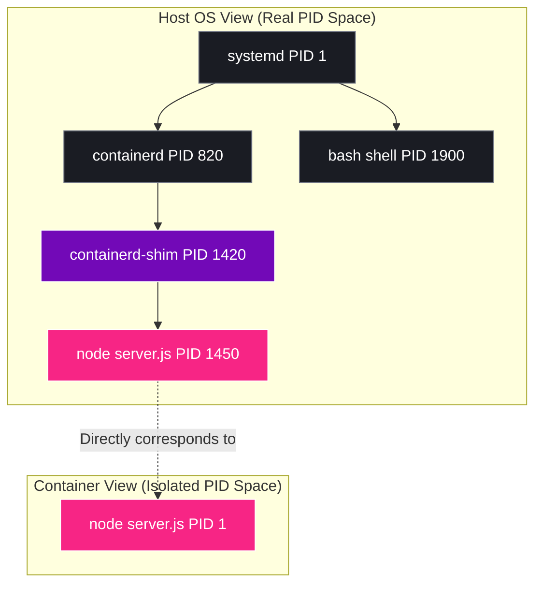
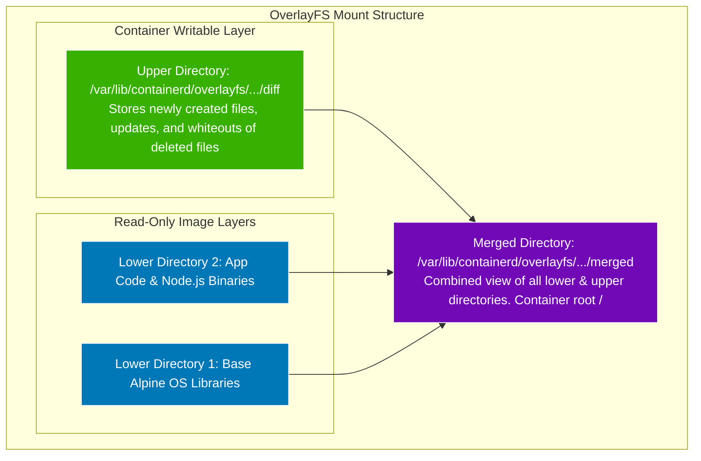
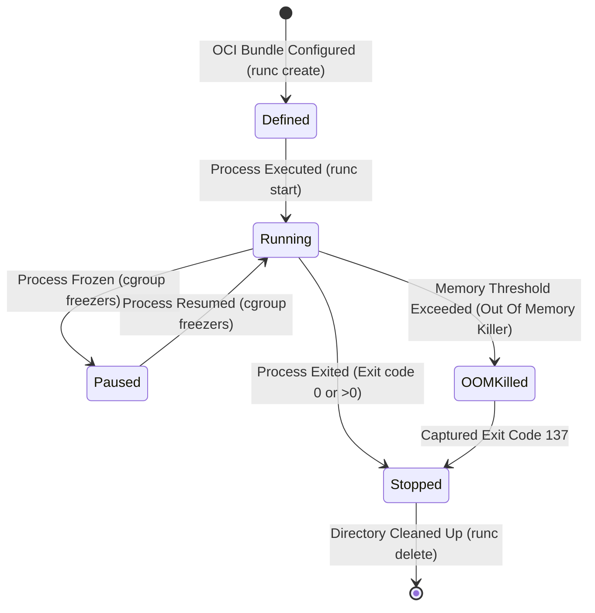

# 🎨 Day 02 Architecture Diagrams: Container Internals

This reference guide provides high-fidelity, production-grade Mermaid diagrams visualizing the architecture, lifecycle, and low-level Linux primitives that make up container technology.

---

## 1. Virtual Machine (VM) Architecture
Virtual Machines isolate applications by virtualizing physical hardware and running a complete, independent **Guest OS** on top of a hypervisor.



---

## 2. Container Architecture
Containers share the host kernel. There is **no guest operating system** or virtualized hardware. The container runtime configures native kernel-level isolation policies.



---

## 3. Linux Namespace Isolation
Namespaces wrap a global system resource in an abstraction that makes it appear to processes within the namespace that they have their own isolated instance of the resource.

```mermaid
graph TB
    subgraph HostOS ["Host Operating System (Global Namespace)"]
        HostProc[Host Process Space: PIDs 1 to 32876]
        HostNet[Host Network: eth0, lo, routing table, iptables]
        HostMount[Host Mounts: /, /usr, /var, /etc]
        HostUsers[Host Users: root UID 0, user1 UID 1000]

        subgraph ContainerNamespace ["Container Isolated Namespace Namespace (ns)"]
            PIDns["PID Namespace: Sees only PIDs 1, 2, 3"]
            NETns["Net Namespace: Sees only eth0 (veth pair), lo"]
            MNTns["Mount Namespace: Sees only pivot_root overlayfs /"]
            USERns["User Namespace: Maps Container UID 0 -> Host UID 10001"]
        end
        
        HostProc -.->|Isolates PIDs| PIDns
        HostNet -.->|Isolates NICs/Ports| NETns
        HostMount -.->|Isolates Directories| MNTns
        HostUsers -.->|Maps Privileges| USERns
    end

    classDef default fill:#1e1e2f,stroke:#3f37c9,color:#fff;
    classDef ns fill:#7209b7,stroke:#fff,color:#fff;
    class ContainerNamespace fill:#12121e,stroke:#f72585,stroke-dasharray: 5 5;
    class PIDns,NETns,MNTns,USERns ns;
```

---

## 4. cgroups Resource Control
Control Groups (cgroups) limit, audit, and throttle resource consumption (CPU, Memory, I/O, Network) of process groups.



---

## 5. OCI Runtime Lifecycle Flow
The Open Container Initiative (OCI) standardizes the runtime execution path.



---

## 6. Docker Internal Architecture
Docker acts as a complete developer experience suite wrapping around `containerd`.



---

## 7. containerd Internal Architecture
`containerd` is the industry-standard high-level container runtime utilized directly by Kubernetes through the Container Runtime Interface (CRI).



---

## 8. Process Isolation: Host vs. Container
The visual breakdown of how processes map between the host kernel view and the container view.



---

## 9. Filesystem Layering (OverlayFS)
OverlayFS stacks multiple directory trees to form a unified root file system inside the container.



---

## 10. Container Lifecycle States
The finite state machine governing container execution.


