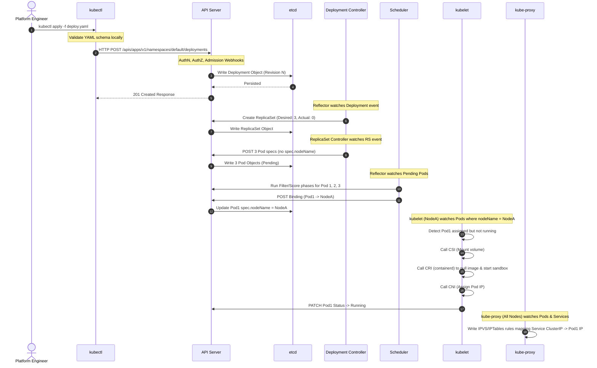

# 🛡️ Day 3: Kubernetes Architecture Internals
## 🏷️ Phase 1 — Foundations of Cloud-Native Systems

Welcome to Day 3 of the **30 Days of Production Kubernetes** course. Today, we strip away the abstraction layers and dive deep into the internals of the Kubernetes Control Plane and Worker Node components. 

Kubernetes is not just a container orchestrator—it is a **highly concurrent, asynchronous, event-driven, distributed operating system**. In this guide, we will analyze the precise mechanics of how Kubernetes manages state, reconciles failures, and processes requests.

---

## 🗺️ Complete Kubernetes Architecture

Below is the high-level, production-grade architecture of a Kubernetes cluster, showing the flow of control and data plane operations.

```mermaid
graph TB
    subgraph "Control Plane (Master Nodes)"
        direction TB
        apiserver["kube-apiserver<br/>(REST API, Auth, Validation, Admission)"]
        etcd["etcd Database<br/>(Distributed MVCC Key-Value Storage)"]
        scheduler["kube-scheduler<br/>(Filtering & Scoring Nodes)"]
        controllermanager["kube-controller-manager<br/>(Reconciliation Loops: ReplicaSet, Node, etc.)"]
        cloudmanager["cloud-controller-manager<br/>(Optional: Cloud Provider Integration)"]
        
        apiserver <--> etcd
        scheduler --> apiserver
        controllermanager --> apiserver
        cloudmanager --> apiserver
    end

    subgraph "Data Plane (Worker Nodes)"
        direction LR
        subgraph "Worker Node 1"
            kubelet1["kubelet<br/>(Node Agent, Pod Sync Loop)"]
            kubeproxy1["kube-proxy<br/>(Service Network Translation)"]
            cri1["Container Runtime<br/>(containerd/CRI-O)"]
            pod1["Pod A (App)"]
            pod2["Pod B (Sidecar)"]

            kubelet1 --> apiserver
            kubeproxy1 --> apiserver
            kubelet1 <--> cri1
            cri1 --> pod1
            cri1 --> pod2
        end

        subgraph "Worker Node 2"
            kubelet2["kubelet<br/>(Node Agent, Pod Sync Loop)"]
            kubeproxy2["kube-proxy<br/>(Service Network Translation)"]
            cri2["Container Runtime<br/>(containerd/CRI-O)"]
            pod3["Pod C (App)"]

            kubelet2 --> apiserver
            kubeproxy2 --> apiserver
            kubelet2 <--> cri2
            cri2 --> pod3
        end
    end

    client["kubectl / API Clients"] --> apiserver
    
    style apiserver fill:#8a2be2,stroke:#fff,stroke-width:2px,color:#fff
    style etcd fill:#4b0082,stroke:#fff,stroke-width:2px,color:#fff
    style scheduler fill:#483d8b,stroke:#fff,stroke-width:1px,color:#fff
    style controllermanager fill:#483d8b,stroke:#fff,stroke-width:1px,color:#fff
    style kubelet1 fill:#1e90ff,stroke:#fff,stroke-width:1px,color:#fff
    style kubelet2 fill:#1e90ff,stroke:#fff,stroke-width:1px,color:#fff
    style kubeproxy1 fill:#20b2aa,stroke:#fff,stroke-width:1px,color:#fff
    style kubeproxy2 fill:#20b2aa,stroke:#fff,stroke-width:1px,color:#fff
```



---

## 🧠 "What Actually Happens" Inside Kubernetes?

At its core, Kubernetes is a database engine (`etcd`) fronted by a stateless REST API gatekeeper (`kube-apiserver`). Every other component in the cluster—whether it is the scheduler, the controllers, or the kubelet running on a node—is simply an **asynchronous client** watching for changes in the database and executing logic to bring the cluster's physical state closer to the desired state stored in etcd.

Kubernetes operates on a **declarative model** powered by **Event-Driven Reconciliation Loops**:
1. You declare the **desired state** (e.g., "I want 3 replicas of my web app running").
2. The controllers observe the **actual state** (e.g., "Only 2 replicas are currently running").
3. The controllers act to resolve the delta (e.g., "Create a request to schedule 1 new pod").
4. This reconciliation loop (`Reconcile()`) runs continuously, reacting to events in real time.

---

## 🔍 Component-by-Component Deep Dive

### 1. The API Server (`kube-apiserver`)
The `kube-apiserver` is the scale-out, stateless gateway to the control plane. It is the **only** component that talks directly to etcd. 

```
[Request] ➡️ [Authentication] ➡️ [Authorization] ➡️ [Mutating Webhooks] ➡️ [Schema Validation] ➡️ [Validating Webhooks] ➡️ [Persist to etcd]
```

* **Authentication (AuthN):** Validates the client identity (Client Certificates, OpenID Connect JWT tokens, Webhook tokens, Service Account tokens).
* **Authorization (AuthZ):** Evaluates if the identity has permission (RBAC rules matching User/Group to Verbs on APIs).
* **Admission Controllers:** intercept requests post-AuthZ but prior to persistence.
  * *Mutating Webhooks:* Modify the incoming payload (e.g., injecting sidecar containers, adding node affinity rules).
  * *Schema Validation:* Ensures fields strictly match the OpenAPI specification.
  * *Validating Webhooks:* Enforce compliance rules (e.g., block images running as root, enforce resource limits).
* **Watch API:** The API server supports HTTP chunked transfer-encoding watches, allowing clients to stream updates about resource changes instead of polling.

### 2. The Distributed Consensus Database (`etcd`)
`etcd` is a strongly consistent, distributed key-value store using the **Raft Consensus Protocol**. It stores the entire cluster state.
* **MVCC (Multi-Version Concurrency Control):** etcd does not overwrite values. Every write updates a global 64-bit revision number, keeping historical versions of keys. This allows clients to request events "since revision X" (crucial for recovery and watch streams).
* **Leases:** Temporary bindings that automatically delete keys (like node heartbeats) if not renewed within a TTL.
* **Compaction & Defragmentation:** Historical versions accumulate. `kube-apiserver` triggers periodic compaction to discard old revisions, followed by defragmentation to reclaim disk space.

### 3. The Controller Manager (`kube-controller-manager`)
The Controller Manager is a daemon containing a bundle of separate, concurrent reconciliation loops:
* **Node Lifecycle Controller:** Monitors node heartbeats and evicts pods from unresponsive nodes.
* **ReplicaSet Controller:** Ensures the current replica count matches the spec by creating or deleting pods via the API.
* **Deployment Controller:** Manages rolling updates by creating new ReplicaSets and scaling down old ones.
* **State Management Mechanisms:**
  * **Informer:** Local cache of resource state in memory to prevent pounding the API server.
  * **Lister:** Queries the Informer's cache.
  * **Reflector:** Keeps the Informer updated by establishing a `Watch` stream against the API server.
  * **WorkQueue:** Holds dirty items that need reconciliation, handling retries with rate limiting.

### 4. The Scheduler (`kube-scheduler`)
The scheduler assigns unscheduled Pods (`spec.nodeName` is empty) to appropriate nodes. It executes a 2-stage cycle:
1. **Filtering (Predicates):** Evaluates node fitness.
   * Checks resource availability (CPU/Memory).
   * Checks port conflicts, taints, tolerations, node selectors, and affinities.
2. **Scoring (Priorities):** Ranks the surviving nodes on a 0-100 scale.
   * Prefers nodes with balanced resource usage (ResourceAllocation).
   * Evaluates image locality (pre-pulled images save start time).
   * Applies topology spread constraints.
3. **Binding:** Writes a `Binding` object back to the API Server, setting `spec.nodeName` of the Pod. This triggers the kubelet on that node to act.

### 5. The Node Agent (`kubelet`)
The `kubelet` is the primary agent running on each worker node, supervising pod lifecycles:
* **Sync Loop:** The central `syncLoop` listens for Pod updates targeted to its node name.
* **Plumbing Interfaces:**
  * **CRI (Container Runtime Interface):** Communicates via gRPC (e.g., to containerd) to pull images, create sandboxes, start containers, and clean up.
  * **CNI (Container Network Interface):** Calls CNI plugins (e.g., Calico, Cilium) to provision IP addresses and configure routing/veth interfaces for pods.
  * **CSI (Container Storage Interface):** Mounts persistent volumes to the host and attaches them to containers.
* **Static Pods:** Pods managed directly by the kubelet directory (usually `/etc/kubernetes/manifests`) bypassing the API Server. Used to bootstrap the control plane itself (apiserver, etcd, etc.).

### 6. The Network Translator (`kube-proxy`)
`kube-proxy` manages Service networking on every node:
* **IPTables Mode:** Default legacy mode. Translates Service IPs into Pod IPs by writing hundreds of sequential iptables DNAT rules. Bottleneck at scale because iptables lookup is $O(N)$ sequential evaluation.
* **IPVS Mode:** Uses IPVS (IP Virtual Server) inside the Linux kernel. It stores rules in hash tables, making IP lookups $O(1)$ constant time. Highly recommended for production clusters with >1000 Services.
* **eBPF (Cilium/Kube-Router):** Modern bypass bypassing iptables/IPVS altogether by attaching eBPF programs directly to network sockets for near-native wire routing speed.

---

## ⚡ The Request Lifecycle: `kubectl apply -f deployment.yaml`

What happens step-by-step when you deploy a 3-replica Nginx deployment?



---

## 📂 Day 3 Repository Directory Structure

Explore the dedicated directories for hands-on application and deep operational readiness:

* 📊 **[diagrams/](diagrams/)**: Contains 12 production-grade Mermaid architectural flowcharts mapping control plane, node runtime, scheduler scoring, and HA topologies.
* 📝 **[notes/](notes/)**: Comprehensive theoretical deep dives into MVCC, Raft, scheduler priority functions, CNI workflows, and Informer mechanics.
* 🛠️ **[labs/](labs/)**: 8 step-by-step production-grade labs to inspect etcd keys, sniff API requests, bypass the scheduler, debug iptables rules, and test pod evictions.
* 📄 **[manifests/](manifests/)**: YAML configurations for static pods, manual scheduling, custom resource limits, and service testing.
* ⚡ **[production-notes/](production-notes/)**: Hard-learned cluster scale realities: etcd database sizing, API backpressure, watch API scalability, split-brain states, and large-cluster performance tuning.
* 🚨 **[troubleshooting/](troubleshooting/)**: Runbooks for recovery from etcd corruption, API Server out-of-memory errors, kubelet disconnection, and service routing drops.
* 🏆 **[exercises/](exercises/)**: The daily challenge assignment—resolve scheduling conflicts and reconstruct a simulated broken deployment.
* 🧬 **[simulations/](simulations/)**: Interactive, single-page "Kubernetes Control Plane Simulator" dashboard to visualize scheduling, reconciliation, and component failure states directly in your browser.

---

## 🎓 Next Steps
Begin with the theoretical background in **[notes/](notes/)**, review the diagrams in **[diagrams/](diagrams/)**, and proceed to execute **[labs/](labs/)** in your local Kind or Minikube cluster!
