# 📊 Day 3 Architecture Diagrams — Kubernetes Internals

This document compiles the 12 primary architectural diagrams and flowcharts that demystify the internal workings of a production-grade Kubernetes cluster.

---

## 1. Complete Kubernetes Architecture
This diagram outlines the segregation between the Control Plane (managing state, scheduling, and orchestrating) and the Data Plane (executing container workloads).

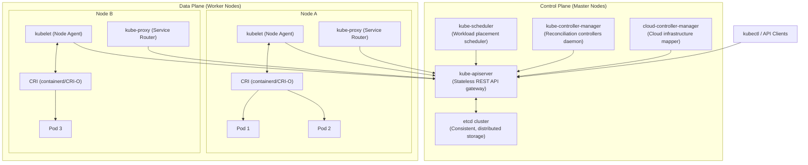

---

## 2. Control Plane Components Internal Communication
In Kubernetes, **no component talks to etcd directly except the API Server**, and components **never** communicate directly with one another. All communication happens asynchronously via the API Server.

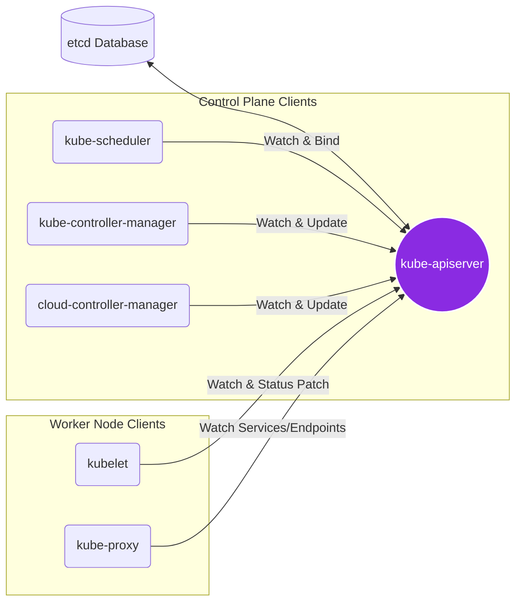

---

## 3. Worker Node Internals & Runtime Interface Layers
The Kubelet orchestrates runtime, storage, and networking layers through standardised gRPC sockets (CRI, CNI, CSI).

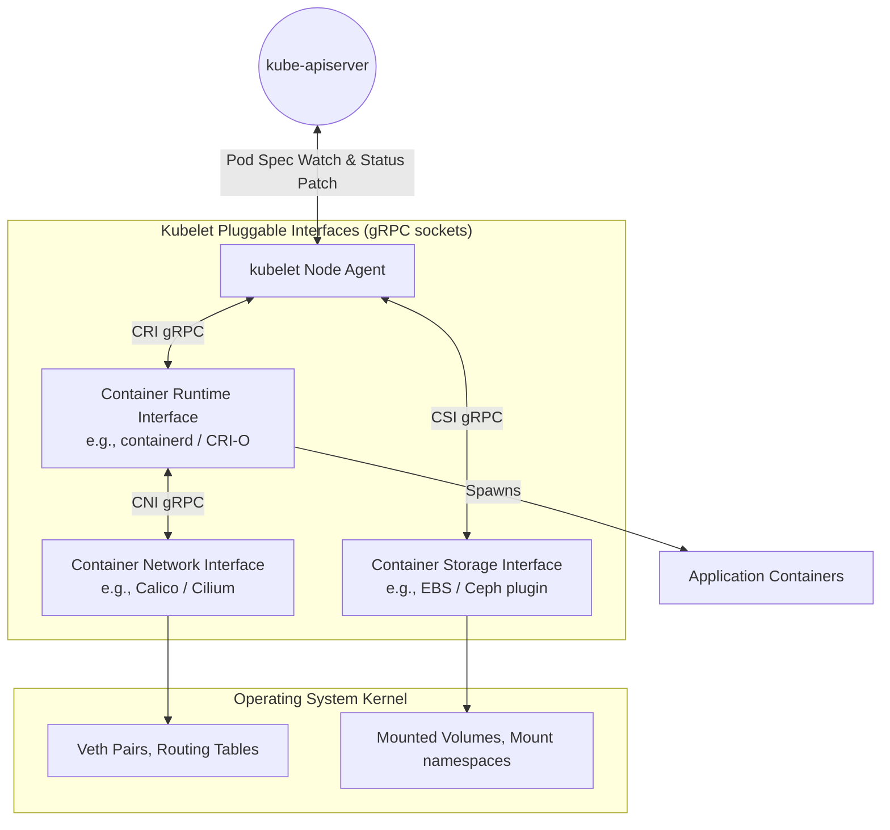

---

## 4. API Request Lifecycle
Every request arriving at the API Server must pass through three distinct phases: **Authentication**, **Authorization**, and **Admission Control** before it can be committed to etcd.

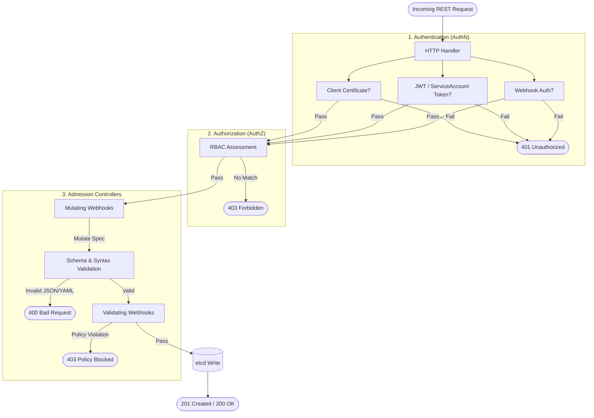

---

## 5. Scheduler Filtering & Scoring Workflow
The scheduling cycle resolves which physical node is the optimal host for a Pod. It evaluates nodes using predicates (filtering) and priorities (scoring).

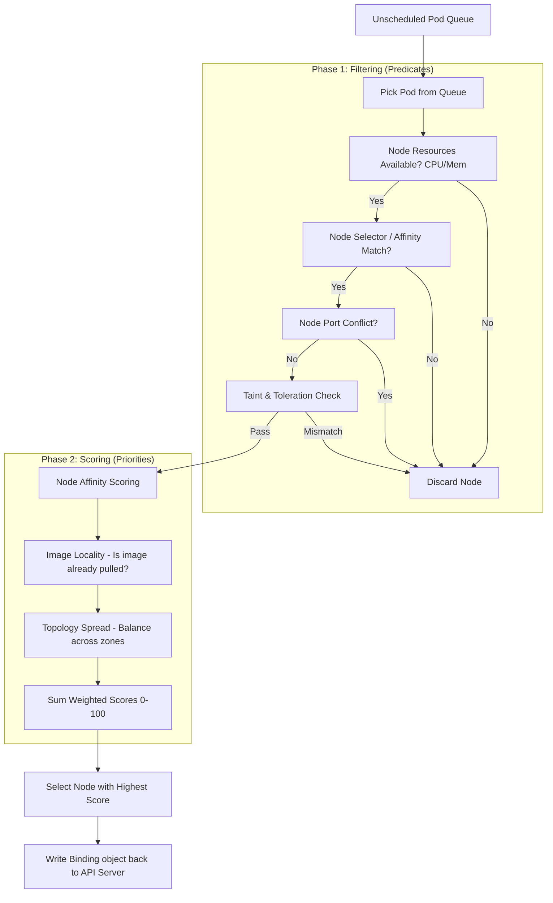

---

## 6. Controller Manager Reconciliation Loop
Controllers run a continuous control loop (the reconciliation loop) to drive the actual state of the cluster toward the desired state.

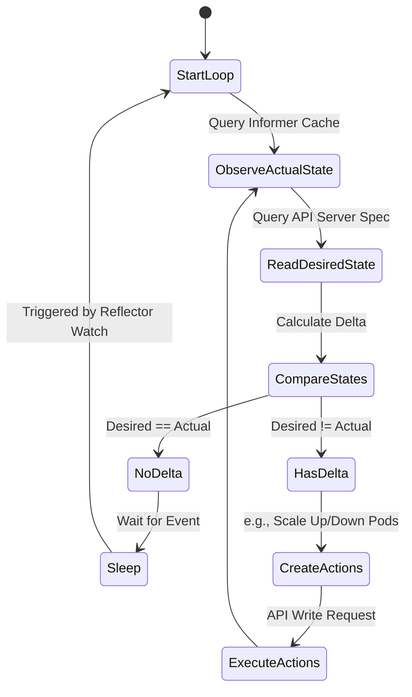

---

## 7. etcd Storage, Consensus & Write Flow
Because etcd is a distributed consensus database, writes must be replicated and committed across a quorum of nodes via Raft before returning success.

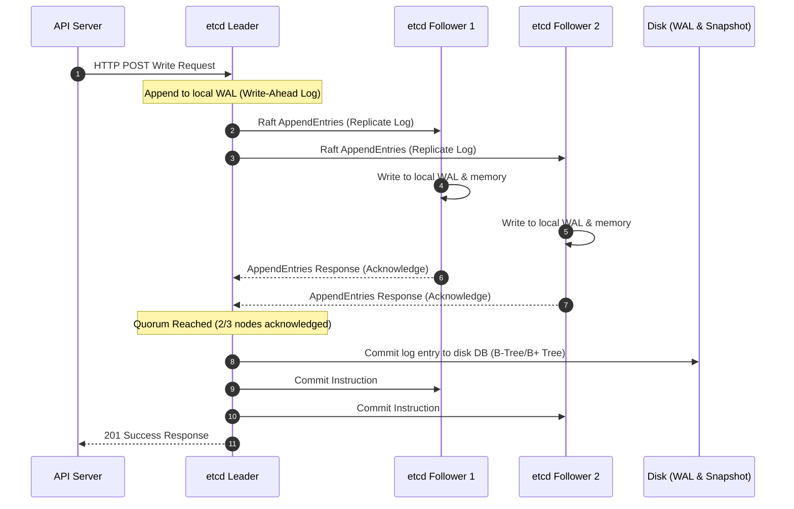

---

## 8. kubelet Pod Sync Loop
The kubelet runs a sync loop (`syncLoop`) that consumes configurations from three sources: the API Server, local files, and an HTTP endpoint. It acts as the local node supervisor.

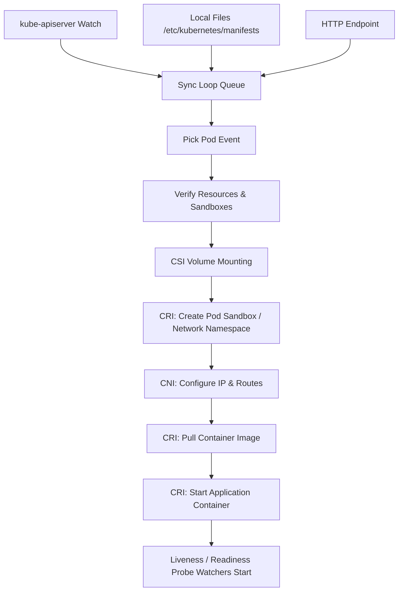

---

## 9. Service Networking Flow (kube-proxy)
kube-proxy implements virtual IP addresses for Services via user-space routing or Linux kernel capabilities (iptables/IPVS).

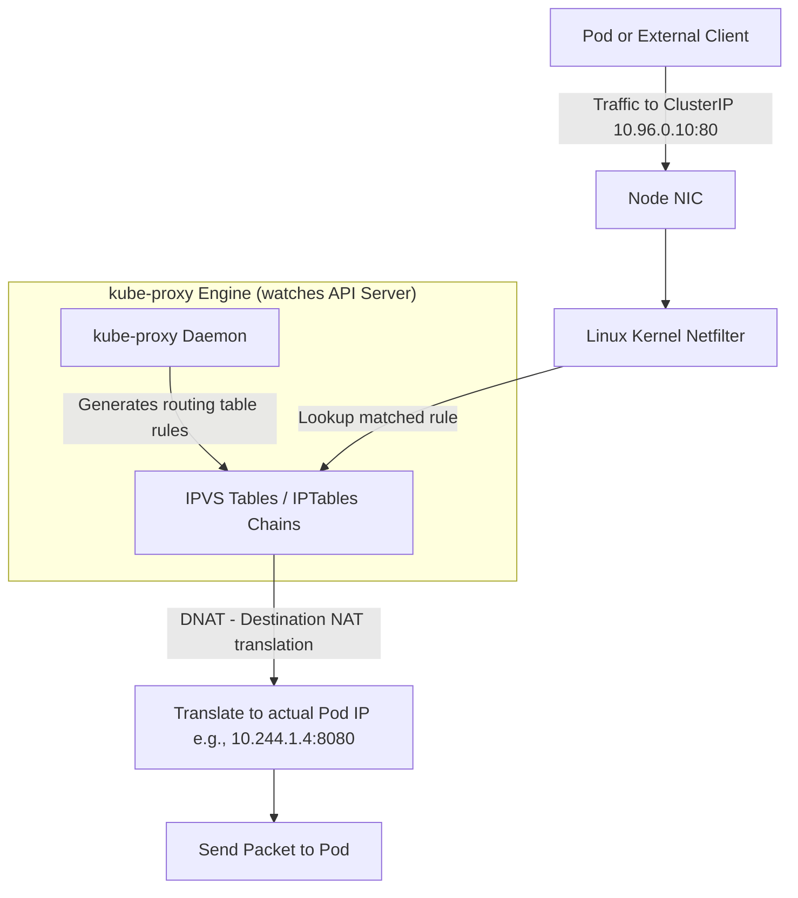

---

## 10. Pod Deployment Lifecycle (End-to-End)
An end-to-end look at the stages of a workload deployment, showing how the control plane and worker node work in tandem.

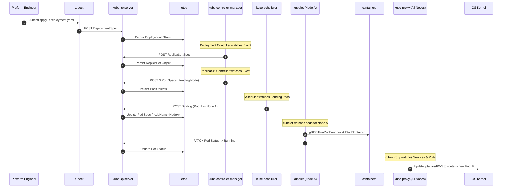

---

## 11. Cluster State Reconciliation
A simplified diagram explaining the core architectural concept of Desired State vs. Actual State reconciliation loop.

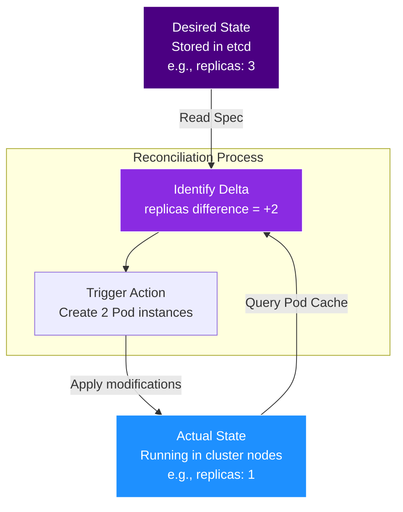

---

## 12. High Availability (HA) Control Plane Topology
A production-grade, highly available multi-master topology configuration.

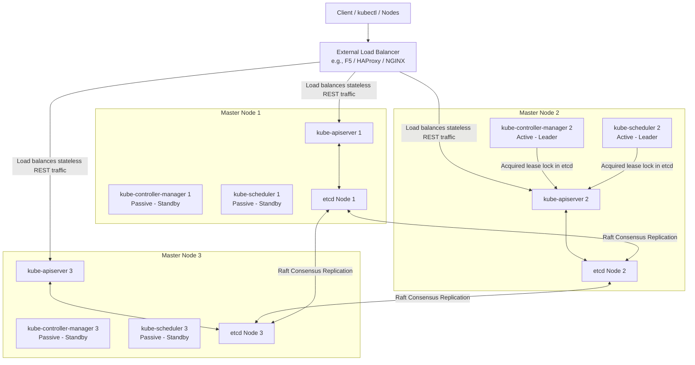
