# 📊 Pod Architecture & Lifecycle Diagrams
## 30 Days of Production Kubernetes — Day 4

This document contains 12 high-resolution, production-grade Mermaid diagrams that map the internal architecture, network namespaces, lifecycle, and communication patterns of Kubernetes Pods.

---

### 1. Pod Internals & Namespace Architecture
This diagram illustrates the underlying structure of a Pod on a node. The **Pause Container** is created first, holding open the shared namespaces (Network, IPC, UTS), which the actual application containers then join.

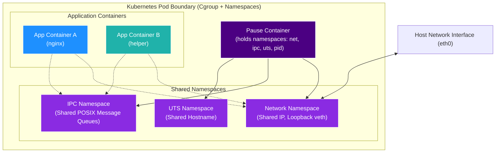

---

### 2. Multi-Container Pod Architecture
Shows the boundary of a multi-container Pod, highlighting how containers run in isolated cgroups but share namespaces and volumes.

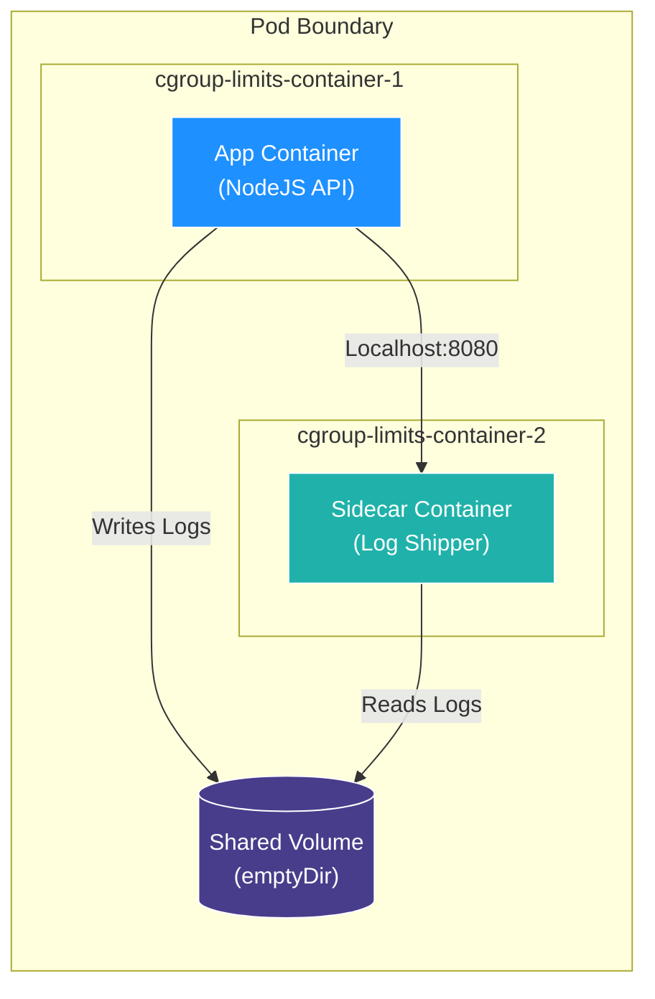

---

### 3. Init Container Execution Flow
Init containers execute sequentially. If any init container fails, the Pod is restarted (depending on the `restartPolicy`) and subsequent containers do not start.

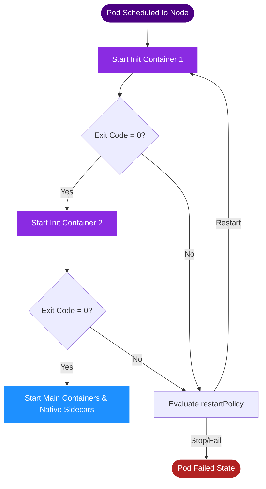

---

### 4. Sidecar Communication (Localhost Loopback)
Demonstrates how sidecars and main containers communicate inside the shared network namespace over localhost, avoiding external network hops.

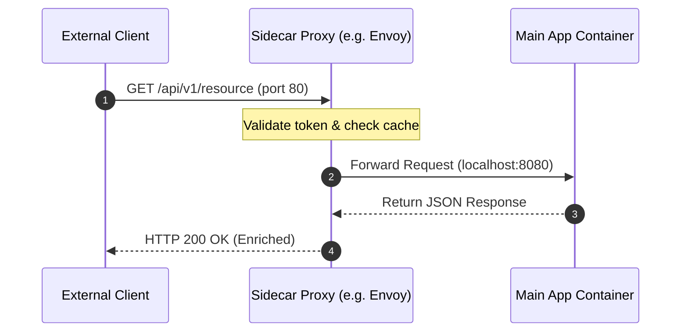

---

### 5. Pod Lifecycle States
Shows the complete phase diagram of a Pod from deployment submission to terminal state.

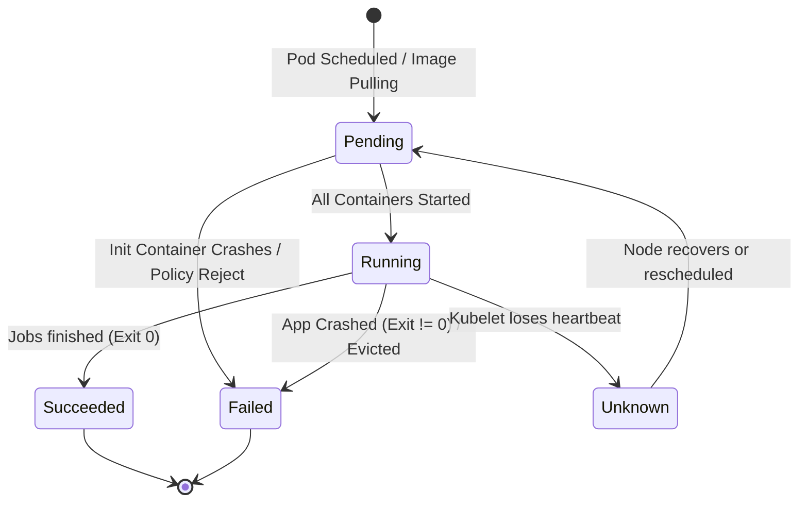

---

### 6. Shared Network Namespace Internals
Visualizes how the CNI plugin creates a virtual ethernet pair (`veth`), attaching one end to the host bridge and the other to the Pod namespace, which is then shared among all containers.

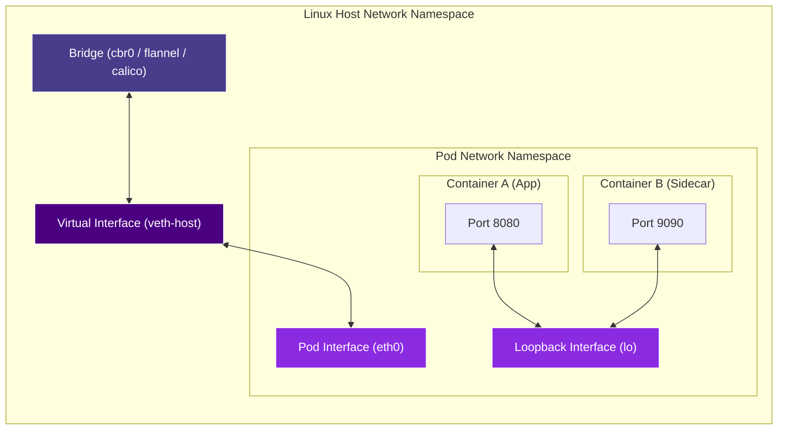

---

### 7. Shared Storage Volumes Mechanics
Details how the kubelet mounts host paths or remote PVs onto the host filesystem under `/var/lib/kubelet/pods/<pod-uid>/volumes/` and binds them into the individual container container-mount-namespaces.

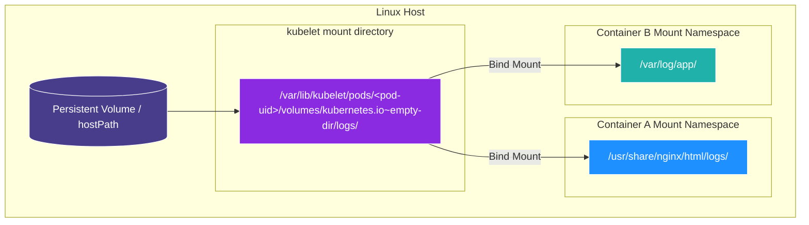

---

### 8. Pod Startup Sequence
The chronological bootstrap timeline of a Pod on a worker node.

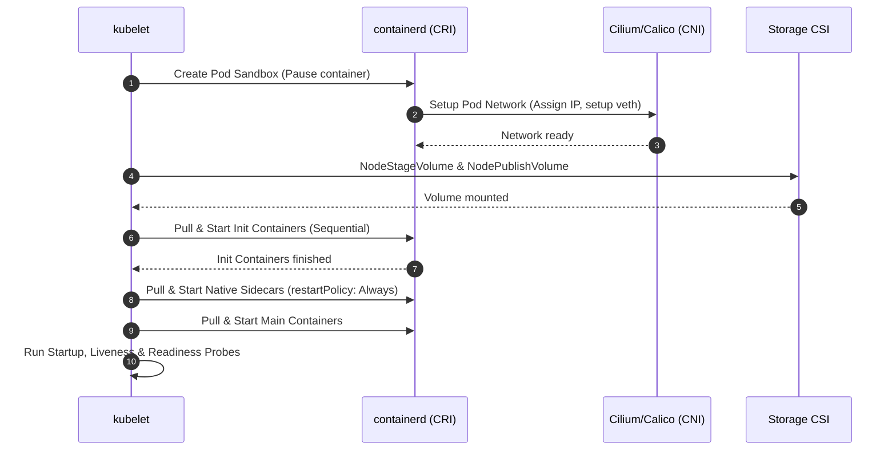

---

### 9. Probe Lifecycle Execution
Visualizes how the kubelet periodically probes the container, transitioning from startup to steady-state checks.

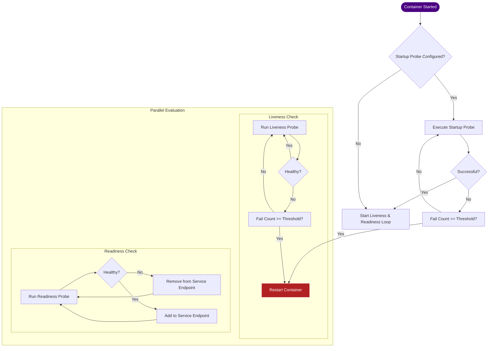

---

### 10. Container Restart Policy Flow
Kubelet evaluates the exit code of containers and decides whether to restart them, applying exponential backoff delay scaling.

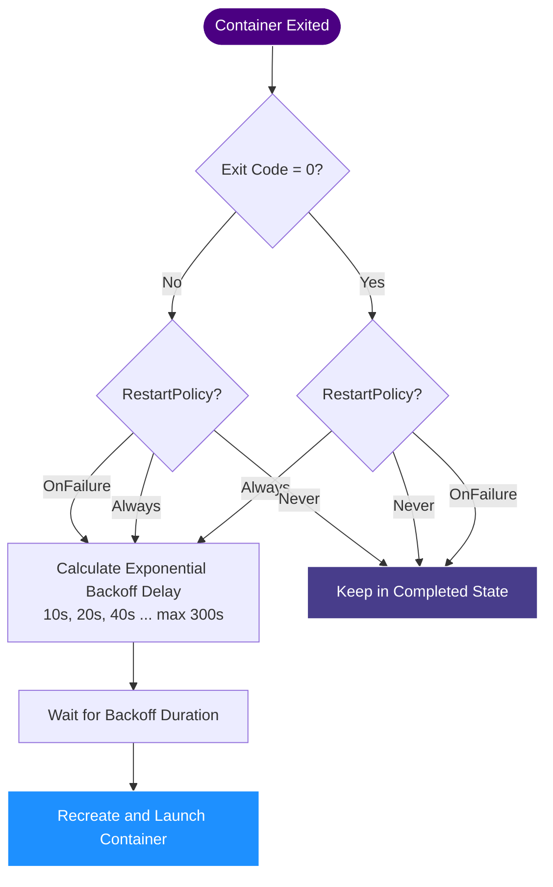

---

### 11. Service Mesh Sidecar Interception
How iptables rules inside the Pod Network Namespace redirect incoming and outgoing traffic into the sidecar proxy (e.g. Envoy).

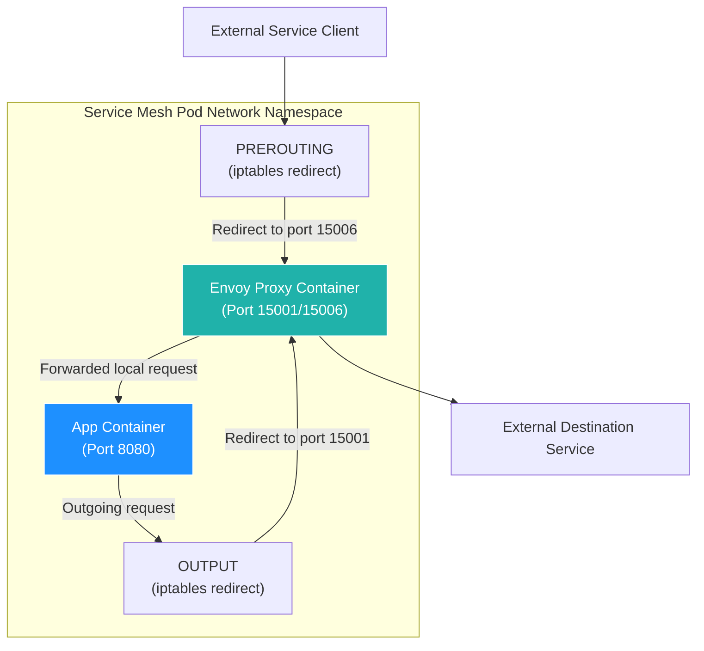

---

### 12. Real Production Multi-Container Pod Example
A production deployment with an init container, a main web server, a native vault-agent sidecar, and a legacy logging daemon.

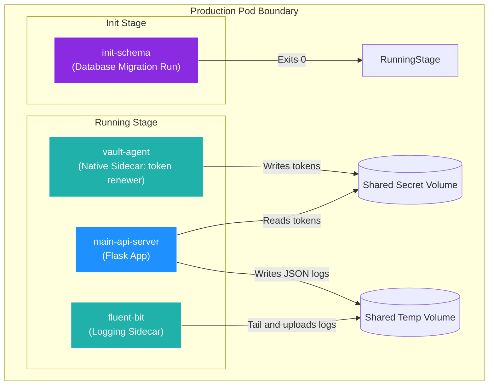
