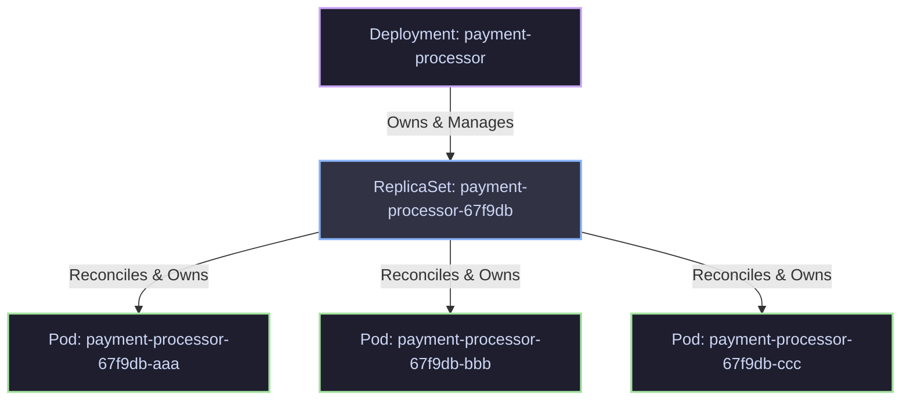

# 📖 Day 5: Deployments, ReplicaSets & Rollouts
### 🏷️ PHASE 1 - FOUNDATIONS OF CLOUD-NATIVE SYSTEMS

Welcome to Day 5 of the **30 Days of Production Kubernetes** course. Today, we are shifting from raw Pod lifecycle management to the core mechanism that enables Kubernetes to run large-scale applications with zero-downtime: **Deployments, ReplicaSets, and the Reconciliation Loop**.

In production, you almost never manage Pods directly. Instead, you define your desired state, and let the Kubernetes control plane enforce, scale, heal, and upgrade your workloads.

---

## 🧭 Navigating Day 5 Resources

Before we begin the deep-dive, here is where all related materials are located:

* 📝 **Core Theory & Under the Hood:** [Reconciliation & State Machine Deep Dive](file:///d:/30_Days_of_Production_Kubernetes/Day-05/notes/reconciliation-and-state-machine.md)
* 📊 **Architecture Diagrams:** [Day 5 Visual Diagrams Index](file:///d:/30_Days_of_Production_Kubernetes/Day-05/diagrams/README.md)
* 🛠️ **Hands-on Labs:** [Lab Guides & Step-by-Step Walkthroughs](file:///d:/30_Days_of_Production_Kubernetes/Day-05/labs/README.md)
* 📋 **Kubernetes manifests:** [Day 5 Manifest Templates](file:///d:/30_Days_of_Production_Kubernetes/Day-05/manifests/)
* ⚡ **Production Hardening Guidelines:** [Production Notes & Safety Patterns](file:///d:/30_Days_of_Production_Kubernetes/Day-05/production-notes/README.md)
* 🚨 **Troubleshooting Runbooks:** [Rollout & Pod Failure Playbook](file:///d:/30_Days_of_Production_Kubernetes/Day-05/troubleshooting/troubleshooting-playbook.md)
* 🏆 **Daily Challenge:** [Deployment & Rollback Exercise](file:///d:/30_Days_of_Production_Kubernetes/Day-05/exercises/assignment.md)
* 🎮 **Interactive Simulation:** [Kubernetes Rollout & Self-Healing HTML Simulator](file:///d:/30_Days_of_Production_Kubernetes/Day-05/simulations/deployment-rollout-simulator.html)

---

## 🎯 Day 5 Core Learning Goals

By the end of this day, you will deeply understand:
1. **Desired State Control Theory:** How Kubernetes acts as an active reconciliation engine.
2. **Resource Ownership Hierarchy:** The relation between `Deployments`, `ReplicaSets`, and `Pods` governed by `OwnerReferences`.
3. **Rollout Budgets:** How to tune `maxSurge` and `maxUnavailable` for safe deployment updates.
4. **Deploy Strategies:** Implementing L4 Canary deployments and Blue/Green switches using label selectors.
5. **Self-Healing Mechanics:** How replica drift is detected and healed.
6. **Graceful Terminations:** The sequence from `SIGTERM` and `preStop` to `SIGKILL`.
7. **Rollback Mechanics:** Reverting broken states using revision histories.

---

## 🧠 1. The Desired State Model & Declarative Infrastructure

Kubernetes operates on a simple but powerful premise: **Control Theory**. Rather than executing a series of script steps to build a server, you define what the final state should look like in a manifest (`spec`), and Kubernetes continuously aligns the actual state (`status`) with this goal.

### Imperative vs. Declarative Infrastructure

| Dimension | Imperative Infrastructure (e.g., Scripts, CLI commands) | Declarative Infrastructure (e.g., Kubernetes YAML, Terraform) |
|---|---|---|
| **What it describes** | The **process** to reach a state ("Run instance, install package, start service"). | The **target state** itself ("Ensure 3 instances are running nginx:1.25"). |
| **Idempotency** | Difficult. Running a script twice might result in errors or duplicate resources. | Built-in. The system evaluates current vs target and only performs required delta actions. |
| **Drift Management** | Requires manual or cron-based audit scripts to detect configuration drift. | Automated. The reconciliation engine runs constantly (every few milliseconds) to undo drift. |
| **Failure Recovery** | If a step fails mid-execution, the system is left in a half-configured, broken state. | Resilient. If a resource fails, the control loop keeps retrying or rolls back to the desired configuration. |

---

## 🏗️ 2. Deployment Architecture & ReplicaSet Internals

A Kubernetes `Deployment` is a high-level API object that manages a set of duplicate Pods using a low-level object called a `ReplicaSet`. 



### The Hierarchical Chain
1. **Deployment**: Manages rollout strategies, history limits, templates, and revision tracking. It controls ReplicaSets.
2. **ReplicaSet**: Guarantees that a specified number of Pod replicas are running at any given time. It matches Pods based on label selectors.
3. **Pod**: The actual running container groups.

### ReplicaSet Selector Matching & OwnerReferences
ReplicaSets identify which Pods they manage through the `spec.selector` block. 
> [!CAUTION]
> If you create a Pod manually that matches the labels of a ReplicaSet's selector, the ReplicaSet controller will assume ownership of that Pod! If it already has its desired replica count, it will immediately delete your newly created Pod to maintain the desired count.

To prevent ownership conflicts, Kubernetes uses **OwnerReferences** in the metadata of child resources. A Pod created by a ReplicaSet contains a metadata field pointing back to its parent UID:
```yaml
metadata:
  ownerReferences:
  - apiVersion: apps/v1
    blockOwnerDeletion: true
    controller: true
    kind: ReplicaSet
    name: payment-processor-67f9db
    uid: a4d5678b-efab-41c1-923f-4e56789abcd
```
This metadata ensures that when a parent resource is deleted, the garbage collector knows which child Pods to cascade-delete.

---

## 🔄 3. The Controller Reconciliation Loop

The core engine of Kubernetes is the **Reconciliation Loop**. Each controller (Deployment, ReplicaSet, Node, etc.) executes a continuous control loop that follows three steps:

$$\text{Observe} \longrightarrow \text{Analyze} \longrightarrow \text{Act}$$

```
   ┌──────────────────────────────────────────────────────────┐
   │                                                          │
   ▼                                                          │
┌───────────────────────┐   ┌───────────────────────────┐     │
│  OBSERVE STATE        │──>│  ANALYZE DRIFT            │     │
│  - Query local cache  │   │  - Compare Desired Spec   │     │
│  - Read actual Pods   │   │    against Actual Status  │     │
└───────────────────────┘   └───────────────────────────┘     │
                                  │                           │
                                  ▼                           │
                            ┌───────────────────────────┐     │
                            │  DECIDE ACTION            │     │
                            │  - Scale up/down?         │     │
                            │  - Create new ReplicaSet? │     │
                            └───────────────────────────┘     │
                                  │                           │
                                  ▼                           │
                            ┌───────────────────────────┐     │
                            │  ACT                      │     │
                            │  - Make API calls to      │─────┘
                            │    reconcile actual state │
                            └───────────────────────────┘
```

1. **Observe**: Queries the API server (via local caches called Informers) to inspect the actual state of the resources (e.g., "I see 2 running Pods").
2. **Analyze**: Compares the actual state with the desired state specified in etcd (e.g., "Desired: 3 replicas. Delta: -1").
3. **Act**: Issues commands to the API server to close the gap (e.g., "Call API to create 1 Pod").

For a detailed code-level lookup of informers, workqueues, and caching mechanisms, refer to [reconciliation-and-state-machine.md](file:///d:/30_Days_of_Production_Kubernetes/Day-05/notes/reconciliation-and-state-machine.md).

---

## ⚡ 4. Self-Healing in Action

What happens if a Pod crashes, is manually killed, or the node hosting it goes dark?
1. The **ReplicaSet Controller** gets an event indicating a Pod is gone.
2. The control loop executes: Desired = 3, Actual = 2.
3. The controller issues a `Create Pod` request.
4. The scheduler picks a healthy node, and the Kubelet downloads the image and runs the container.

This self-healing is **declarative**. The system does not care *why* the Pod died; it only cares that the actual replica count does not match the desired replica count.

---

## 🚀 5. Rolling Update Mechanics

A rolling update allows you to upgrade application versions with zero-downtime by slowly replacing old Pod instances with new ones.

### The Rolling Update Budget: Surge and Unavailable
When configuring `spec.strategy.type: RollingUpdate`, you must define the rollout budget using two key variables under `spec.strategy.rollingUpdate`:

* **`maxSurge`**: The maximum number of Pods that can be created **above** the desired replica count during the update. Can be an absolute number (e.g., `1`) or a percentage (e.g., `25%`).
* **`maxUnavailable`**: The maximum number of Pods that can be **unavailable** during the update, relative to the desired replica count. Can be an absolute number or a percentage.

#### Mathematical Guardrails
Consider a Deployment with `replicas: 4`, `maxSurge: 1`, and `maxUnavailable: 0`:
* **Minimum Available Pods**: $\text{Replicas} - \text{maxUnavailable} = 4 - 0 = 4$ pods must remain running and ready at all times.
* **Maximum Concurrent Pods**: $\text{Replicas} + \text{maxSurge} = 4 + 1 = 5$ pods maximum can exist at any stage of the rollout.

This means Kubernetes must first spin up a new Pod ($4+1=5$) and wait for it to be fully ready before it is allowed to terminate any of the old Pods. This protects service capacity at the expense of temporary resource usage on the nodes.

> [!TIP]
> For resource-constrained clusters where you cannot afford surge overhead, use `maxSurge: 0` and `maxUnavailable: 1`. This terminates an old pod *before* creating a new one. Note that your application will run at $75\%$ capacity during the rollout.

---

## 🏥 6. Health Checks & Zero-Downtime Deployment Principles

A rolling update is only "zero-downtime" if Kubernetes knows **when** a pod is actually ready to receive traffic. If probes are missing, Kubernetes will terminate old pods as soon as the new containers start, even if the application inside the new containers is still booting.

### Three Crucial Probes
1. **Startup Probe**: Determines if the application has started. All other probes are disabled until the startup probe succeeds. Prevents slow-starting applications from getting killed mid-boot.
2. **Readiness Probe**: Determines if the container is ready to accept HTTP traffic. If this fails, the Pod's IP is removed from the Service Endpoints, so client requests are not routed to it.
3. **Liveness Probe**: Determines if the container needs to be restarted. If this fails, the Kubelet kills the container and triggers a restart.

### Rollout Control Parameters
* **`minReadySeconds`**: The number of seconds a newly created Pod must run without crashing or failing probes before it is considered "Ready" and the rolling update is allowed to proceed to the next Pod. This acts as a bake period.
* **`progressDeadlineSeconds`**: The amount of time the Deployment controller waits for a rollout to make progress (i.e., new pods scaling up, old pods scaling down) before marking the deployment status as Failed (`ProgressDeadlineExceeded`). It defaults to `600` seconds.

---

## 🗺️ 7. Advanced Deployment Strategies

While `RollingUpdate` is the default, production environments often require more control over blast radius via progressive delivery.

### Canary Deployments (Label-Based)
A Canary rollout routes a small fraction (e.g., 10%) of production traffic to the new version to monitor metrics before upgrading the entire fleet.
In native Kubernetes, this is achieved by creating two separate Deployments:
* **Deployment A (Stable)**: Runs `version: v1` with 3 replicas.
* **Deployment B (Canary)**: Runs `version: v2` with 1 replica.
* **Service**: Selects the shared label `app: payment-processor` (which is present on both Deployments' Pods).

Since the service balances traffic round-robin across all matching pods, the Canary pods naturally receive $\frac{1}{3+1} = 25\%$ of the traffic.

```
Incoming Request
       │
       ▼
┌──────────────┐
│   Service    │  (Selects app: payment-processor-canary)
└──────────────┘
   │        │
   │ (75%)  │ (25%)
   ▼        ▼
┌────┐    ┌────┐
│ v1 │    │ v2 │  (Canary)
└────┘    └────┘
```

### Blue/Green Deployments
Blue/Green deployments run two complete, identical environments, but only one (e.g., Blue) is active at any time.
* **Blue Deployment**: 3 replicas, labeled `color: blue`. Active.
* **Green Deployment**: 3 replicas, labeled `color: green`. Standby/Preview.
* **Service**: Selects `app: payment-processor, color: blue`.

Once the Green version is deployed and smoke-tested, you patch the Service selector to point to `color: green`. The traffic cuts over near-instantaneously.

```
                  ┌──────────────┐
                  │ Client Load  │
                  └──────────────┘
                         │
                         ▼
                  ┌──────────────┐
                  │   Service    │
                  └──────────────┘
                         │
            ┌────────────┴────────────┐
            │ (Before Cutover)        │ (After Cutover)
            ▼                         ▼
   ┌─────────────────┐       ┌─────────────────┐
   │ Blue Deployment │       │ Green Deployment│
   │  (color: blue)  │       │ (color: green)  │
   └─────────────────┘       └─────────────────┘
```

---

## ⏪ 8. Rollback Internals

If an update is broken (e.g., it crashes or times out), you need to revert immediately. Kubernetes stores history in ReplicaSets to enable fast rollbacks.

### Revision History Limit
The Deployment maintains historical ReplicaSets up to `spec.revisionHistoryLimit` (defaults to 10).
When you change the Deployment's template:
1. A new ReplicaSet is created.
2. The older ReplicaSet is kept in etcd but scaled down to 0 replicas.
3. The revision number is incremented.

### Triggering a Rollback
Executing `kubectl rollout undo deployment/payment-processor` triggers the Deployment controller to:
1. Look up the desired historical ReplicaSet template.
2. Swap the roles: set the old ReplicaSet's desired replicas back to target, and scale the current active ReplicaSet down to 0.
3. Because the ReplicaSet already exists in etcd, the rollback occurs instantly without needing to rebuild templates.

---

## 🚫 9. Production Deployment Anti-Patterns

Avoid these common mistakes in large-scale production environments:

* **Using the `latest` tag**: Declaring `image: my-app:latest` bypasses deployment rollouts. If you apply the same manifest, the spec template hasn't changed, so the Deployment controller will NOT trigger a rollout, even if the image content in the registry has updated. Always use explicit version tags or git commit SHAs.
* **Missing Readiness Probes**: Without readiness probes, Kubernetes considers a container "ready" as soon as the process starts. In a rolling update, this will tear down all old pods while the new ones are still warming up, causing severe outages.
* **Mismatching Selectors**: Attempting to change `spec.selector` on an existing deployment is a forbidden API action. If you try to force it, it can orphan older ReplicaSets or cause validation failures.
* **Tight Rollout Budgets with Starved Resources**: Setting `maxUnavailable: 0` alongside high CPU/Memory requests on a cluster without free capacity will cause the rolling update to freeze. The new pod cannot find a node with enough resource capacity, and since `maxUnavailable` is 0, the controller cannot terminate an old pod to free up space.

---

## 🏁 Summary of Next Steps

To consolidate what you've learned today:
1. **Explore the Visuals**: Review the detailed diagrams in the [diagrams/](file:///d:/30_Days_of_Production_Kubernetes/Day-05/diagrams/README.md) folder.
2. **Execute the Labs**: Spin up your local cluster and run through the hands-on scenarios in the [labs/README.md](file:///d:/30_Days_of_Production_Kubernetes/Day-05/labs/README.md) walkthrough.
3. **Practice Debugging**: Walk through the troubleshooting runbooks in [troubleshooting/troubleshooting-playbook.md](file:///d:/30_Days_of_Production_Kubernetes/Day-05/troubleshooting/troubleshooting-playbook.md).
4. **Take the Challenge**: Complete today's assignment in [exercises/assignment.md](file:///d:/30_Days_of_Production_Kubernetes/Day-05/exercises/assignment.md).
5. **Run the Simulator**: Open the futuristic [rollout simulator](file:///d:/30_Days_of_Production_Kubernetes/Day-05/simulations/deployment-rollout-simulator.html) in your browser to inspect reconciliation loops, pods crashing, and traffic shifting in real-time!
