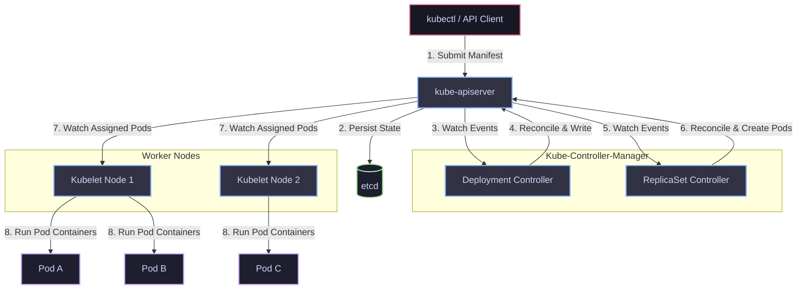

# 01 - Deployment Architecture

This diagram visualizes the structural flow of a Kubernetes Deployment, highlighting the declarative lifecycle loop from the client configuration down to container runtime execution.

