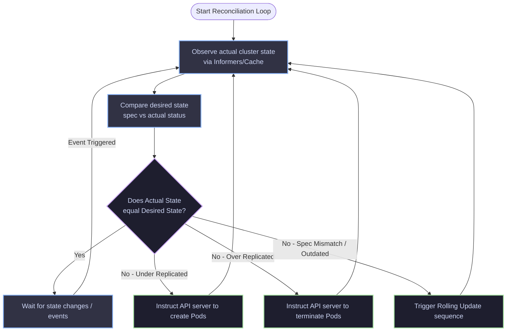

# 03 - Controller Reconciliation Loop

This diagram models the execution cycle of a Kubernetes Controller (such as the Deployment or ReplicaSet controller). It continuously runs a control loop to align the actual state of the cluster with the desired state specified in the etcd database.

