# 04 - Rolling Update Workflow

This diagram maps the lifecycle progression of a Rolling Update rollout with `maxSurge: 1` and `maxUnavailable: 0` for a Deployment with a target of 3 replicas. This configuration ensures that service capacity never drops below 100% (3 replicas) during the upgrade.

```mermaid
sequenceDiagram
    autonumber
    participant D as Deployment Controller
    participant RS_Old as Old ReplicaSet (v1.0.0)
    participant RS_New as New ReplicaSet (v1.1.0)
    participant P_New as New Pod (v1.1.0)
    participant P_Old as Old Pod (v1.0.0)

    Note over D, P_Old: Initial State: 3 Old Pods running. MaxSurge=1, MaxUnavailable=0.
    
    rect rgb(30, 30, 46)
        Note over D, RS_New: Phase 1: Deploy New Replica Set
        D->>RS_New: Scale Up to 1 Replica (Surge Active)
        RS_New->>P_New: Create Pod v1.1.0-A
        P_New->>P_New: Startup & Readiness Probes Passing
        Note over P_New: Pod v1.1.0-A is Ready (Traffic Joins)
    end

    rect rgb(49, 50, 68)
        Note over D, RS_Old: Phase 2: Decent Old Replica Set
        D->>RS_Old: Scale Down to 2 Replicas
        RS_Old->>P_Old: Terminate Pod v1.0.0-C
        Note over P_Old: SIGTERM -> preStop Hook -> Pod Removed
    end

    rect rgb(30, 30, 46)
        Note over D, RS_New: Phase 3: Increment New Replica Set
        D->>RS_New: Scale Up to 2 Replicas
        RS_New->>P_New: Create Pod v1.1.0-B
        P_New->>P_New: Startup & Readiness Probes Passing
        Note over P_New: Pod v1.1.0-B is Ready
    end

    rect rgb(49, 50, 68)
        Note over D, RS_Old: Phase 4: Decent Old Replica Set
        D->>RS_Old: Scale Down to 1 Replica
        RS_Old->>P_Old: Terminate Pod v1.0.0-B
    end

    rect rgb(30, 30, 46)
        Note over D, RS_New: Phase 5: Complete New Workload
        D->>RS_New: Scale Up to 3 Replicas
        RS_New->>P_New: Create Pod v1.1.0-C
        P_New->>P_New: Startup & Readiness Probes Passing
        Note over P_New: Pod v1.1.0-C is Ready
    end

    rect rgb(49, 50, 68)
        Note over D, RS_Old: Phase 6: Clean Up Old Workload
        D->>RS_Old: Scale Down to 0 Replicas
        RS_Old->>P_Old: Terminate Pod v1.0.0-A
        Note over D: Rollout Finished: 3 New Pods Running
    end
```

