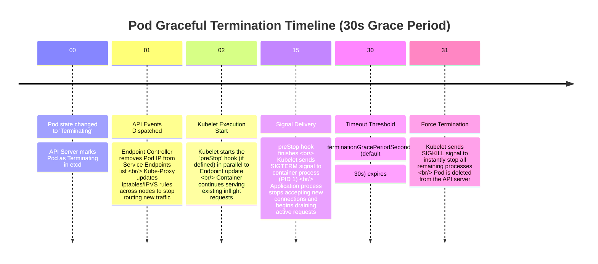

# 07 - Pod Replacement Flow (Graceful Termination)

This diagram details the step-by-step lifecycle flow of a Pod when it is terminated (e.g., during scale-down or rolling updates) to prevent traffic loss (achieving zero-downtime).

