# 09 - Rollback Sequence Diagram

This diagram visualizes the rollback sequence triggered when an operator runs `kubectl rollout undo`. The Deployment controller reads the template of a historical ReplicaSet and initiates a rolling update to revert the system to the stable state.

```mermaid
sequenceDiagram
    autonumber
    actor Admin as Platform Engineer
    participant API as kube-apiserver
    participant DC as Deployment Controller
    participant RS_New as RS v1.1.0 (Bad - Revision 2)
    participant RS_Old as RS v1.0.0 (Stable - Revision 1)

    Admin->>API: kubectl rollout undo deployment/payment-processor
    API->>DC: Notify: Rollback Requested
    
    Note over DC: Look up historical ReplicaSets.<br/>Find Revision 1 (v1.0.0) template.
    
    rect rgb(30, 30, 46)
        Note over DC, RS_Old: Phase 1: Re-activate Old ReplicaSet
        DC->>API: Patch Deployment spec.template to match Revision 1
        DC->>RS_Old: Update replicas (increment towards target)
        Note over RS_Old: Starts spinning up pods running v1.0.0
    end
    
    rect rgb(49, 50, 68)
        Note over DC, RS_New: Phase 2: Deprecate Bad ReplicaSet
        DC->>RS_New: Update replicas (decrement towards 0)
        Note over RS_New: Starts terminating pods running v1.1.0
    end

    Note over DC: Reconciliation completes.<br/>Revision 1 is now active. Revision 2 scaled to 0.
    DC->>API: Update Deployment Status (Rollback Complete)
    API-->>Admin: Deployment "payment-processor" rolled back
```

