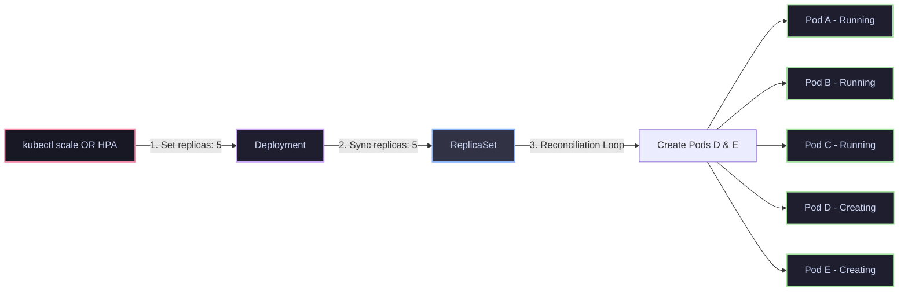

# 10 - Replica Scaling Diagram

This diagram visualizes how a replica scaling request (whether manual or automated via Horizontal Pod Autoscaler) scales the pod count up or down.

```mermaid
graph LR
    %% Styling
    classDef client fill:#181825,stroke:#f38ba8,stroke-width:2px,color:#cdd6f4;
    classDef depl fill:#1e1e2e,stroke:#cba6f7,stroke-width:2px,color:#cdd6f4;
    classDef rs fill:#313244,stroke:#89b4fa,stroke-width:2px,color:#cdd6f4;
    classDef pod fill:#1e1e2e,stroke:#a6e3a1,stroke-width:2px,color:#cdd6f4;

    Trigger[kubectl scale OR HPA]:::client -->|1. Set replicas: 5| Dep[Deployment]:::depl
    Dep -->|2. Sync replicas: 5| RS[ReplicaSet]:::rs
    
    RS -->|3. Reconciliation Loop| Act[Create Pods D & E]
    
    Act --> PodA[Pod A - Running]:::pod
    Act --> PodB[Pod B - Running]:::pod
    Act --> PodC[Pod C - Running]:::pod
    Act --> PodD[Pod D - Creating]:::pod
    Act --> PodE[Pod E - Creating]:::pod
```
