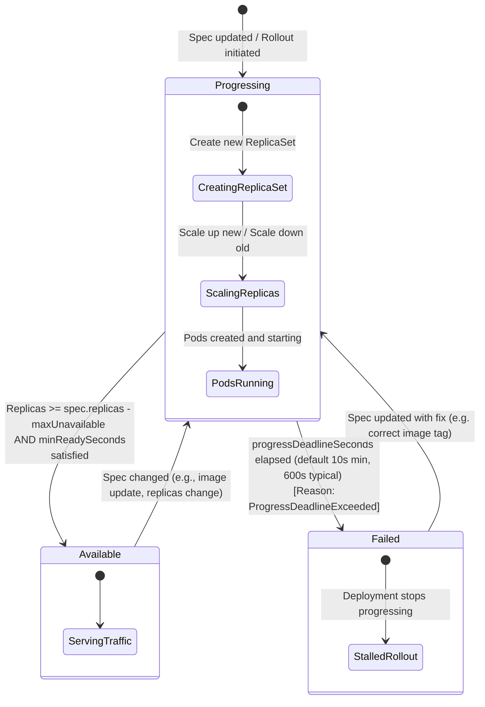

# 11 - Deployment Lifecycle and Status Conditions

This diagram charts the lifecycle states and transitions of a Kubernetes Deployment, focusing on the status conditions (`Progressing`, `Available`, `Failed`) reported in the resource status field.

