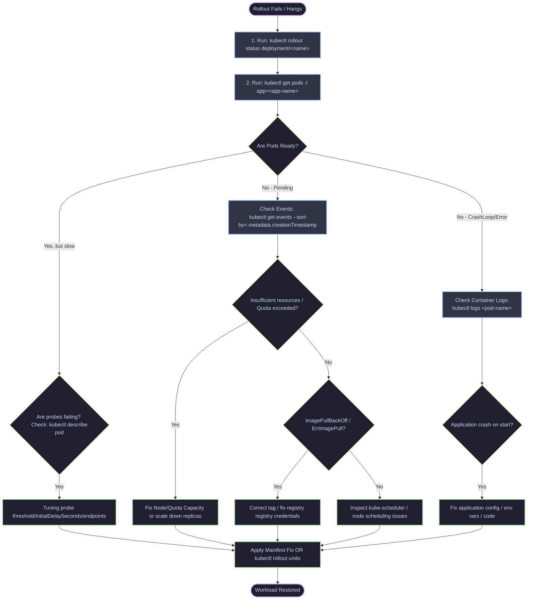

# 12 - Rollout Failure Recovery Flow

This decision tree visualizes the diagnostic path and recovery actions an engineer should take when a rollout hangs or fails.

```mermaid
flowchart TD
    %% Styling
    classDef startEnd fill:#1e1e2e,stroke:#cba6f7,stroke-width:2px,color:#cdd6f4;
    classDef cmd fill:#313244,stroke:#89b4fa,stroke-width:2px,color:#cdd6f4;
    classDef check fill:#1e1e2e,stroke:#f9e2af,stroke-width:2px,color:#cdd6f4;
    classDef action fill:#1e1e2e,stroke:#a6e3a1,stroke-width:2px,color:#cdd6f4;

    Start([Rollout Fails / Hangs]):::startEnd --> Triage1["1. Run: kubectl rollout status deployment/&lt;name&gt;"]:::cmd
    Triage1 --> Triage2["2. Run: kubectl get pods -l app=&lt;app-name&gt;"]:::cmd
    Triage2 --> CheckPods{Are Pods Ready?}:::check
    
    CheckPods -->|Yes, but slow| ProbeCheck{Are probes failing? <br> Check: kubectl describe pod}:::check
    CheckPods -->|No - Pending| CheckEvents["Check Events: <br> kubectl get events --sort-by=.metadata.creationTimestamp"]:::cmd
    CheckPods -->|No - CrashLoop/Error| CheckLogs["Check Container Logs: <br> kubectl logs &lt;pod-name&gt;"]:::cmd

    CheckEvents --> ResourceCheck{Insufficient resources / Quota exceeded?}:::check
    ResourceCheck -->|Yes| FixResource[Fix Node/Quota Capacity or scale down replicas]:::action
    ResourceCheck -->|No| ImageCheck{ImagePullBackOff / ErrImagePull?}:::check
    
    ImageCheck -->|Yes| FixImage[Correct tag / fix registry registry credentials]:::action
    ImageCheck -->|No| UnknownCheck[Inspect kube-scheduler / node scheduling issues]:::action

    CheckLogs --> CodeCheck{Application crash on start?}:::check
    CodeCheck -->|Yes| FixApp[Fix application config / env vars / code]:::action

    ProbeCheck -->|Yes| FixProbes[Tuning probe threshold/initialDelaySeconds/endpoints]:::action

    %% Mitigation options
    FixResource --> ApplyFix[Apply Manifest Fix OR kubectl rollout undo]:::action
    FixImage --> ApplyFix
    FixApp --> ApplyFix
    FixProbes --> ApplyFix
    UnknownCheck --> ApplyFix
    
    ApplyFix --> Done([Workload Restored]):::startEnd
```
