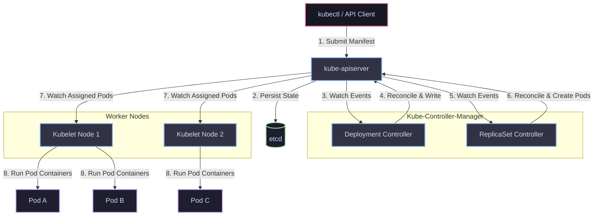

# 📊 Day 5 Visual Architecture Hub: Deployments, ReplicaSets & Rollouts

This directory contains high-fidelity visual diagrams representing the internal mechanics, workflows, and failure recovery processes for Kubernetes Deployments, ReplicaSets, and Pod reconciliation.

---

## 🗺️ Diagrams Index

| # | Diagram | Target Path | Core Concept |
|---|---|---|---|
| 01 | **Deployment Architecture** | [01-deployment-architecture.md](file:///d:/30_Days_of_Production_Kubernetes/Day-05/diagrams/01-deployment-architecture.md) | Client to container execution path |
| 02 | **Deployment -> ReplicaSet -> Pod** | [02-deployment-rs-pod.md](file:///d:/30_Days_of_Production_Kubernetes/Day-05/diagrams/02-deployment-rs-pod.md) | Hierarchical ownership & history |
| 03 | **Controller Reconciliation Loop** | [03-reconciliation-loop.md](file:///d:/30_Days_of_Production_Kubernetes/Day-05/diagrams/03-reconciliation-loop.md) | State-observe-reconcile control theory |
| 04 | **Rolling Update Workflow** | [04-rolling-update.md](file:///d:/30_Days_of_Production_Kubernetes/Day-05/diagrams/04-rolling-update.md) | maxSurge & maxUnavailable execution |
| 05 | **Canary Deployment Strategy** | [05-canary-deployment.md](file:///d:/30_Days_of_Production_Kubernetes/Day-05/diagrams/05-canary-deployment.md) | Label-based L4 traffic splitting |
| 06 | **Blue/Green Deployment** | [06-blue-green.md](file:///d:/30_Days_of_Production_Kubernetes/Day-05/diagrams/06-blue-green.md) | Instant Service selector cutover |
| 07 | **Pod Graceful Termination Flow** | [07-pod-replacement.md](file:///d:/30_Days_of_Production_Kubernetes/Day-05/diagrams/07-pod-replacement.md) | preStop hooks, SIGTERM, and SIGKILL |
| 08 | **Self-Healing Mechanics** | [08-self-healing.md](file:///d:/30_Days_of_Production_Kubernetes/Day-05/diagrams/08-self-healing.md) | Reconciliation of unexpected pod loss |
| 09 | **Rollback Sequence** | [09-rollback-sequence.md](file:///d:/30_Days_of_Production_Kubernetes/Day-05/diagrams/09-rollback-sequence.md) | Reverting spec changes via `rollout undo` |
| 10 | **Replica Scaling** | [10-replica-scaling.md](file:///d:/30_Days_of_Production_Kubernetes/Day-05/diagrams/10-replica-scaling.md) | Manual scaling & HPA propagation |
| 11 | **Deployment Lifecycle & Conditions** | [11-deployment-lifecycle.md](file:///d:/30_Days_of_Production_Kubernetes/Day-05/diagrams/11-deployment-lifecycle.md) | Progressing, Available, and Failed states |
| 12 | **Failure Recovery Flowchart** | [12-failure-recovery.md](file:///d:/30_Days_of_Production_Kubernetes/Day-05/diagrams/12-failure-recovery.md) | Triage playbook for stuck rollouts |

---

## 🎨 Diagram Previews

### 1. Deployment Architecture

### 2. Rolling Update Workflow (maxSurge=1, maxUnavailable=0)

```mermaid
sequenceDiagram
    autonumber
    participant D as Deployment Controller
    participant RS_Old as Old ReplicaSet (v1.0.0)
    participant RS_New as New ReplicaSet (v1.1.0)
    participant P_New as New Pod (v1.1.0)
    participant P_Old as Old Pod (v1.0.0)

    Note over D, P_Old: Initial State: 3 Old Pods running. MaxSurge=1, MaxUnavailable=0.
    
    rect rgb(30, 30, 46)
        Note over D, RS_New: Phase 1: Deploy New Replica Set
        D->>RS_New: Scale Up to 1 Replica (Surge Active)
        RS_New->>P_New: Create Pod v1.1.0-A
        P_New->>P_New: Startup & Readiness Probes Passing
        Note over P_New: Pod v1.1.0-A is Ready (Traffic Joins)
    end

    rect rgb(49, 50, 68)
        Note over D, RS_Old: Phase 2: Decent Old Replica Set
        D->>RS_Old: Scale Down to 2 Replicas
        RS_Old->>P_Old: Terminate Pod v1.0.0-C
        Note over P_Old: SIGTERM -> preStop Hook -> Pod Removed
    end

    rect rgb(30, 30, 46)
        Note over D, RS_New: Phase 3: Increment New Replica Set
        D->>RS_New: Scale Up to 2 Replicas
        RS_New->>P_New: Create Pod v1.1.0-B
        P_New->>P_New: Startup & Readiness Probes Passing
        Note over P_New: Pod v1.1.0-B is Ready
    end

    rect rgb(49, 50, 68)
        Note over D, RS_Old: Phase 2: Decent Old Replica Set
        D->>RS_Old: Scale Down to 1 Replica
        RS_Old->>P_Old: Terminate Pod v1.0.0-B
    end

    rect rgb(30, 30, 46)
        Note over D, RS_New: Phase 5: Complete New Workload
        D->>RS_New: Scale Up to 3 Replicas
        RS_New->>P_New: Create Pod v1.1.0-C
        P_New->>P_New: Startup & Readiness Probes Passing
        Note over P_New: Pod v1.1.0-C is Ready
    end

    rect rgb(49, 50, 68)
        Note over D, RS_Old: Phase 6: Clean Up Old Workload
        D->>RS_Old: Scale Down to 0 Replicas
        RS_Old->>P_Old: Terminate Pod v1.0.0-A
        Note over D: Rollout Finished: 3 New Pods Running
    end
```

