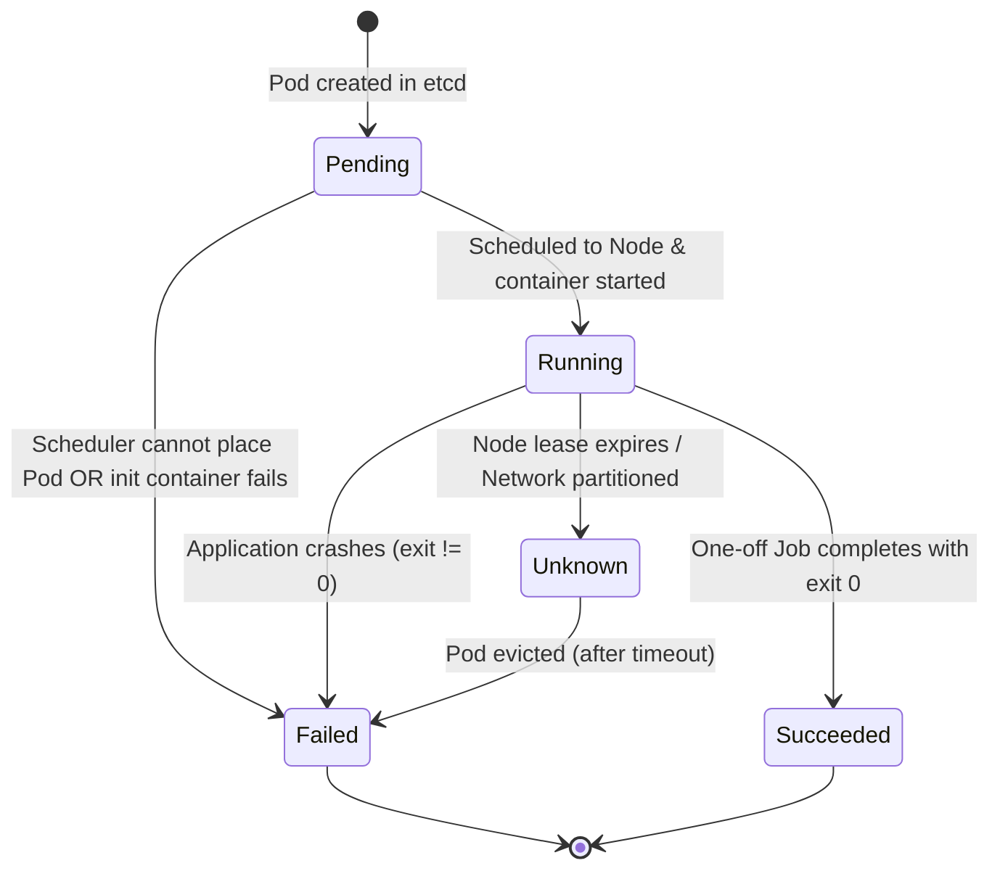

# 🧠 Deep Dive: Reconciliation Loops, Informers & Pod State Machines

This document explores the internal control theory of Kubernetes. We trace exactly what happens under the hood when a Deployment manifest is submitted, how the control plane monitors states, and how Pod status conditions transition.

---

## 1. Control Theory & The Kube-Controller-Manager

Kubernetes is built on **Control Loops**, a fundamental concept in systems engineering. Instead of executing scripts that run once and terminate, Kubernetes runs multiple continuous loops.

These loops are housed in the **kube-controller-manager** binary on the control plane. Inside this binary, multiple go-routines run independently:
* **Deployment Controller**: Watches Deployments, manages ReplicaSets.
* **ReplicaSet Controller**: Watches ReplicaSets, manages Pod counts.
* **Node Lifecycle Controller**: Watches Node heartbeats and handles evictions.
* **Namespace Controller**: Cleans up resources when a namespace is deleted.

---

## 2. Under the Hood: Informers, Listers & Workqueues

To reconcile states, controllers need to know about changes to resources. However, polling the API Server constantly would saturate the etcd database and crash the control plane. To solve this, Kubernetes uses a caching event-driven architecture.

```
                  ┌──────────────────────────────────────────────┐
                  │              Kubernetes Cluster              │
                  │   ┌────────────┐            ┌────────────┐   │
                  │   │ kube-apiserver ◄───────►│    etcd    │   │
                  │   └─────┬──────┘            └────────────┘   │
                  └─────────┼────────────────────────────────────┘
                            │ Watch Events (HTTP Stream)
                            ▼
┌───────────────────────────┼────────────────────────────────────┐
│ Kube-Controller-Manager   │                                    │
│   ┌───────────────────────▼────────────────────────┐           │
│   │ SharedIndexInformer                            │           │
│   │  - Reflector: Executes List-Watch              │           │
│   │  - DeltaFIFO Queue                             │           │
│   │  - Local Cache Store (Thread-Safe Lister)      │           │
│   └───────────────────────┬────────────────────────┘           │
│                           │ Trigger Event Handlers             │
│                           ▼                                    │
│   ┌────────────────────────────────────────────────┐           │
│   │ Rate-Limiting Workqueue                        │           │
│   │  - Queue of resource keys (e.g. "default/pay")  │           │
│   └───────────────────────┬────────────────────────┘           │
│                           │ ProcessItem()                      │
│                           ▼                                    │
│   ┌────────────────────────────────────────────────┐           │
│   │ Reconcile Worker Loop                          │           │
│   │  - Call Lister to read local cache             │           │
│   │  - Diff current vs desired state               │           │
│   │  - Call api-server to write modifications      │           │
│   └────────────────────────────────────────────────┘           │
└────────────────────────────────────────────────────────────────┘
```

### The Component Pipeline
1. **Reflector**: Establishes a HTTP stream connection (List-Watch API) to the API Server. It lists resources on startup to populate a local cache, and then watches for incremental changes (Add, Update, Delete events).
2. **DeltaFIFO**: A first-in-first-out queue that stores incoming events and their modifications (deltas).
3. **Informer**: Consumes events from the DeltaFIFO queue, updates the local thread-safe **Lister Cache**, and invokes registered event handlers.
4. **Workqueue**: When an event handler triggers (e.g. "Pod Deleted"), it doesn't execute the reconcile logic immediately. Instead, it extracts the resource's namespace/name key (e.g. `default/payment-processor-67f9db-aaa`) and pushes it onto a rate-limiting workqueue.
5. **Worker**: Multiple worker go-routines pull keys from the workqueue, query the local Lister Cache to get the current object state, and run the reconciliation code.

This design guarantees that if the API server crashes or network failures occur, the controller can recover state immediately by syncing from the local cache and retrying items in the workqueue with exponential backoff.

---

## 3. The Pod Lifecycle & State Machine

Every Pod object has a `status.phase` representing its high-level execution state, and a list of `status.conditions` providing fine-grained lifecycle details.

### Status Phases



* **`Pending`**: The Pod manifest has been accepted by the API Server, but one or more containers are not yet running. This includes time spent waiting to be scheduled, downloading images over the network, or executing init containers.
* **`Running`**: The Pod has been bound to a Node, and all containers have been created. At least one container is currently running, or is in the process of starting or restarting.
* **`Succeeded`**: All containers in the Pod have terminated successfully (exit code 0) and will not be restarted. This is typical for Job workloads.
* **`Failed`**: All containers in the Pod have terminated, and at least one container has terminated in failure (exit code is non-zero) or was killed by the system (e.g., OOMKilled).
* **`Unknown`**: The state of the Pod cannot be obtained. This typically occurs due to a network communication failure between the control plane and the Kubelet on the worker node.

---

## 4. Node Lease & Eviction reconciliation

What happens under the hood when a Node goes offline?

1. **Heartbeats**: Every node has a `Lease` object in the `kube-node-lease` namespace. The Kubelet updates this lease every `node-status-update-frequency` (default: 10s).
2. **Node Controller Watch**: The Node Controller monitors these Lease objects. If a node lease is not updated within `node-monitor-grace-period` (default: 40s), the controller marks the Node status as `Ready: Unknown` or `Ready: False`.
3. **Eviction Grace Period**: Once a node is marked unhealthy, the Pod Eviction Controller waits for a grace period defined by `--pod-eviction-timeout` (default: 5 minutes) on the controller manager.
4. **Tear-Down & Reschedule**: If the node remains dead after the eviction timeout, the controller calls the API Server to delete all Pods scheduled on that Node.
5. **ReplicaSet Reconciliation**: Since the Pods are marked deleted, the ReplicaSet controller detects a replica count drop and launches replacement Pods on healthy nodes, maintaining application availability.
