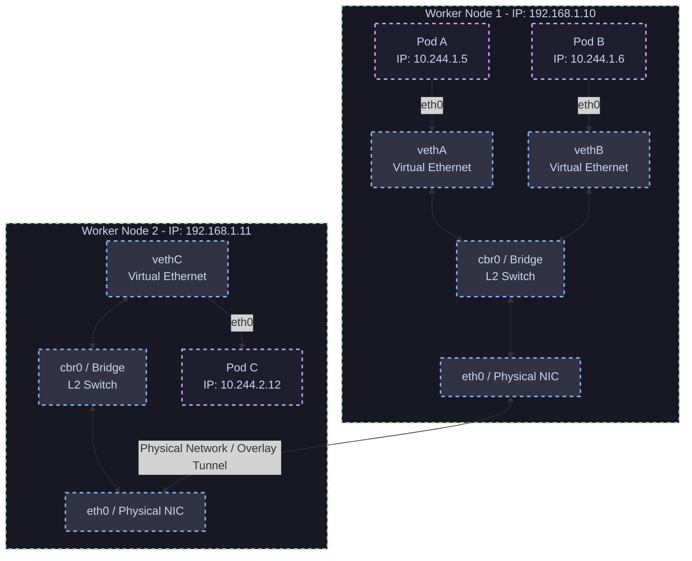

# 01 - Pod-to-Pod Communication

Kubernetes enforces a flat network model where every Pod receives a unique, routable IP address within the cluster. Pods can communicate with all other Pods without NAT, regardless of which node they reside on.

## Same Node vs. Cross-Node Packet Flow

### Explanation of Components
1. **veth (Virtual Ethernet Pair)**: Act as a virtual patch cord. One end is placed inside the Pod's network namespace (exposed as `eth0`), and the other end is bound to the host network bridge (e.g., `vethA`).
2. **cbr0 / Bridge**: An L2 software bridge acting as a local virtual switch. Packets between Pods on the same node (e.g., Pod A to Pod B) are switched locally at L2 by the bridge without ever reaching the physical network interface.
3. **Cross-Node Routing**: When Pod A (10.244.1.5) sends a packet to Pod C (10.244.2.12), the bridge realizes the destination IP is outside its subnet and forwards it to the host routing table. The host routes the packet via its physical NIC (`eth0`) across the network (via BGP routing or VXLAN/Geneve encapsulation) to Node 2.
