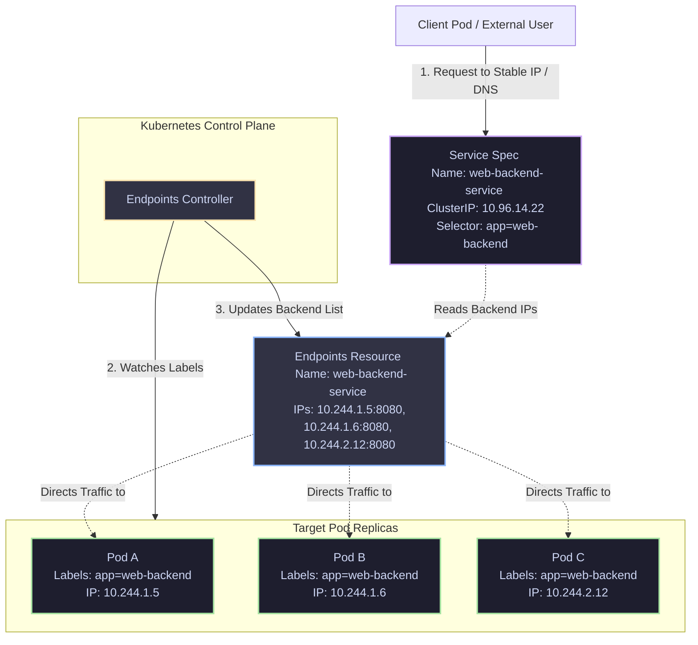

# 02 - Kubernetes Service Architecture

A Service is an abstract way to expose an application running on a set of Pods as a network service. It provides a stable IP address (ClusterIP) and DNS name, shielding clients from the ephemeral nature of individual Pods.

## Structural Relationship

### Key Concepts
* **Selector**: The label query used by the service to identify target pods (`app=web-backend`).
* **Endpoints**: A separate API object automatically created by Kubernetes that tracks the actual, healthy IP addresses and ports of Pods matching the selector.
* **Stable Abstraction**: If Pod B dies and is replaced by Pod D (with a new IP), the Endpoints Controller automatically updates the Endpoints list, ensuring the Client continues to call the Service IP without interruption.
