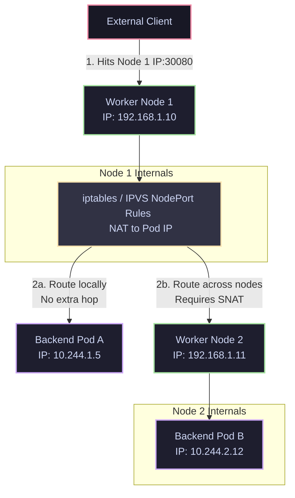

# 04 - NodePort Traffic Routing

A `NodePort` Service exposes the service on each Node's IP at a static port (in the range 30000-32767). External clients can connect to any Node's IP on that port to reach the application.

## NodePort Routing Path

### The Double-NAT / SNAT Hop Problem
By default (`externalTrafficPolicy: Cluster`):
1. The client sends a packet: `Client IP -> Node 1 IP:30080`.
2. Node 1 intercepts the packet. It selects a backend pod.
3. If Node 1 selects **Pod B** (which is on **Node 2**):
   * It performs **DNAT** to rewrite the destination to `Pod B IP (10.244.2.12:8080)`.
   * It performs **SNAT** (Source NAT) to rewrite the source IP to `Node 1 IP (192.168.1.10)`. This is necessary so Node 2 replies back to Node 1 rather than sending the packet directly back to the client (which the client would discard as a spoofed connection).
4. Pod B receives the packet, but the source IP is Node 1, **masking the client's actual IP**.
5. The packet travels: Client -> Node 1 -> Node 2 -> Pod B. This adds an extra network hop, increasing latency.

To fix this, you can set `externalTrafficPolicy: Local` (explored in the LoadBalancer section).
