# 06 - DNS Resolution Flow in CoreDNS

Kubernetes runs a cluster-wide DNS server (CoreDNS) as a Deployment in the `kube-system` namespace. The CoreDNS Service IP (usually the 10th IP in the service CIDR) is injected into every Pod's `/etc/resolv.conf` file as `nameserver`.

## Tracing a DNS Query Inside a Pod

```
When a Pod queries "web-backend-service" or "google.com":
```



```mermaid
sequenceDiagram
    autonumber
    participant Pod as Client Pod (Namespace: billing)
    participant Core as CoreDNS Pod
    participant Upstream as Upstream DNS (e.g., 8.8.8.8)

    Note over Pod: App resolves "web-backend-service"
    
    rect rgb(30, 30, 46)
        Note over Pod, Core: Loop 1: Appends local search domains (/etc/resolv.conf)
        Pod->>Core: Query A: web-backend-service.billing.svc.cluster.local
        Core-->>Pod: NXDOMAIN (Name Error / Not Found)
    end
    
    rect rgb(49, 50, 68)
        Note over Pod, Core: Loop 2: Tries next search suffix
        Pod->>Core: Query B: web-backend-service.svc.cluster.local
        Core-->>Pod: Found! returns ClusterIP: 10.96.14.22
    end
    
    Note over Pod: App resolves "google.com" (External)
    
    rect rgb(30, 30, 46)
        Note over Pod, Core: Loop 1 to 3: Appends cluster search paths (ndots:5 penalty)
        Pod->>Core: google.com.billing.svc.cluster.local?
        Core-->>Pod: NXDOMAIN
        Pod->>Core: google.com.svc.cluster.local?
        Core-->>Pod: NXDOMAIN
        Pod->>Core: google.com.cluster.local?
        Core-->>Pod: NXDOMAIN
    end
    
    rect rgb(49, 50, 68)
        Note over Pod, Upstream: Loop 4: Tries absolute name
        Pod->>Core: google.com?
        Core->>Upstream: Forward Query to Upstream
        Upstream-->>Core: IP: 142.250.190.46
        Core-->>Pod: Return IP: 142.250.190.46
    end
```

### The `/etc/resolv.conf` Structure
Every Pod gets a default resolv.conf:
```text
nameserver 10.96.0.10
search billing.svc.cluster.local svc.cluster.local cluster.local c.my-project.internal google.internal
options ndots:5
```

### The `ndots:5` Bottleneck
* **What is ndots?**: It specifies that any domain name with fewer than 5 dots (`.`) is treated as a relative name first.
* **Why does it hurt?**: A query for `google.com` (1 dot) has fewer than 5 dots. The resolver sequentially appends all searches listed in `/etc/resolv.conf` before attempting an absolute lookup. This results in **4 failed queries** (NXDOMAIN responses) to CoreDNS before successfully forwarding the request to the upstream DNS, multiplying CoreDNS traffic by up to 5x for external lookups.
* **Mitigation**: Append a trailing dot (e.g., `google.com.`) in client code to force an absolute query, skipping the search suffix list entirely, or tune `spec.dnsConfig.options` in the Pod spec to reduce `ndots`.
