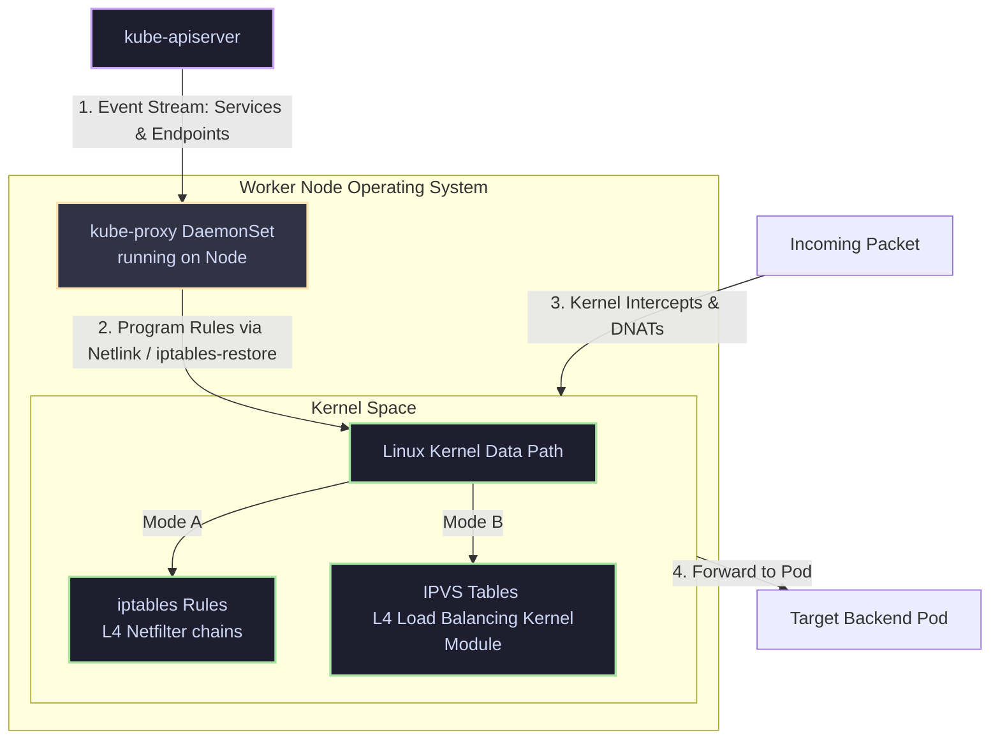

# 07 - kube-proxy Internals

`kube-proxy` runs on every worker node as a DaemonSet. It does not act as an inline proxy (which would be a major performance bottleneck); instead, it acts as a controller that configures the kernel's packet-filtering and NAT rules.

## Control Loop Architecture

### Execution Loop Details
1. **Watch Loop**: kube-proxy starts a watch loop against the API server to catch creations, updates, or deletions of `Service` and `EndpointSlice` objects.
2. **Reconciliation**: When an event occurs, kube-proxy updates its memory cache and triggers a reconciliation cycle.
3. **Data Path Programming**: 
   * **iptables Mode**: Translates all services into sequential iptables rules chains, replacing the entire rule-set in the kernel space using a bulk command.
   * **IPVS Mode**: Calls netlink interfaces to add IPVS virtual servers and bind backend pod endpoints as target servers.
4. **Traffic Path**: When packets arrive at the host network interfaces, the kernel processes them via the programmed routing rules directly, ensuring high throughput.
