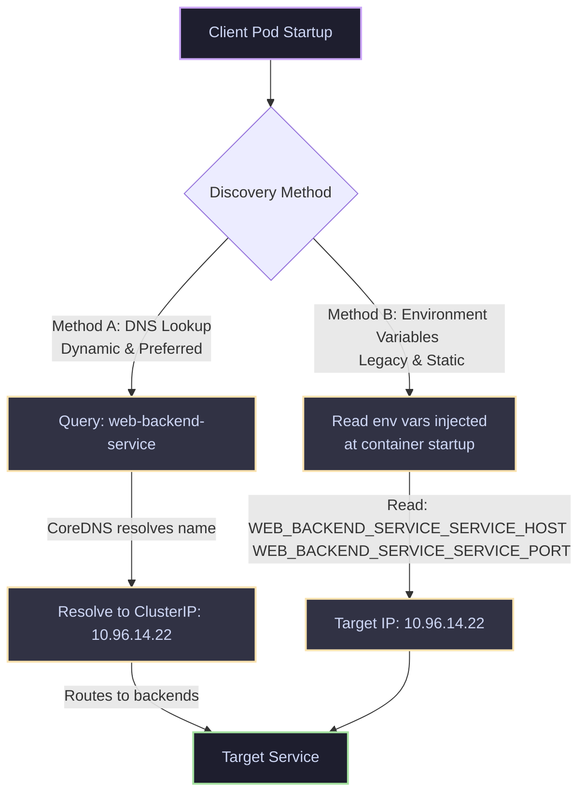

# 12 - Service Discovery Workflow

Kubernetes provides two primary mechanisms for discovery: **DNS-based** and **Environment Variables**.

## How Services are Discovered



### 1. DNS-Based Service Discovery (Modern Standard)
* When a Service is created, a DNS record is automatically registered in CoreDNS: `<service-name>.<namespace>.svc.cluster.local`.
* This resolves to the Service's ClusterIP.
* **Pros**: Dynamic. If a service is created *after* the Pod started, the Pod can still resolve it instantly.

### 2. Environment Variables (Legacy)
* When a Pod is created, the Kubelet automatically injects environment variables for every active Service running in that same namespace.
* If a service is named `web-backend-service`, the following env vars are injected:
  ```bash
  WEB_BACKEND_SERVICE_SERVICE_HOST=10.96.14.22
  WEB_BACKEND_SERVICE_SERVICE_PORT=80
  WEB_BACKEND_SERVICE_PORT=tcp://10.96.14.22:80
  WEB_BACKEND_SERVICE_PORT_80_TCP=tcp://10.96.14.22:80
  ```
* **Critical Flaw**: **Order of Creation Dependency**. If `web-backend-service` is created *after* the client Pod, the client Pod will not have these environment variables injected. Therefore, always rely on DNS-based resolution in production.
