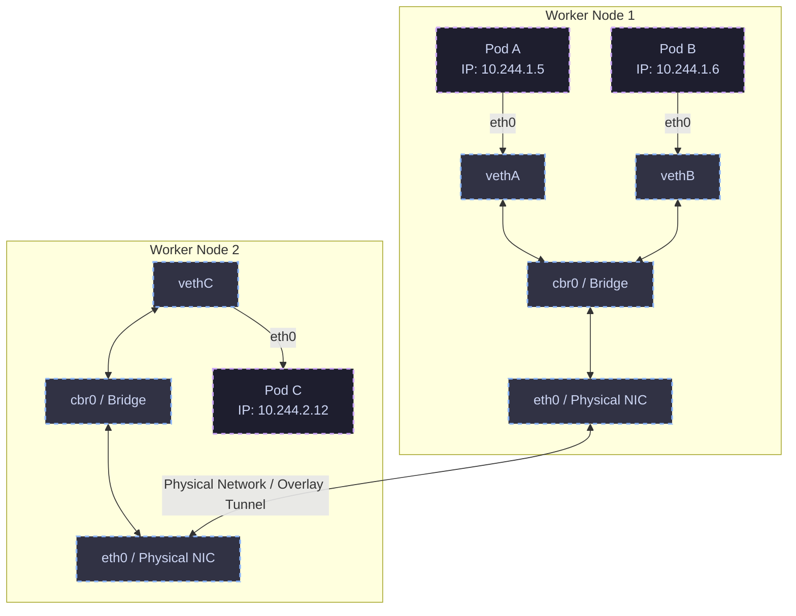
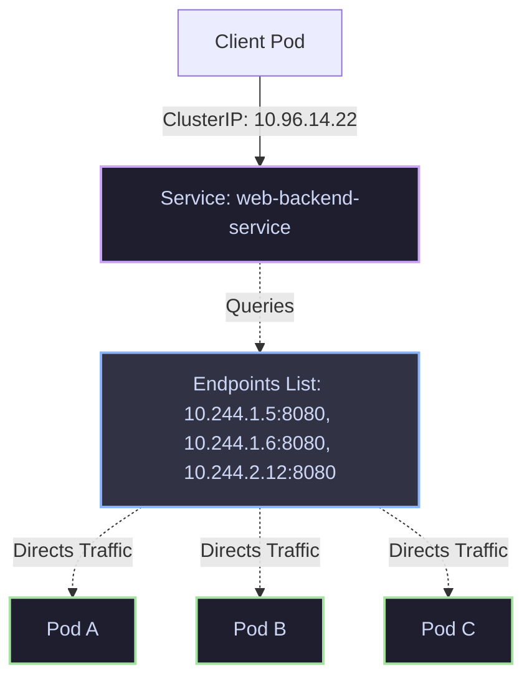

# 📊 Day 6 Visual Architecture Hub: Kubernetes Services & Networking

This directory contains high-fidelity visual diagrams representing the internal mechanics, packet flows, and routing algorithms of Kubernetes Services and Networking.

---

## 🗺️ Diagrams Index

| # | Diagram | Target Path | Core Concept |
|---|---|---|---|
| 01 | **Pod-to-Pod Communication** | [01-pod-to-pod.md](file:///d:/30_Days_of_Production_Kubernetes/Day-06/diagrams/01-pod-to-pod.md) | Veth pairs, bridges, and cross-node overlay/routing paths |
| 02 | **Service Architecture** | [02-service-architecture.md](file:///d:/30_Days_of_Production_Kubernetes/Day-06/diagrams/02-service-architecture.md) | Relationship between Services, Selectors, and Endpoints |
| 03 | **ClusterIP Packet Flow** | [03-clusterip-packet-flow.md](file:///d:/30_Days_of_Production_Kubernetes/Day-06/diagrams/03-clusterip-packet-flow.md) | Virtual IP routing, interception, and client-side DNAT |
| 04 | **NodePort Traffic Routing** | [04-nodeport-routing.md](file:///d:/30_Days_of_Production_Kubernetes/Day-06/diagrams/04-nodeport-routing.md) | Port bindings and the double-NAT (SNAT) external hop problem |
| 05 | **LoadBalancer Service Workflow** | [05-loadbalancer-workflow.md](file:///d:/30_Days_of_Production_Kubernetes/Day-06/diagrams/05-loadbalancer-workflow.md) | CCM interaction and `externalTrafficPolicy` (Cluster vs Local) |
| 06 | **DNS Resolution Flow in CoreDNS** | [06-dns-resolution-flow.md](file:///d:/30_Days_of_Production_Kubernetes/Day-06/diagrams/06-dns-resolution-flow.md) | Search path traversal, ndots:5 latency penalty, and upstream forwards |
| 07 | **kube-proxy Internals** | [07-kube-proxy-internals.md](file:///d:/30_Days_of_Production_Kubernetes/Day-06/diagrams/07-kube-proxy-internals.md) | API watch loop, controller reconciliation, and data path updates |
| 08 | **iptables Packet Traversal Path** | [08-iptables-routing.md](file:///d:/30_Days_of_Production_Kubernetes/Day-06/diagrams/08-iptables-routing.md) | Traversal of custom Netfilter chains and statistics balancing |
| 09 | **IPVS Routing Architecture** | [09-ipvs-architecture.md](file:///d:/30_Days_of_Production_Kubernetes/Day-06/diagrams/09-ipvs-architecture.md) | Hash tables lookup performance vs sequential chains scanning |
| 10 | **Endpoint Mapping & EndpointSlices** | [10-endpoint-mapping.md](file:///d:/30_Days_of_Production_Kubernetes/Day-06/diagrams/10-endpoint-mapping.md) | Solving "endpoint explosion" in large scale clusters |
| 11 | **Cross-Node Networking** | [11-cross-node-networking.md](file:///d:/30_Days_of_Production_Kubernetes/Day-06/diagrams/11-cross-node-networking.md) | VXLAN overlay encapsulation vs BGP / native routing |
| 12 | **Service Discovery Workflow** | [12-service-discovery.md](file:///d:/30_Days_of_Production_Kubernetes/Day-06/diagrams/12-service-discovery.md) | DNS lookup paths vs legacy environment variable injection |

---

## 🎨 Core Diagram Previews

### 1. Pod-to-Pod Communication (Same Node & Cross-Node)

### 2. Service-to-Pod Endpoints Mapping

