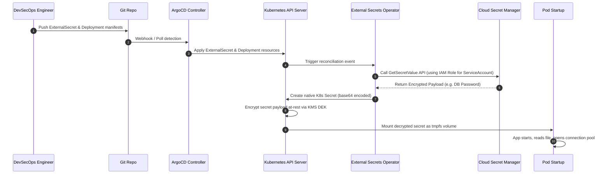

# 🔐 Day 7 — ConfigMaps, Secrets & Environment Management
### 🏷️ PHASE 1 - FOUNDATIONS OF CLOUD-NATIVE SYSTEMS

> **TL;DR:** Configuration separation, secrets protection, and External Secret Operator integration. The learner should NEVER store credentials directly in code again.

---

## 🎯 Learning Objectives
By the end of this day, you will be able to:
1. Explain the architectural concepts of **ConfigMaps, Secrets, and Environment Management**.
2. Contrast **Environment Variable Injection** vs **Volume Mounting** and evaluate security implications.
3. Decouple configurations from container builds following **Twelve-Factor App** principles.
4. Deploy and operate **HashiCorp Vault** sidecars and **External Secrets Operator (ESO)** sync interfaces.
5. Apply and automate secret **rotation policies** without triggering disruptive application outages.
6. Troubleshoot and solve configuration failures in production clusters.

---

## 🎥 Interactive Hands-On Simulation
To visualize the behaviors of ConfigMaps, Secrets, External Secrets Operator, and Vault, open our custom glassmorphic simulator in your browser:
👉 **[Interactive Configuration & Secret Management Simulator](file:///d:/30_Days_of_Production_Kubernetes/Day-07/resources/configuration-management-simulator.html)**

---

## 📝 Core Concepts & Deep Dives

For the full detailed theoretical breakdown, read the **[Day 7 Core Concepts Guide](file:///d:/30_Days_of_Production_Kubernetes/Day-07/notes/core-concepts.md)**.

### Why Configuration Causes Production Incidents
In microservice architectures, configuration errors (like typos in connection strings, incorrect hostnames, or expired API tokens) are responsible for **nearly 40% of all production downtime**. 

Unlike code logic, configuration exists at the boundary between your system and the outside world. If configuration is bundled inside the container image, updating a single property requires a complete rebuild, test, and release cycle—prolonging outages.

### The Twelve-Factor App Principles (Factor III: Config)
A Cloud-Native application must strictly separate configuration from code.
* **Image Portability:** The build artifact (the Docker image) must remain identical across Dev, Staging, and Prod.
* **Environment Extraction:** Config must be read from environment variables or mounted configuration files at runtime.

---

## 🛠️ Kubernetes Native Configuration

Kubernetes provides two core primitives to externalize configuration data:

### 1. ConfigMaps
Used for non-sensitive data (e.g., ports, log levels, config file templates).
* **Manifest Example:** **[manifests/01-configmap.yaml](file:///d:/30_Days_of_Production_Kubernetes/Day-07/manifests/01-configmap.yaml)**
* **Consumption Options:**
  1. **Environment Variables:** Map key-value pairs using `valueFrom.configMapKeyRef`.
  2. **Bulk Env Load:** Inject all keys automatically using `envFrom`.
  3. **Volume Mounts:** Mount the ConfigMap as files inside a directory.

### 2. Secrets
Used for sensitive data (e.g., passwords, TLS keys, API keys).
* **Manifest Example:** **[manifests/02-secret.yaml](file:///d:/30_Days_of_Production_Kubernetes/Day-07/manifests/02-secret.yaml)**
* **Misconception Alert:** Kubernetes Secrets are **not encrypted by default**. They are stored in `etcd` as Base64-encoded strings, which are trivially easy to decode. To secure them, you must configure **KMS Envelope Encryption** at-rest.
* **Memory Protection:** Mounted Secrets use `tmpfs` (a RAM-backed filesystem) so that credentials never write to physical disks on the worker node.

---

## 🚀 Environment Variables vs. Volume Mounts

```
                  ┌───────────────────────┐
                  │ ConfigMap / Secret    │
                  └──────────┬────────────┘
                             │
            ┌────────────────┴────────────────┐
            ▼                                 ▼
   [ Environment Injection ]          [ Volume Mounts ]
   - Static at container start        - Dynamic (updates on disk)
   - visible via `ps aux` / `/proc`   - Filesystem permissions (0400)
   - Easy for legacy code             - Backed by RAM (tmpfs for Secrets)
```

| Feature | Environment Variables | Volume Mounts |
| :--- | :--- | :--- |
| **Manifests** | **[03-deployment-env-injection.yaml](file:///d:/30_Days_of_Production_Kubernetes/Day-07/manifests/03-deployment-env-injection.yaml)** | **[04-deployment-volume-mount.yaml](file:///d:/30_Days_of_Production_Kubernetes/Day-07/manifests/04-deployment-volume-mount.yaml)** |
| **Hot Reload** | ❌ Requires pod restart. |  Auto-updates within 60 seconds (unless using `subPath`). |
| **Security** | ❌ Can leak to logs, cores, and `/proc`. |  Supports Unix file permission bits (`defaultMode: 0400`). |

---

## 🔒 Enterprise Secret Architectures

For scale, production environments move secret lifecycle management out of Kubernetes API objects and into enterprise managers.

### 1. HashiCorp Vault Integration
* Mutating webhooks inject a **Vault Agent sidecar** container into Pods.
* The Agent logs into Vault using the Pod's **Kubernetes ServiceAccount**, extracts credentials, and writes them to a `/vault/secrets/` RAM-volume.
* **Manifest Example:** **[manifests/05-vault-agent-injector.yaml](file:///d:/30_Days_of_Production_Kubernetes/Day-07/manifests/05-vault-agent-injector.yaml)**

### 2. External Secrets Operator (ESO)
* A controller retrieves secrets from AWS Secrets Manager, GCP Secret Manager, or Azure Key Vault, and writes them directly into Kubernetes native Secrets.
* Decouples the application code from cloud APIs.
* **Manifest Example:** **[manifests/06-external-secrets.yaml](file:///d:/30_Days_of_Production_Kubernetes/Day-07/manifests/06-external-secrets.yaml)**

---

## 📊 Visual Workflows & Architecture Diagrams

For the complete list of 12 architecture diagrams (including GitOps, Vault, and ESO flows), visit the **[Day 7 Diagrams Library](file:///d:/30_Days_of_Production_Kubernetes/Day-07/diagrams/README.md)**.

### Secret Retrieval Flow Sequence


---

## 🛠️ Hands-On Lab Walkthrough
Deploy, verify, and rotate configuration settings in a local cluster:
👉 **[Day 7 Lab Guide](file:///d:/30_Days_of_Production_Kubernetes/Day-07/labs/lab-guide.md)**

---

## ⚡ Production Considerations & Hardening
Senior platform engineering lessons learned, including post-mortems and compliance standards:
👉 **[Lessons Learned Guide](file:///d:/30_Days_of_Production_Kubernetes/Day-07/production-notes/lessons-learned.md)**

---

## 🚨 Troubleshooting Runbooks
Runbooks and diagnostic command snippets for debugging typical configuration issues:
👉 **[Configuration Troubleshooting Playbook](file:///d:/30_Days_of_Production_Kubernetes/Day-07/troubleshooting/playbook.md)**

---

## 🏆 Daily Assignment and Challenge
Reinforce your learning by building secure, locked-down manifests:
👉 **[Exercises & Challenges](file:///d:/30_Days_of_Production_Kubernetes/Day-07/exercises/challenges.md)**

---

## 📚 References
* [Twelve-Factor App - Config](https://12factor.net/config)
* [Kubernetes Secrets API](https://kubernetes.io/docs/concepts/configuration/secret/)
* [External Secrets Operator Website](https://external-secrets.io/)
* [HashiCorp Vault Documentation](https://developer.hashicorp.com/vault)
