# 📊 Day 7 Architecture Diagrams

This document contains 12 professional, enterprise-grade architecture diagrams visualizing the concepts of Kubernetes configuration, secret management, and external integration.

---

## 1. ConfigMap Architecture
Shows how a ConfigMap resource maps configuration values to Pods via environment variables and volume mounts.

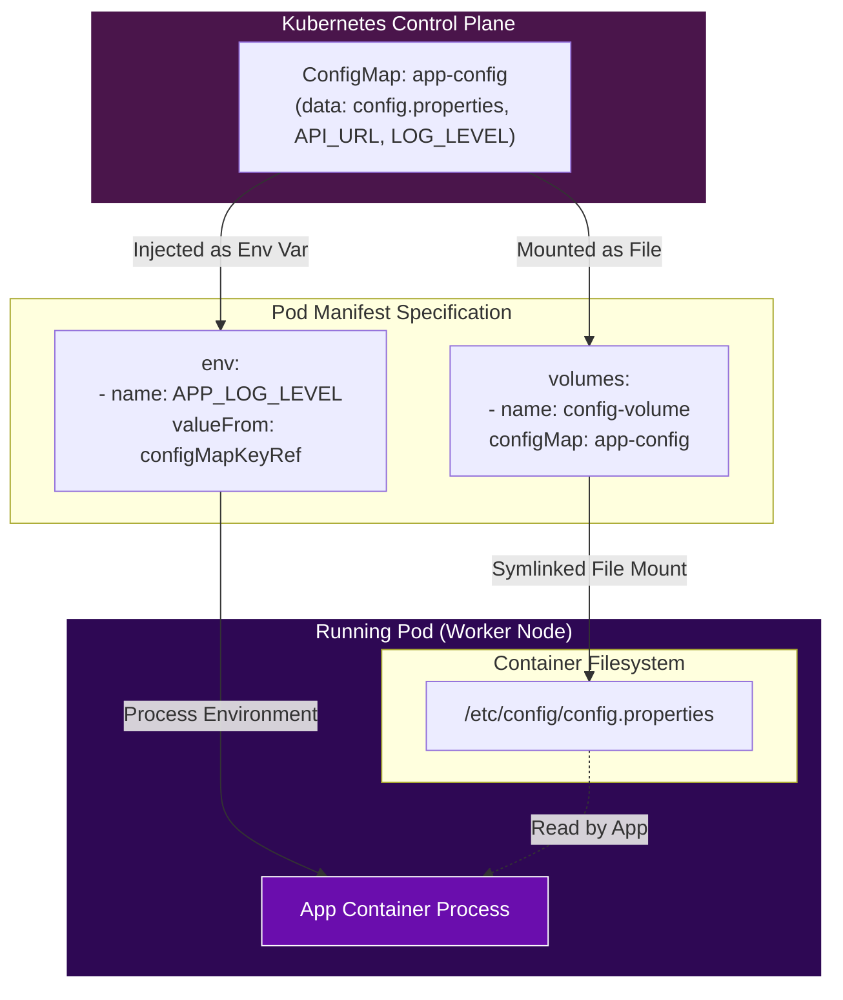

---

## 2. Secret Architecture
Visualizes how Opaque Secrets are stored Base64-encoded in `etcd`, but decrypted and mounted into Pods using memory-backed `tmpfs` volumes.

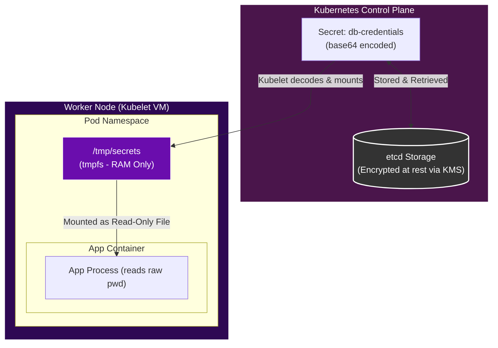

---

## 3. Environment Variable Injection Flow
Details the step-by-step process of how Kubelet reads values from ConfigMaps/Secrets and feeds them into container launch scripts.

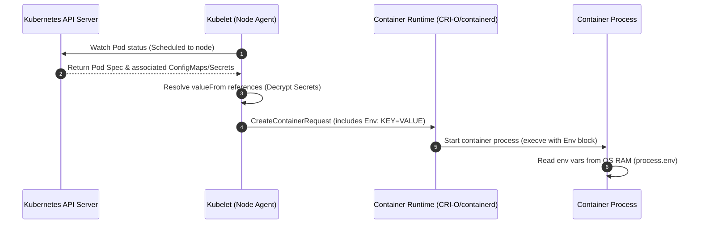

---

## 4. Volume Mounting Workflow
How the Kubelet Volume Manager updates the node disk, creates directory structures, and links ConfigMap/Secret API resources.

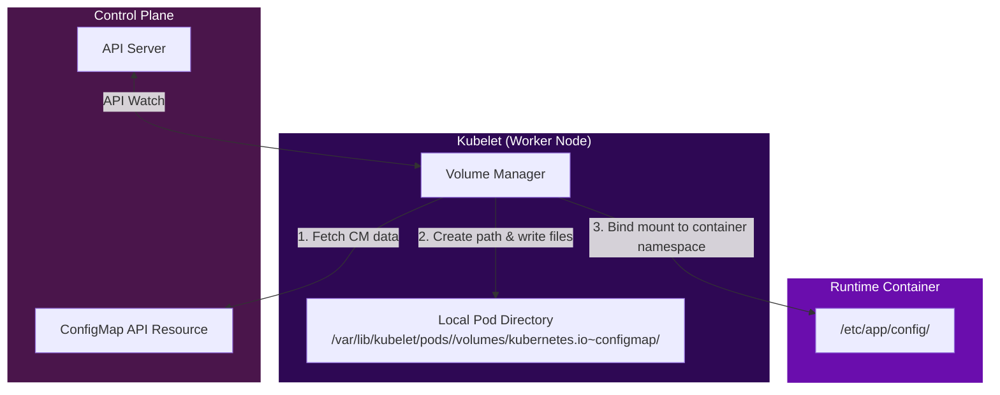

---

## 5. Secret Rotation Process
Visualizes Kubelet's reconciliation loop updating mounted volume files and how applications watch these files to reload configurations dynamically.

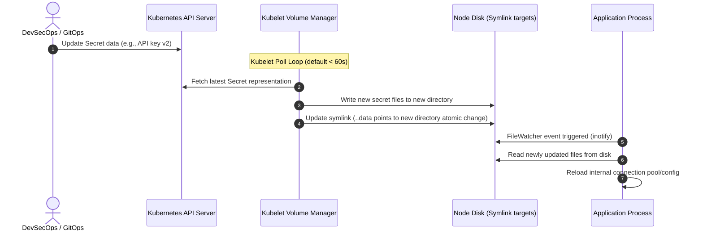

---

## 6. Vault Integration Architecture
Illustrates the HashiCorp Vault Agent Injector workflow, mutating the Pod Spec to insert a Sidecar container that authenticates and mounts secrets.

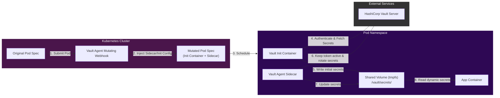

---

## 7. External Secrets Operator (ESO) Workflow
Details how External Secrets Operator bridges external cloud APIs (AWS/GCP/Azure) with native Kubernetes Secret objects.

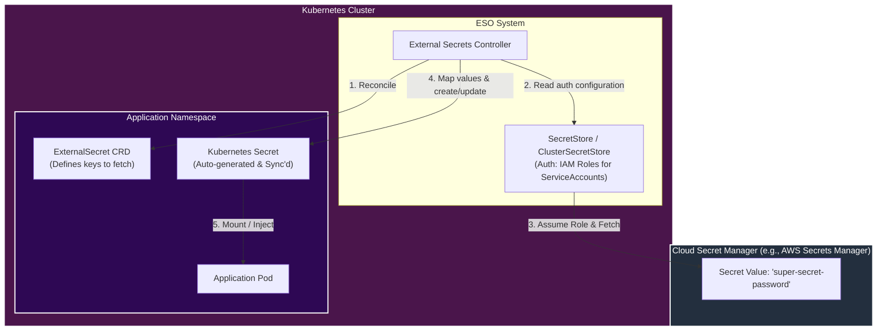

---

## 8. Application Startup Flow
Visualizes the application boot order: validating presence of secrets/configs, testing connection strings, and handling graceful crashes if dependencies are missing.

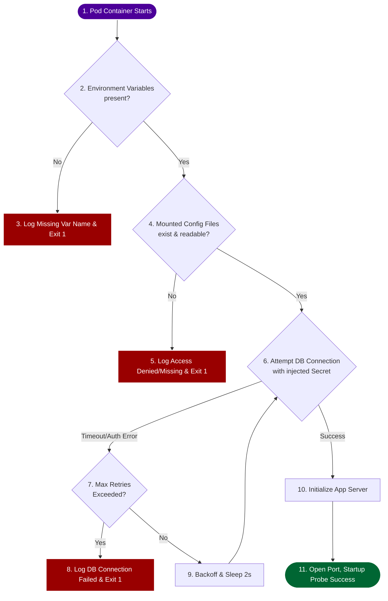

---

## 9. Multi-Environment Configuration
Shows how base configurations are overlaid using GitOps directories or Kustomize/Helm values to inject environment-specific overrides.

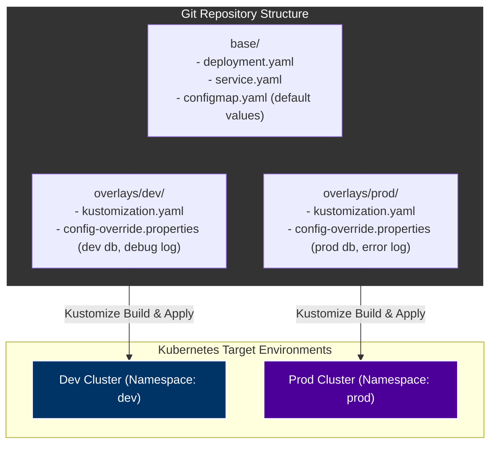

---

## 10. GitOps Configuration Architecture
Displays the security separation where Git only contains reference pointers (ExternalSecrets), preventing actual credentials from leaking into Git commits.

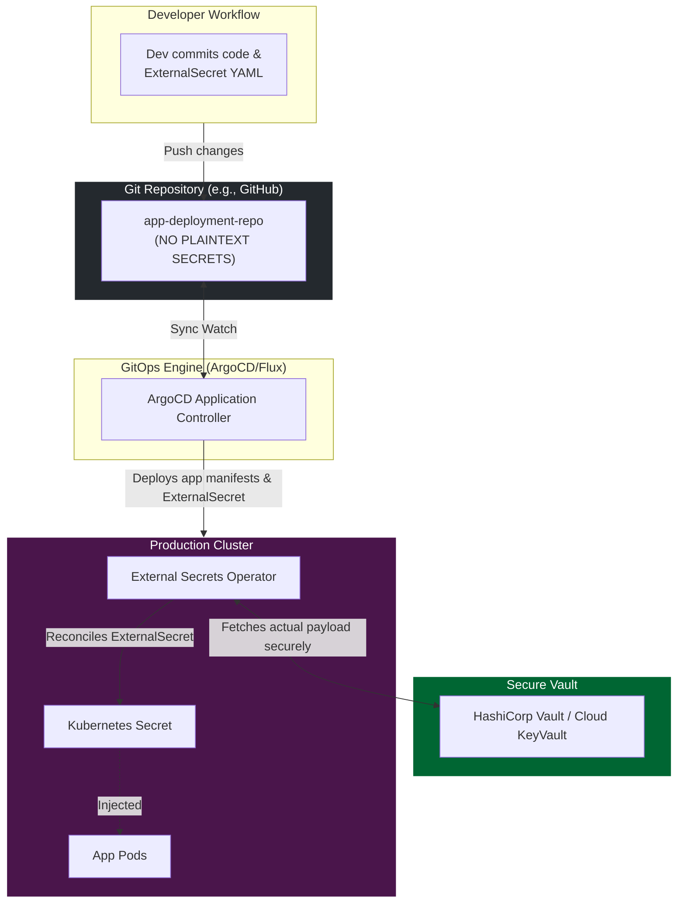

---

## 11. Production Secret Management Architecture
Illustrates a locked-down production flow incorporating RBAC, KMS envelope encryption, NodeRestriction, and read-only volume-based file mounts.

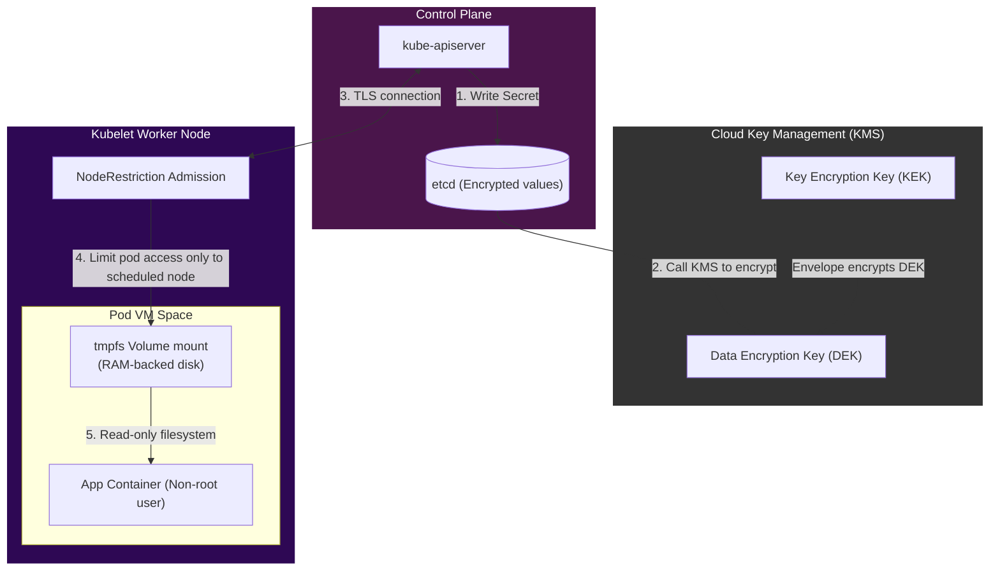

---

## 12. End-to-End Secret Retrieval Workflow
Detailed timeline representation of a GitOps deployed pod retrieving an external secret.

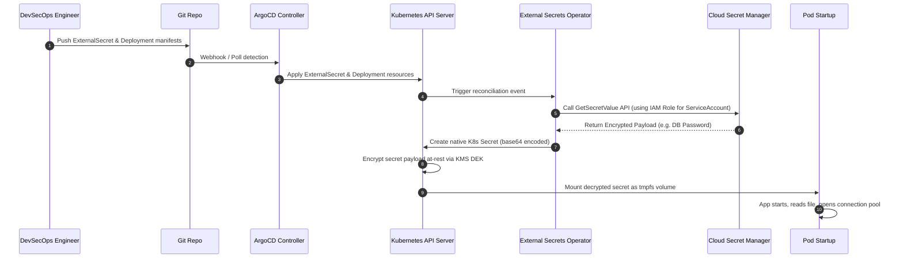
