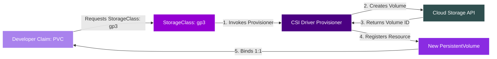
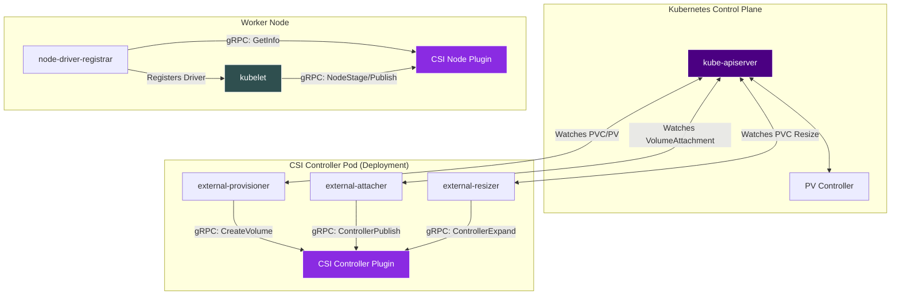
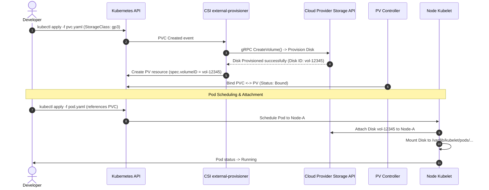
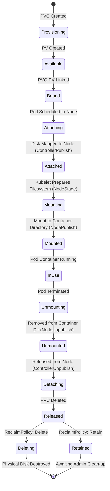
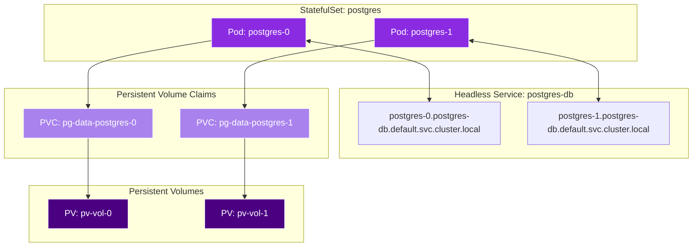
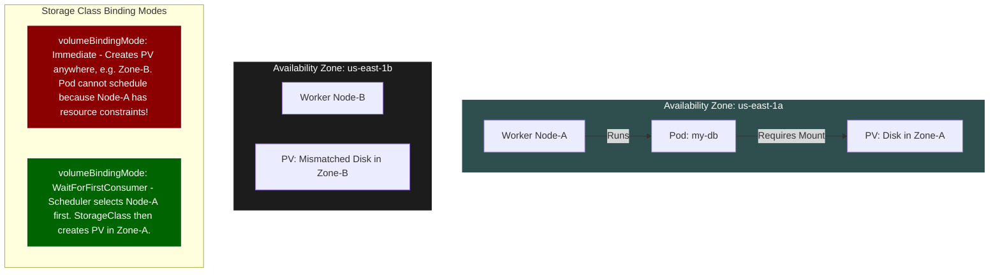
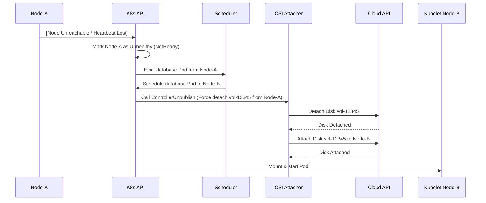
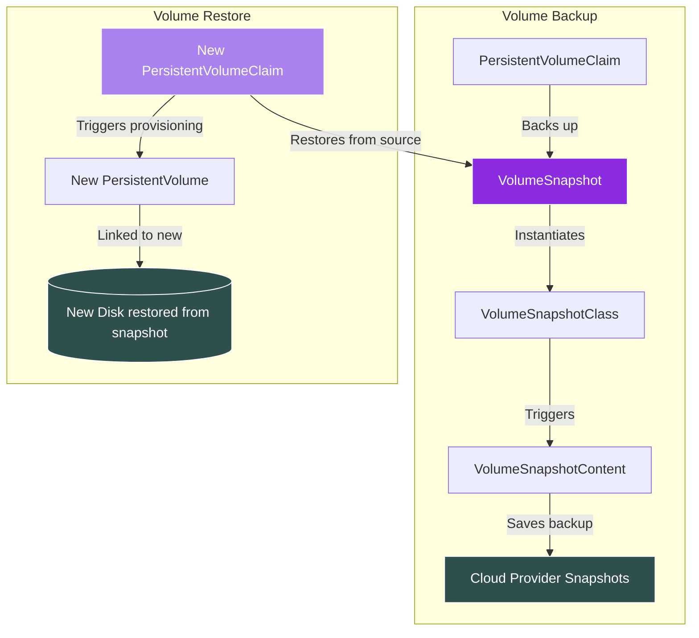
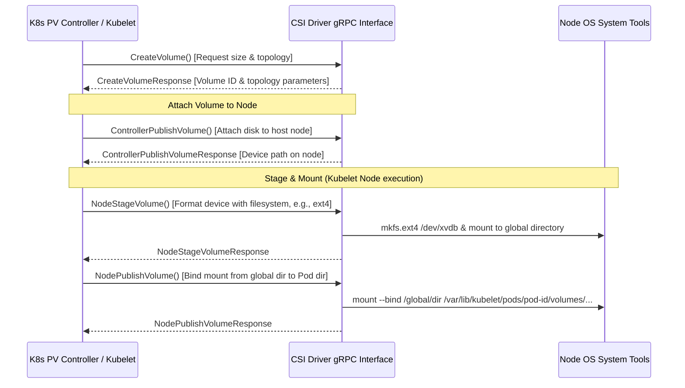
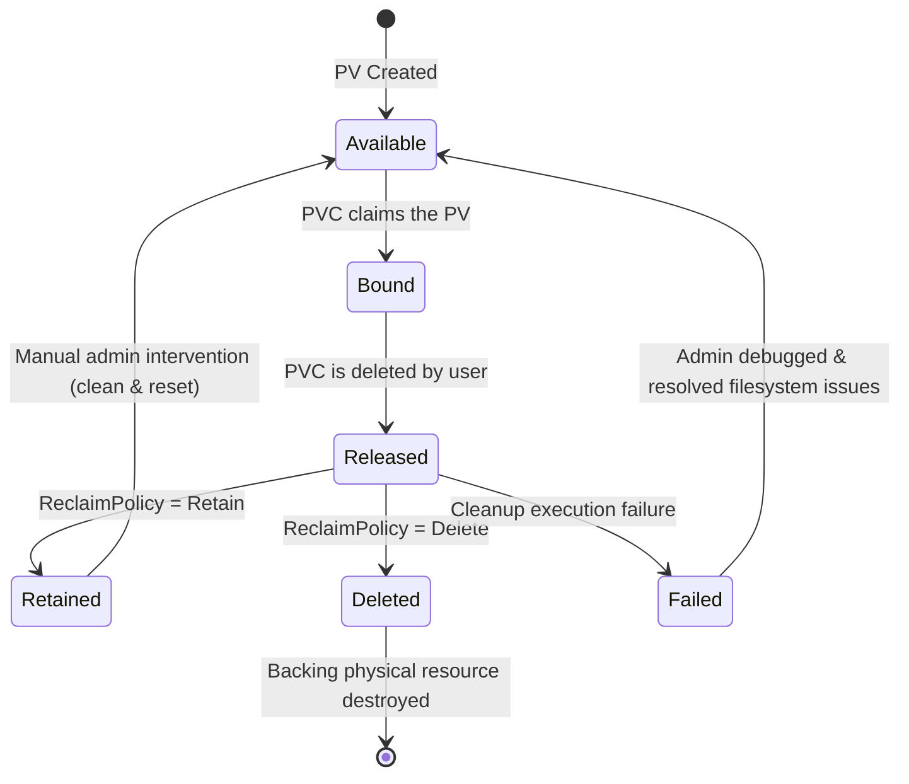

# 📊 Day 08 — Storage Architecture Diagrams

This document contains 12 professional-grade Mermaid diagrams designed to visualize how Kubernetes decouples compute from storage, manages lifecycle transitions, coordinates with CSI drivers, and ensures high availability for stateful workloads.

---

## 1. Pod → PVC → PV Binding Workflow
This diagram illustrates the logical separation of concerns. The developer only interacts with the Pod and the PVC, while the cluster maps them to a PV and the underlying physical disk.

```mermaid
graph TD
    subgraph DeveloperSpace ["Developer Domain (Namespaced)"]
        Pod["Pod: postgres-0"]
        PVC["PersistentVolumeClaim: pg-data-postgres-0"]
    end

    subgraph AdminSpace ["Cluster Infrastructure (Cluster-Scoped)"]
        PV["PersistentVolume: pv-ebs-vol-08f2e9"]
        CloudDisk[("Physical Cloud Disk: AWS EBS gp3")]
    end

    Pod -->|1. Mounts volume 'pg-storage'| PVC
    PVC -->|2. Logically binds to (1:1)| PV
    PV -->|3. References physical volume ID| CloudDisk
    
    style Pod fill:#8a2be2,stroke:#fff,stroke-width:2px,color:#fff
    style PVC fill:#a982ed,stroke:#fff,stroke-width:2px,color:#fff
    style PV fill:#4b0082,stroke:#fff,stroke-width:2px,color:#fff
    style CloudDisk fill:#2f4f4f,stroke:#fff,stroke-width:2px,color:#fff
```

---

## 2. Storage Class Dynamic Provisioning Architecture
The StorageClass acts as a "factory blueprint". When a claim requests a StorageClass, it triggers the provisioner to automatically build the PV.



---

## 3. CSI Component Architecture
The Container Storage Interface (CSI) separates Kubernetes core logic from cloud-specific driver code. It utilizes sidecar containers to bridge K8s events with the storage driver.



---

## 4. Dynamic Provisioning Sequence Flow
This step-by-step sequence diagram shows what happens when a developer applies a PVC file to a cluster with dynamic provisioning.



---

## 5. Volume Attachment Lifecycle
This state diagram represents the lifecycle states of a volume, from creation to final clean-up.



---

## 6. Stateful Application Architecture
StatefulSets ensure each pod maintains a stable ordinal identifier (`-0`, `-1`, `-2`) mapped to a dedicated PVC and PV. If `postgres-1` dies, it mounts the exact same `pvc-1` when rescheduled.



---

## 7. Multi-Zone Storage Architecture
This diagram contrasts the impact of `volumeBindingMode: Immediate` (bad) versus `WaitForFirstConsumer` (good).



---

## 8. Database Storage Write Path
Illustrates the layers a write operation undergoes in a Kubernetes Pod running a transactional database before hitting non-volatile media.

```mermaid
graph TD
    App["Database App Container"] -->|1. Write SQL Statement| WAL["Write-Ahead Log / Page Cache"]
    WAL -->|2. OS Cache Buffer| KubeMount["Container Mount: /var/lib/postgresql/data"]
    KubeMount -->|3. Kubelet Loop device/Direct map| NodeMount["Node Host Mount: /var/lib/kubelet/..."]
    NodeMount -->|4. CSI Driver Protocol| NetworkStorage["Network Fabric / SAN Controller"]
    NetworkStorage -->|5. fsync() write confirmation| DiskController["Physical NVMe/SSD Disk Controller"]
    
    style App fill:#8a2be2,stroke:#fff,color:#fff
    style WAL fill:#9400d3,stroke:#fff,color:#fff
    style DiskController fill:#2f4f4f,stroke:#fff,color:#fff
```

---

## 9. Storage Node Failure & Recovery Flow
When a node becomes unhealthy, Kubernetes must migrate stateful workloads safely. Since block storage is ReadWriteOnce, force evictions require clean volume disassociations.



---

## 10. Backup and Restore Architecture
Using custom Volume Snapshots, developers can request point-in-time copies of their production volumes directly via the Kubernetes API.



---

## 11. CSI Driver gRPC Interaction Sequence
This sequence details the low-level gRPC calls made by Kubernetes sidecars and Kubelets to the CSI driver during volume lifecycle changes.



---

## 12. Persistent Storage Lifecycle State Machine
A PersistentVolume cycles through several phases during its lifecycle. This state machine demonstrates the transitions and policies.


