# 📊 Day 09 Diagrams — StatefulSet & Database Architectures

This page contains professional, enterprise-grade architecture diagrams visualizing the internal mechanics of StatefulSets and distributed database clustering on Kubernetes.

---

## 1. Deployment vs. StatefulSet

This diagram highlights the differences in how Deployments and StatefulSets manage Pod naming, networking, and storage mapping.

```mermaid
graph TD
    subgraph "Deployment (Stateless)"
        dep[Deployment Controller] --> rep_dep[ReplicaSet]
        rep_dep --> pod_d1[Pod: web-7ab8f]
        rep_dep --> pod_d2[Pod: web-9cf1a]
        pod_d1 -.-> pvc_d[Single Shared PVC / No PVC]
        pod_d2 -.-> pvc_d
        svc_d[Standard LoadBalancer Service] --> pod_d1
        svc_d --> pod_d2
    end

    subgraph "StatefulSet (Stateful)"
        sts[StatefulSet Controller] --> pod_s0[Pod: db-0]
        sts --> pod_s1[Pod: db-1]
        pod_s0 --> pvc_s0[PVC: data-db-0]
        pod_s1 --> pvc_s1[PVC: data-db-1]
        pvc_s0 --> pv_s0[PV: vol-001]
        pvc_s1 --> pv_s1[PV: vol-002]
        svc_s[Headless Service: db-headless]
        svc_s -.->|db-0.db-headless| pod_s0
        svc_s -.->|db-1.db-headless| pod_s1
    end

    style dep fill:#5f27cd,stroke:#341f97,stroke-width:2px,color:#fff
    style sts fill:#5f27cd,stroke:#341f97,stroke-width:2px,color:#fff
    style pod_d1 fill:#222f3e,stroke:#576574,stroke-width:1px,color:#fff
    style pod_d2 fill:#222f3e,stroke:#576574,stroke-width:1px,color:#fff
    style pod_s0 fill:#10ac84,stroke:#0f8f6b,stroke-width:2px,color:#fff
    style pod_s1 fill:#10ac84,stroke:#0f8f6b,stroke-width:2px,color:#fff
```

---

## 2. StatefulSet Architecture

A structural view of the StatefulSet environment. The controller coordinates scheduling, mapping ordinal index pods to unique persistent volume claims.

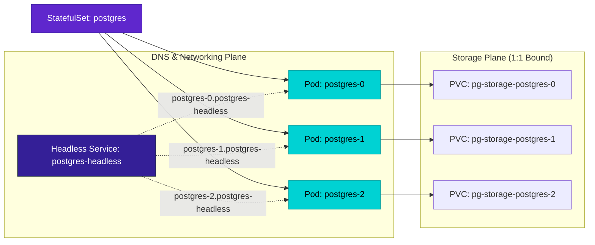

---

## 3. Stable Pod Identity Workflow

This sequence shows how a Pod retains its hostname and storage binding across a rescheduling event (e.g. node crash).

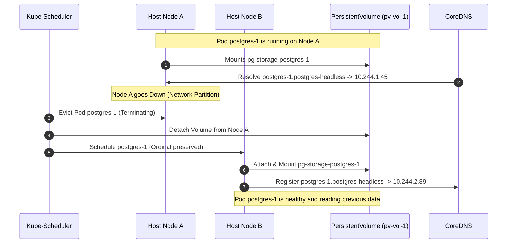

---

## 4. Persistent Storage Binding

Visualization of `volumeClaimTemplates` generating independent claims rather than sharing a volume.

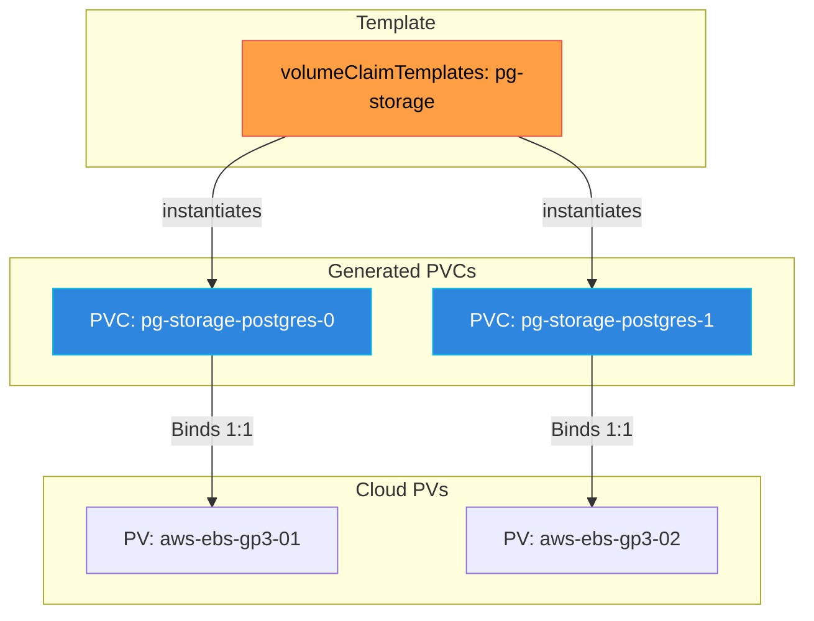

---

## 5. Kafka Cluster Architecture (KRaft Mode)

A 3-node Apache Kafka cluster running without ZooKeeper. The controllers form a raft quorum via port 9093, and clients publish logs on port 9092.

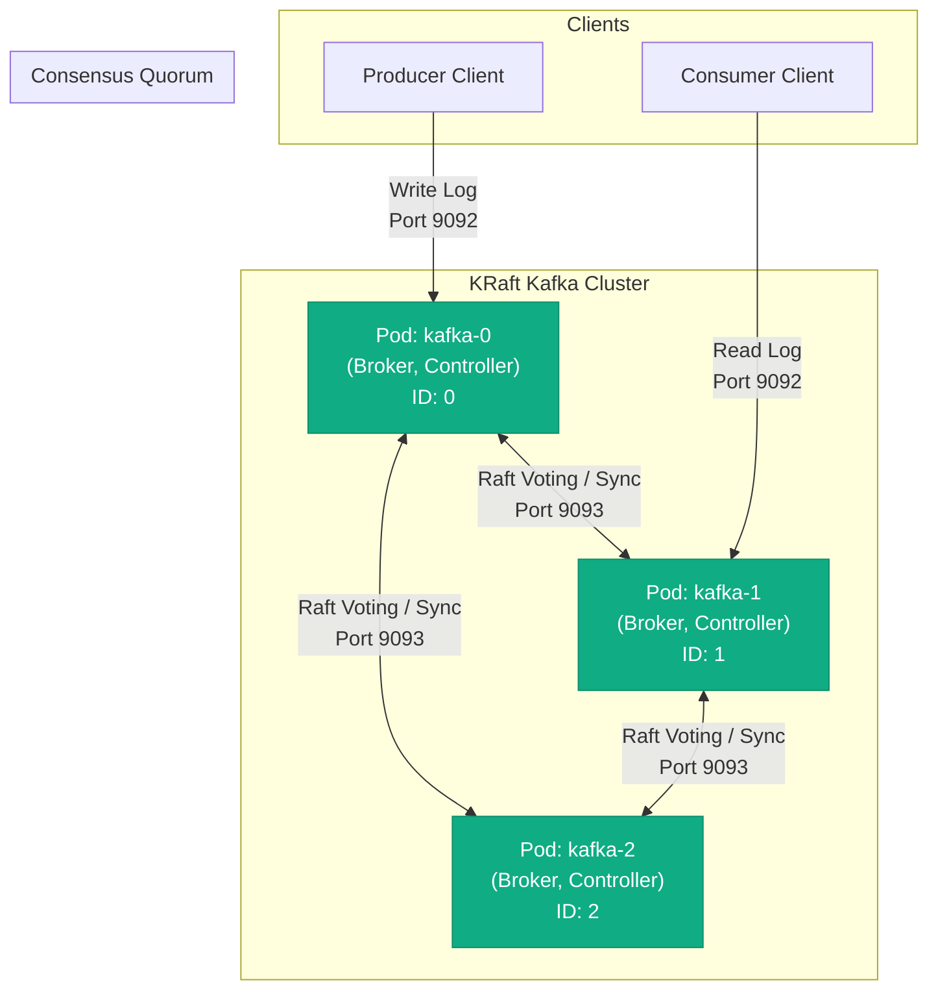

---

## 6. PostgreSQL Replication (Leader-Follower)

PostgreSQL running with one Read-Write Leader and two Read-Only Replicas.

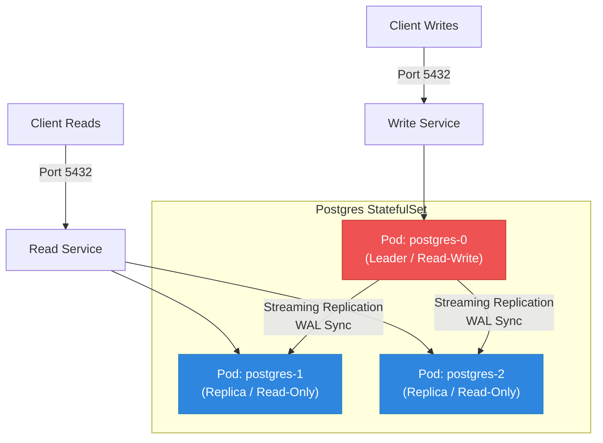

---

## 7. Elasticsearch Cluster Topology

Elasticsearch nodes dynamically discover each other using Headless DNS and form a master quorum while distributing index shards.

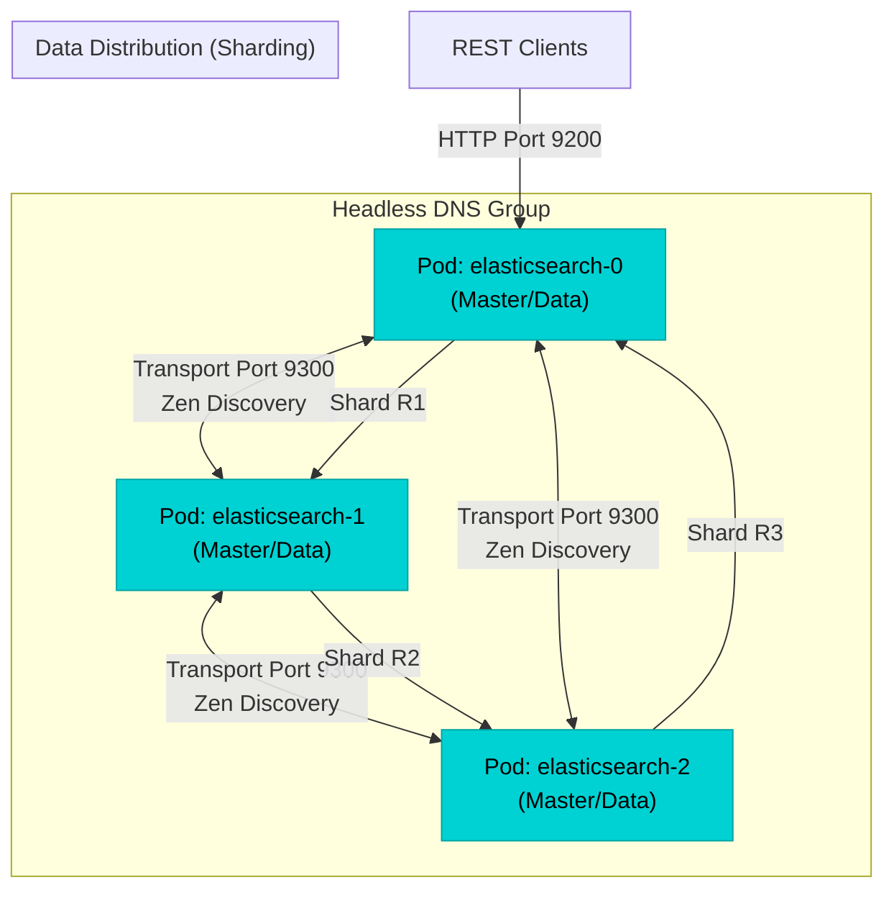

---

## 8. Apache Pinot Architecture

Pinot decouples storage and query execution, showing stateful and stateless components on Kubernetes.

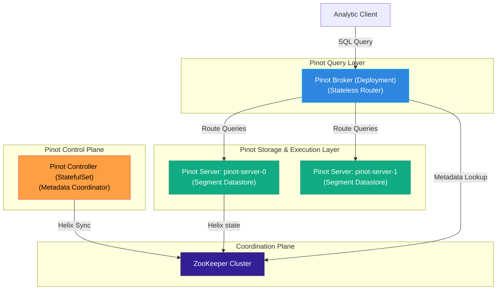

---

## 9. Ordered Startup Sequence

Unlike Deployments where all pods schedule concurrently, StatefulSets instantiate pods sequentially.

```mermaid
gantt
    title StatefulSet Startup Timeline (OrderedReady)
    dateFormat  X
    axisFormat %s

    section Pod: db-0
    Scheduling & Pulling    :active, 0, 5
    Init Containers Running  : 5, 8
    Main Container Booting   : 8, 12
    Liveness & Readiness Pass :crit, 12, 15

    section Pod: db-1
    Waiting for db-0 Ready   : 0, 15
    Scheduling & Pulling    :active, 15, 20
    Init Containers Running  : 20, 23
    Main Container Booting   : 23, 27
    Liveness & Readiness Pass :crit, 27, 30

    section Pod: db-2
    Waiting for db-1 Ready   : 0, 30
    Scheduling & Pulling    :active, 30, 35
```

---

## 10. Node Failure & Auto-Recovery

What happens when a node running a database node crashes?

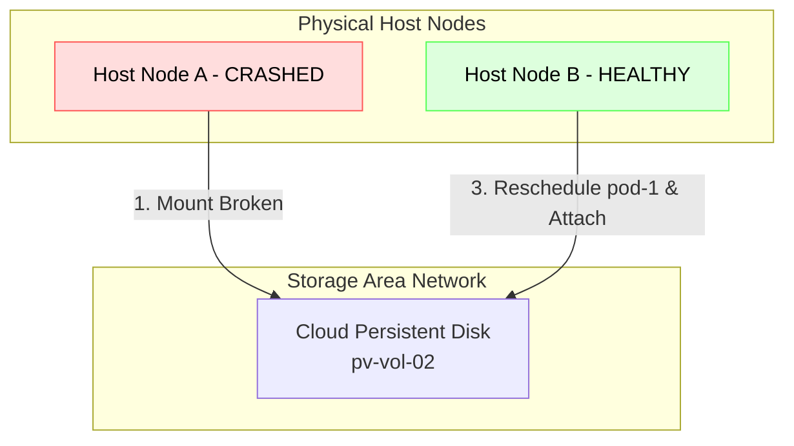

---

## 11. Replica Synchronization Flow

The anatomy of a replicated write. Highlighting WAL committing and replication validation.

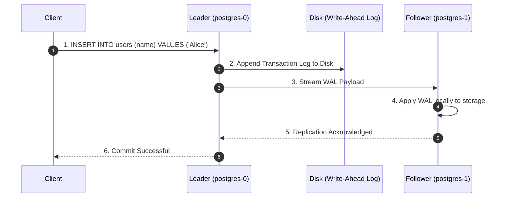

---

## 12. Stateful Application Lifecycle

A state machine showing the path of a stateful workload from creation to upgrade, downscaling, and volume decommissioning.

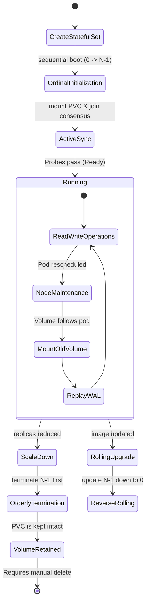
