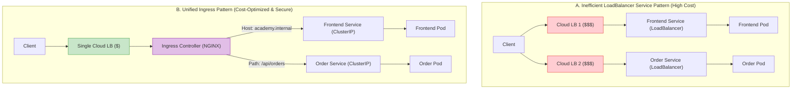
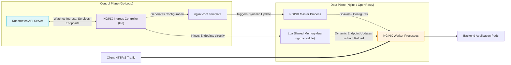
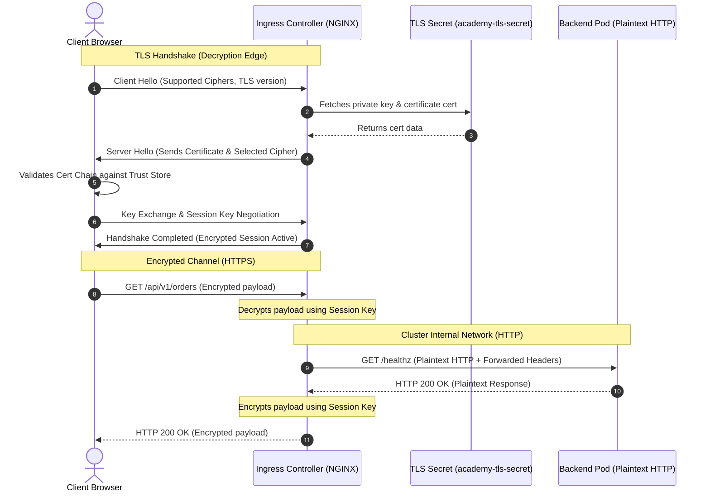
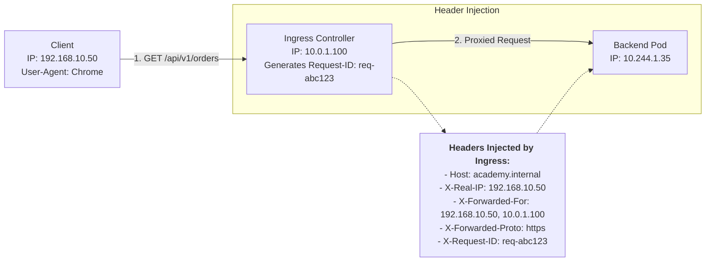
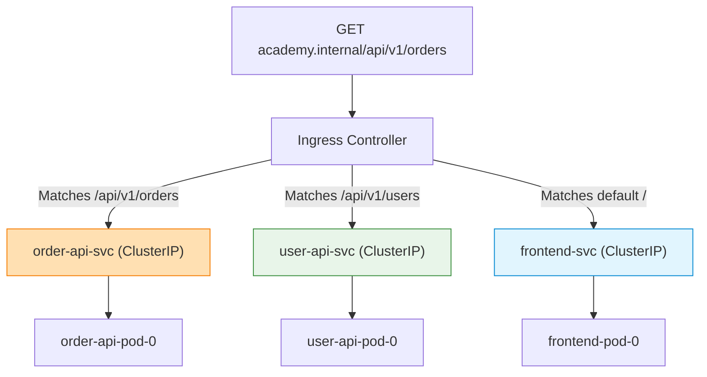
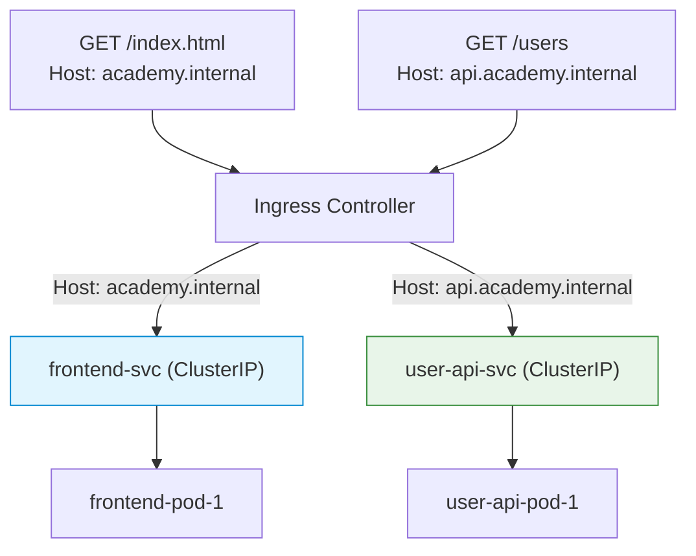
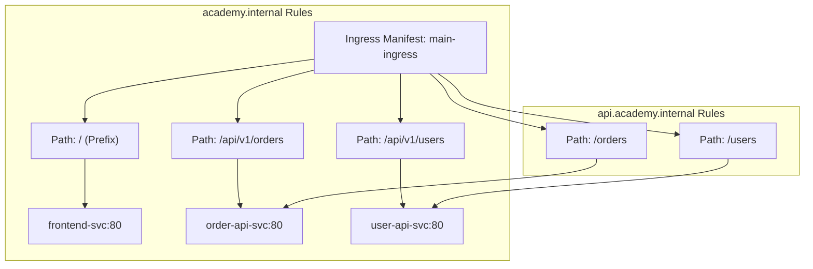
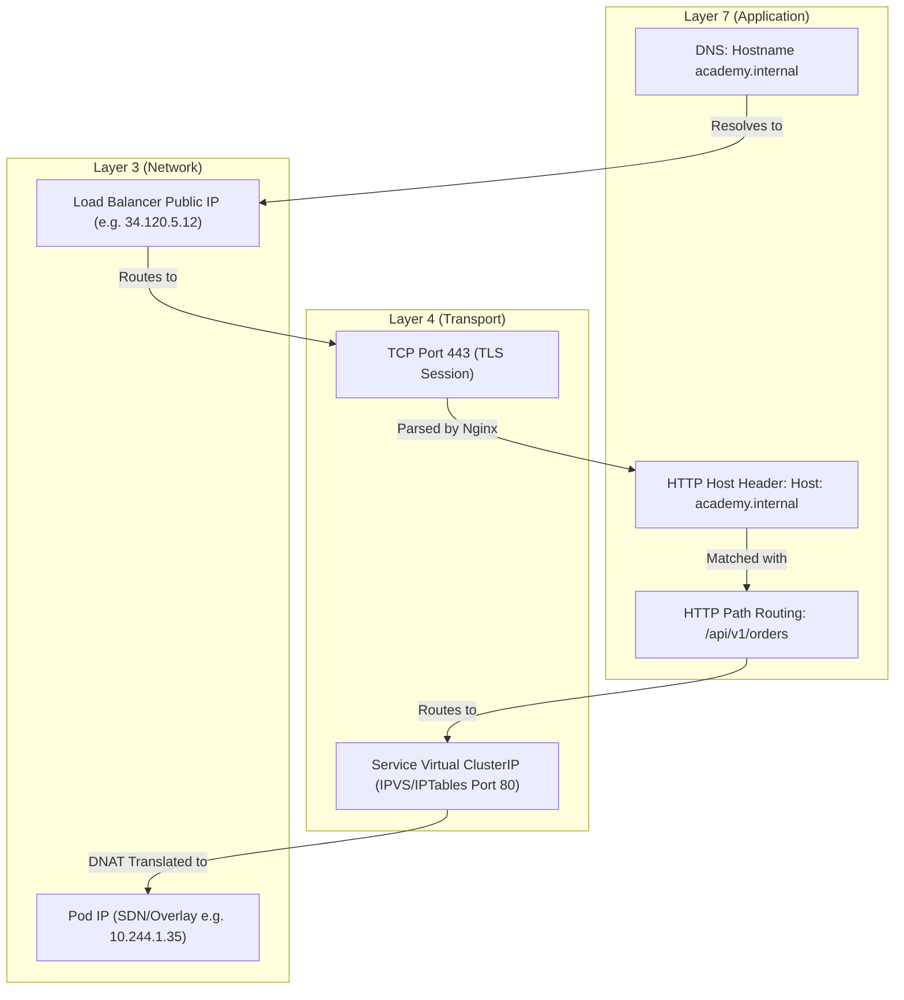
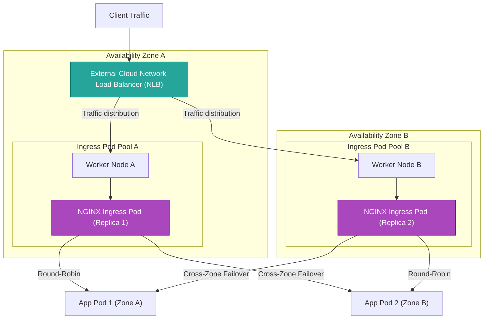
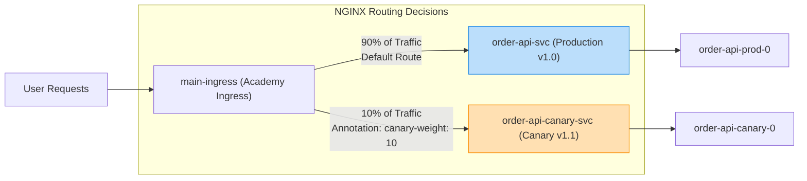

# 📊 Ingress & Traffic Routing Diagrams

Visual blueprints illustrating how external traffic is routed, secured, and proxy-forwarded within a production Kubernetes cluster.

---

## 1. External Traffic Flow
This diagram traces the flow of a client's request from DNS resolution through the cloud infrastructure down to the target pod inside the Kubernetes cluster.

```mermaid
graph TD
    Client["Client Browser"] -->|1. DNS Lookup: academy.internal| DNS["DNS Server (Route53/Cloudflare)"]
    DNS -->|2. Returns LB IP| Client
    Client -->|3. HTTPS Request (Port 443)| CloudLB["Cloud Load Balancer (NLB/ALB)"]
    CloudLB -->|4. Routes to NodePort| K8sNode1["K8s Worker Node 1 (IP: 10.0.1.10)"]
    CloudLB -->|4. Routes to NodePort| K8sNode2["K8s Worker Node 2 (IP: 10.0.1.11)"]
    
    subgraph "Kubernetes Cluster ClusterIP Range"
        K8sNode1 -->|Port 32080/32443| IngressPod1["NGINX Ingress Pod (Replica 1)"]
        K8sNode2 -->|Port 32080/32443| IngressPod2["NGINX Ingress Pod (Replica 2)"]
        
        IngressPod1 -->|5. Routes directly to Pod IP| PodA["Order API Pod (10.244.1.35)"]
        IngressPod2 -->|5. Routes directly to Pod IP| PodB["Order API Pod (10.244.2.82)"]
    end

    style Client fill:#3F51B5,stroke:#303F9F,stroke-width:2px,color:#fff
    style CloudLB fill:#FF5722,stroke:#E64A19,stroke-width:2px,color:#fff
    style IngressPod1 fill:#9C27B0,stroke:#7B1FA2,stroke-width:2px,color:#fff
    style IngressPod2 fill:#9C27B0,stroke:#7B1FA2,stroke-width:2px,color:#fff
    style PodA fill:#4CAF50,stroke:#388E3C,stroke-width:2px,color:#fff
    style PodB fill:#4CAF50,stroke:#388E3C,stroke-width:2px,color:#fff
```

---

## 2. Service vs Ingress Architecture
Compare the cost-inefficient "LoadBalancer-for-everything" approach with the unified "Ingress Controller" pattern.



---

## 3. NGINX Ingress Controller Architecture
The interaction between the Control Plane (watching resources via the API server) and the Data Plane (parsing configuration and proxying traffic).



---

## 4. TLS Termination Workflow
This sequence diagram shows how HTTPS encryption is terminated at the Ingress controller, and subsequent communications are forwarded within the cluster.



---

## 5. Reverse Proxy Architecture & Header Mutation
See how the Ingress proxy acts as an intermediary, injecting client context metadata into headers before dispatching upstream.



---

## 6. Path-Based Routing
Routing requests to different microservices based on the URL path structure.



---

## 7. Host-Based Routing
Routing requests to completely different services using the incoming HTTP Host header.



---

## 8. Multi-Service Ingress Topology
Single configuration resource managing multiple hosts and routing paths.



---

## 9. Request Lifecycle Timeline
A millisecond-resolution journey of a single packet starting at the client socket down to backend processing.

```mermaid
gantt
    title Request Lifecycle Timeline
    dateFormat  S
    axisFormat %L ms
    
    section Client
    DNS Resolution              :active, dns, 0, 15
    TCP Handshake (SYN/ACK)    :active, tcp, 15, 35
    TLS Handshake Negotiation   :active, tls, 35, 75
    Send HTTP Request           :active, req, 75, 80
    
    section Ingress Controller
    Parse Headers & Match Rules:crit, parse, 80, 83
    Lookup Backend Endpoint IP :crit, lookup, 83, 84
    Forward Request Upstream   :crit, proxy, 84, 88
    
    section Pod Backend
    Process Application Logic  :active, app, 88, 120
    Write JSON Response        :active, resp, 120, 122
    
    section Network Return
    Transfer Bytes to Client   :active, ret, 122, 140
```

---

## 10. DNS -> Ingress -> Service -> Pod OSI/Layer Flow
How the network resolution shifts layer responsibilities down the networking stack.



---

## 11. Production HA Ingress Controller Architecture
The gold standard for production-grade high-availability: multi-zone node pools, pod anti-affinity, and external load balancers.



---

## 12. Canary Traffic Routing
Implementing blue-green or canary rollouts using Ingress annotations to split backend targets.


