# 📊 Day 11: Helm Deep Dive Diagrams

This collection contains 12 professional visual blueprints illustrating Helm's architecture, templating loops, lifecycle states, upgrade mechanics, and enterprise GitOps integration.

---

## 1. Helm v3 Architecture
Helm v3 operates as a client-only CLI. It communicates directly with the Kubernetes API Server and stores release histories in cluster-native `Secrets` within the deployment namespace.

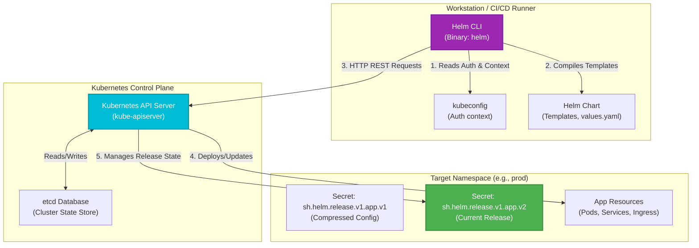

---

## 2. Helm Chart Folder Structure
The file layout of a standard Helm chart package.

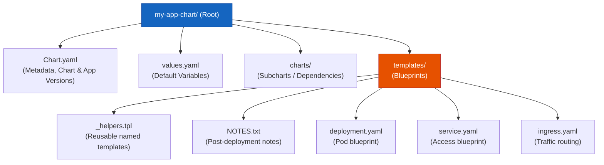

---

## 3. Template Rendering Workflow
How Helm compiles parameters and blueprints into raw manifest code ready for Kubernetes ingestion.

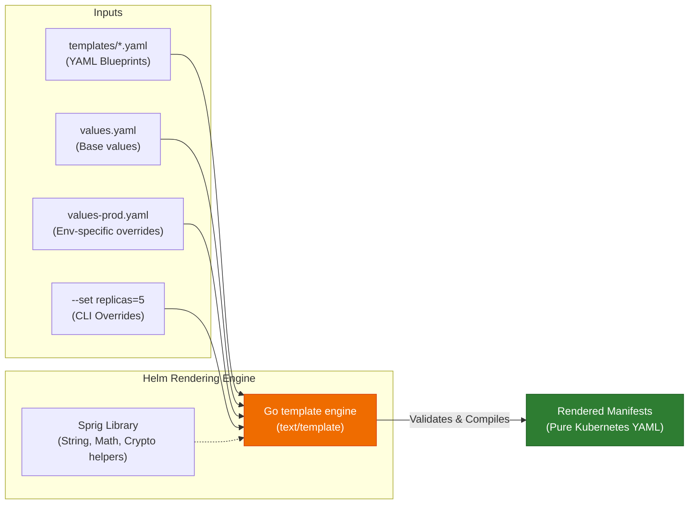

---

## 4. Values Injection & Merge Precedence
The hierarchy of configuration merging. Values listed lower in the diagram override those above them.

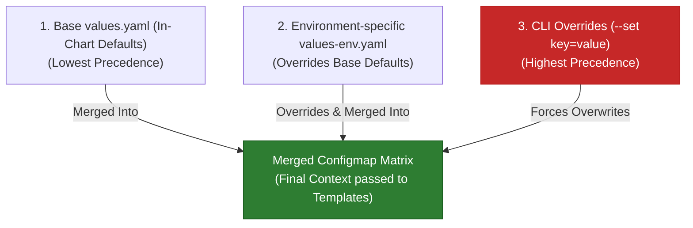

---

## 5. Release Lifecycle States
The state machine of a Helm release revision.

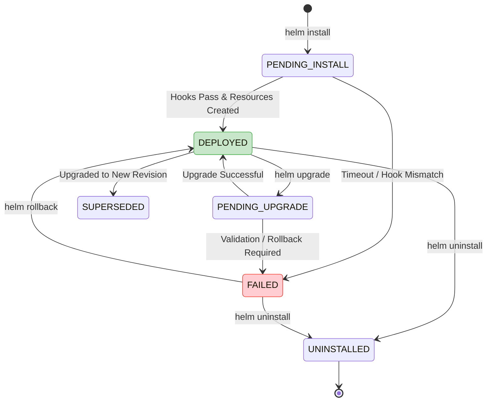

---

## 6. Upgrade Workflow (Three-Way Merge Patch)
Helm v3 uses a three-way strategic merge patch comparing: the **old release manifest**, the **live cluster state** (which may have manual changes), and the **proposed new manifest**.

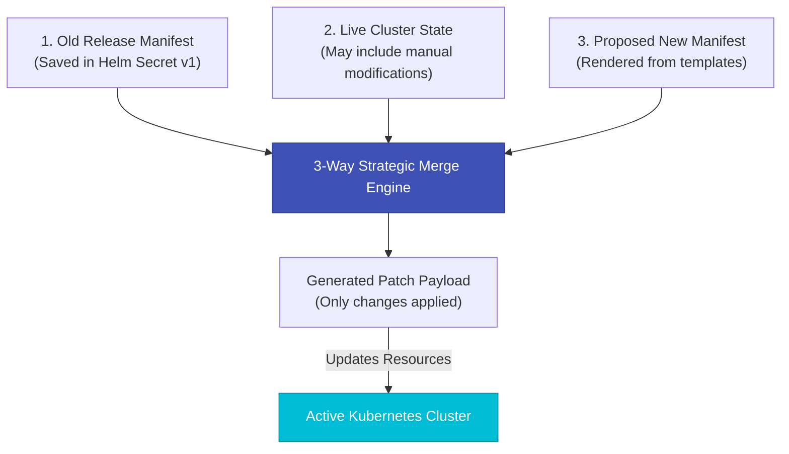

---

## 7. Rollback Workflow
When a rollback is triggered, Helm extracts historical manifests from its Release Secret store, processes them, and commits them as a new revision.

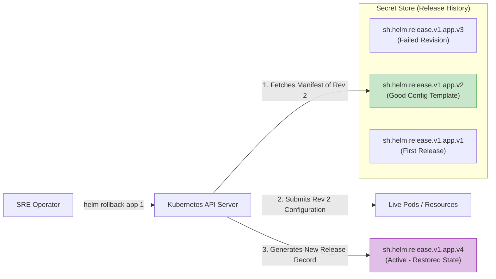

---

## 8. Multi-Environment Promotion Pipeline
How a single Helm chart is promoted across environments using value overlays.

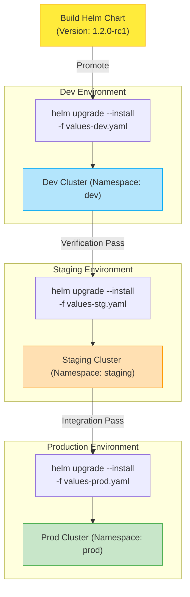

---

## 9. Helm Repository Architecture
Comparison between traditional HTTP/S static Chart repositories and modern OCI registries.

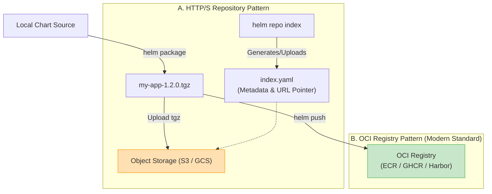

---

## 10. Production CI/CD Pipeline
Continuous integration and continuous deployment pipeline using Helm.

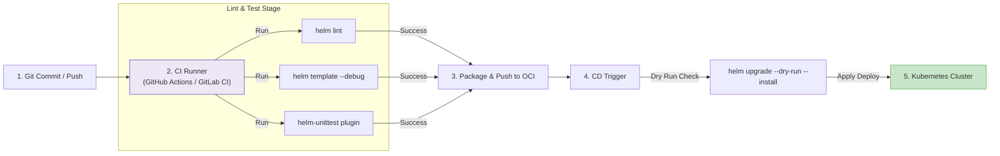

---

## 11. GitOps Integration (ArgoCD & Flux)
The GitOps approach: the Git repository is the source of truth, and controllers in the cluster pull charts and values to reconcile state.

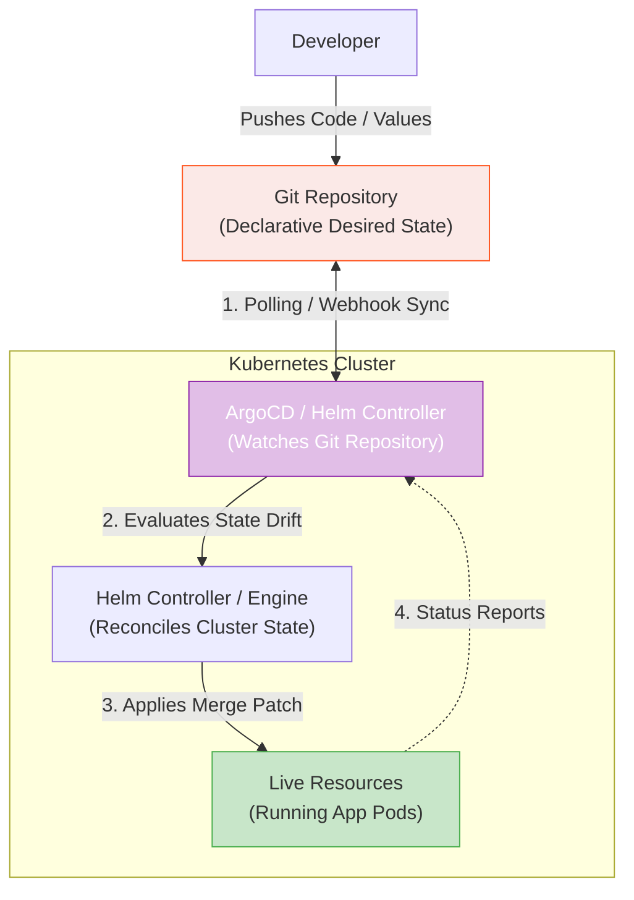

---

## 12. Enterprise Production Deployment Architecture
An enterprise-grade release topology. A single Helm upgrade coordinates the entire system, configuring autoscaling, high-availability pod layout, security parameters, and routing structures.

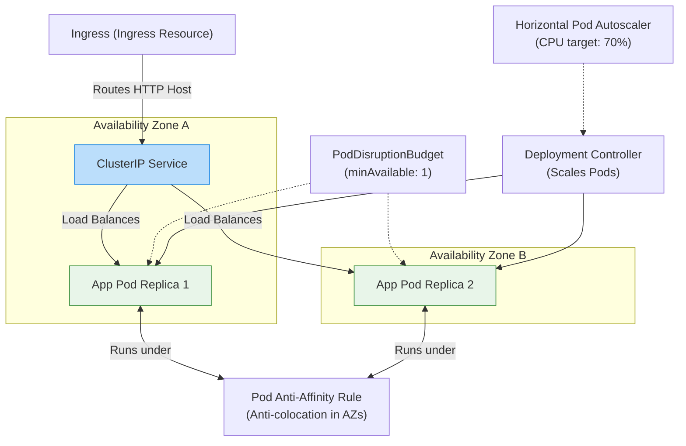
