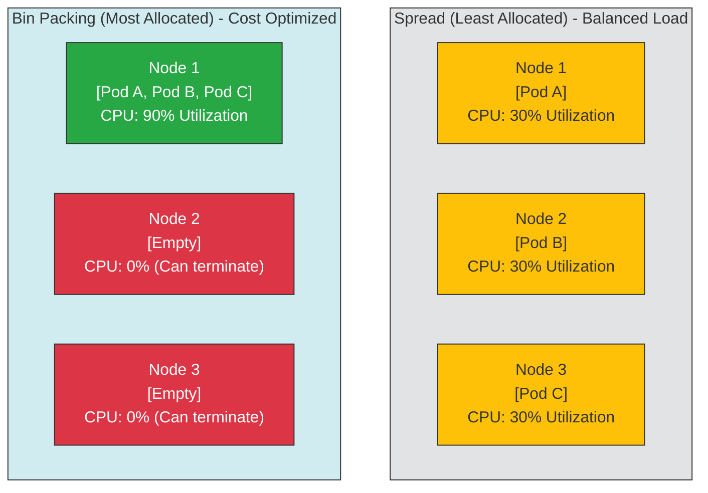

# 📦 Bin Packing vs Spread

This diagram contrasts the default "Spread" (Least Allocated) strategy with the "Bin Packing" (Most Allocated) strategy.

### Explanatory Summary
- **Spread:** Pods are distributed evenly across nodes. Good for safety and performance isolation, but results in high under-utilization and prevents cluster downscaling (higher cost).
- **Bin Packing:** Pods are tightly packed onto the minimum number of nodes. Nodes 2 and 3 can be terminated by the Cluster Autoscaler / Karpenter, reducing infrastructure costs.
