# 📉 Cluster Utilization Example

This diagram demonstrates a common production scenario where a node's Capacity, Scheduled Requests (Reservations), and Actual Runtime Resource Usage diverge.

```mermaid
gantt
    title Node Allocation Breakdown (Total Node Capacity: 8 CPU, 16Gi Memory)
    dateFormat  X
    axisFormat %s
    
    section CPU (Cores)
    Kube-Reserved (0.5 Core)   :active, 0, 5
    Allocated Requests (5.5 Cores) :done, 5, 60
    Slack Request Space (Unused Cores) :crit, 60, 80
    Available for Scheduling (2.0 Cores) :active, 80, 100

    section Memory (GiB)
    SystemReserved (1.0 GiB) :active, 0, 10
    Allocated Requests (10.0 GiB) :done, 10, 70
    Slack Memory Space (Unused GiB) :crit, 70, 90
    Available for Scheduling (5.0 GiB) :active, 90, 160
```

### Explanatory Summary
- **Allocated Requests (Guaranteed Reservation):** The scheduler will refuse to place new Pods if their requests exceed the remaining "Available for Scheduling" space (2.0 CPU / 5.0 GiB), even if actual usage is very low.
- **Slack Space:** The gap between *Allocated Requests* and *Actual Usage*. Having large amounts of slack space represents **wasted spend** and cluster inefficiency, which can be mitigated via sizing tuning or bin packing.
- **System Reserved:** Dedicated capacity set aside for OS daemons (`systemd`, `ssh`) and Kubernetes daemons (`kubelet`, `containerd`), configured via `--kube-reserved` and `--system-reserved`.
