# ⏱️ CPU Throttling Visualization

This diagram visualizes how the Completely Fair Scheduler (CFS) bandwidth control throttles a container when it exhausts its allocated CPU quota within a 100ms period.

```mermaid
gantt
    title CFS Quota Period (100ms Window) - Limit set to 0.5 CPU (50ms Quota)
    dateFormat  X
    axisFormat %s

    section Thread Activity (Container Runtime)
    Workload processing (Thread 1) :active, 0, 30
    Workload processing (Thread 2) :active, 0, 20
    Throttled Window (All threads blocked) :crit, 30, 100

    section CFS Quota Tracker
    Quota Remaining (50ms) :done, 0, 30
    Quota Exhausted (0ms)   :crit, 30, 100
```

### Explanatory Summary
1. **Multi-threading:** If a container runs on a node with multiple CPUs, it can execute threads in parallel.
2. **Quota Consumption:** If a container has a `0.5 CPU` limit (which equates to `50ms` of CPU runtime per `100ms` period), running Thread 1 for `30ms` and Thread 2 for `20ms` in parallel consumes the entire `50ms` budget in just `30ms` of wall-clock time.
3. **Throttling:** The container is **throttled** (suspended from execution) for the remaining `70ms` of the period, leading to sudden response latency spikes.
4. **CFS Period Reset:** At the end of the `100ms` window, the quota is refilled to `50ms`, and the container threads resume execution.
