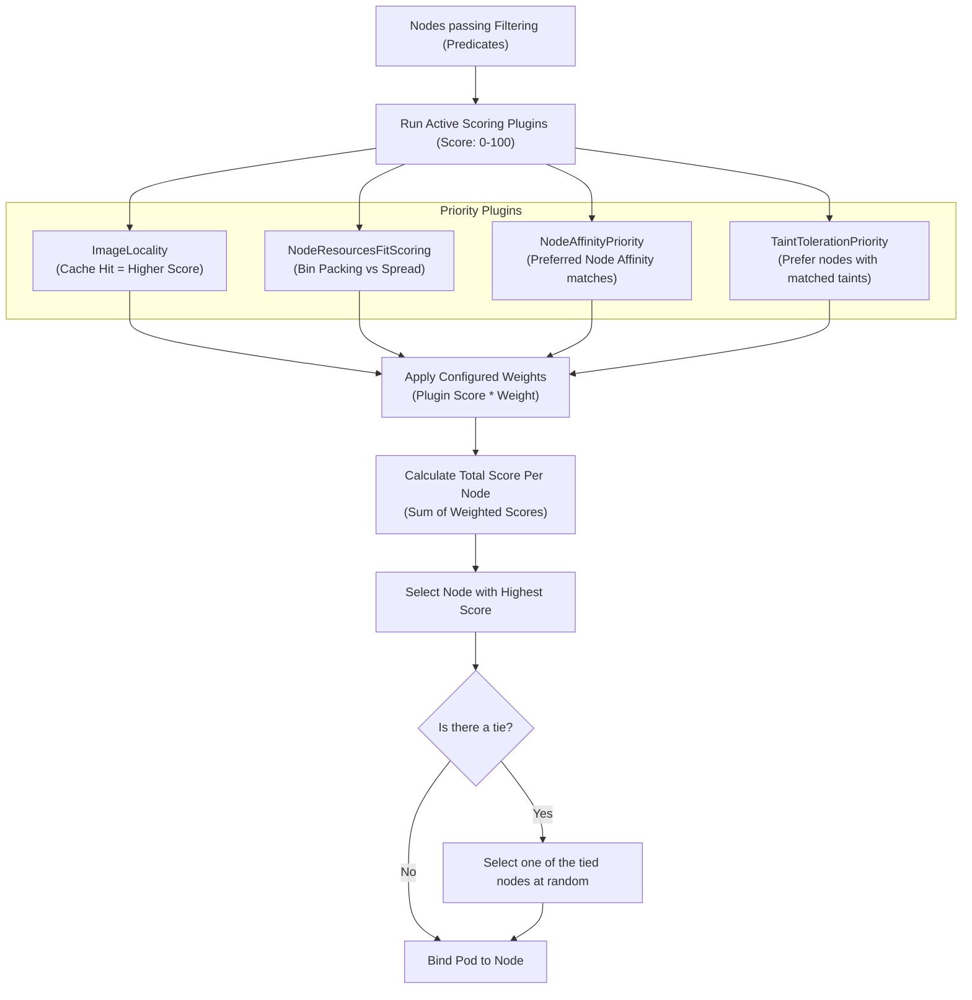

# 💯 Node Scoring Workflow

This flow diagram illustrates the scoring phase where nodes that pass filtering are evaluated against multiple priority plugins to find the optimal target.

### Explanatory Summary
1. **Scoring Plugins:** Each plugin returns a score from `0` to `100` for each candidate node.
2. **Weights:** Plugins are configured with a weight (e.g., `ImageLocality` might have a weight of `1`, while `NodeResourcesFit` has a weight of `10`).
3. **Calculation:**
   $$\text{Final Node Score} = \sum (\text{Plugin Score} \times \text{Weight})$$
4. **Tie Breaking:** In case of identical scores, a round-robin or random selection is applied to distribute workloads.
