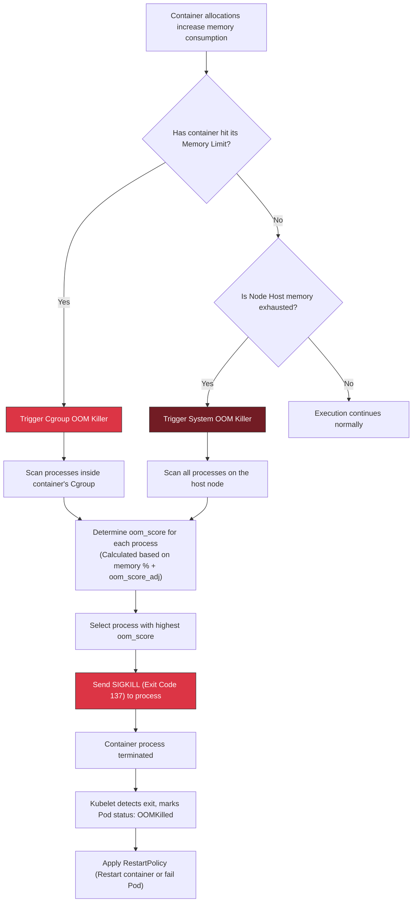

# 💀 OOMKilled Workflow

This workflow diagram illustrates how the Linux Out-Of-Memory (OOM) Killer reacts when a container exceeds its memory limit or when the host runs out of memory.

### Explanatory Summary
- **Cgroup OOM:** Isolated to the container. Only container processes are evaluated, and the container is killed. This is caused by setting limits too low.
- **System OOM:** The entire host is exhausted. The Linux kernel scans the whole node. Due to Kubelet settings, `BestEffort` and `Burstable` container processes have high `oom_score` values, making them the primary targets to save the host.
- **Exit Code 137:** Indicates termination by signal `9` (`SIGKILL` -> $128 + 9 = 137$).
