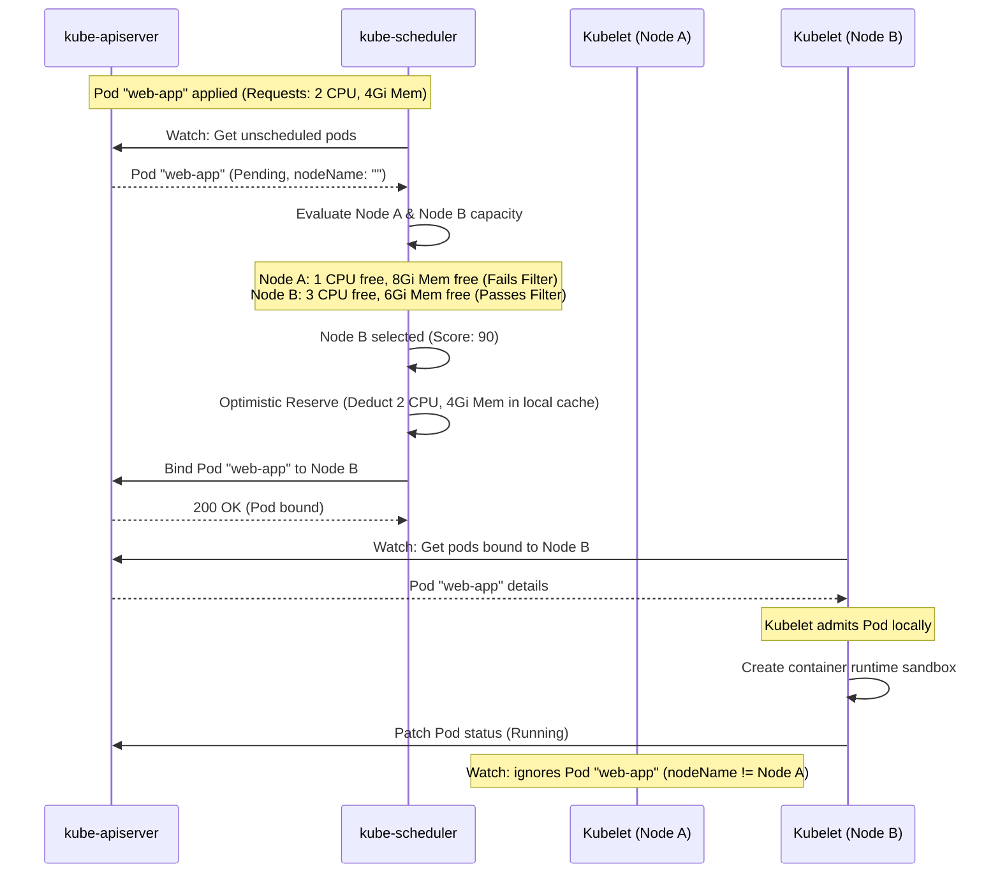

# 🎯 Pod Placement Decisions

This sequence diagram outlines the interaction loop between the Scheduler, Control Plane, and Kubelet that resolves the final placement of a Pod.

### Explanatory Summary
- The Scheduler is the decision-maker; it binds the Pod to a node in the API server.
- The Kubelet on the selected node is the worker that pulls the spec, reserves local resource capacity, builds the cgroup boundaries, and boots the container.
- Other Kubelets ignore the Pod since `spec.nodeName` does not match their own hostname.
