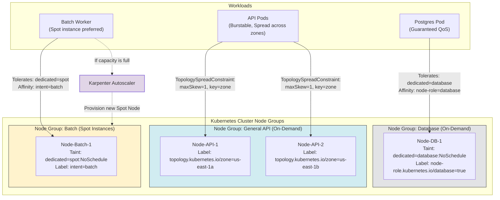

# 🏢 Production Scheduling Architecture

This diagram illustrates how enterprise platforms structure node groups and use labels, taints, and tolerations to organize different types of application workloads.

### Explanatory Summary
1. **Database Workloads:** Kept isolated on premium on-demand nodes using **Taints** (`dedicated=database:NoSchedule`) and **Node Affinity** to prevent noisy neighbors from scheduling there.
2. **Web APIs:** Scheduled across multiple availability zones using **Topology Spread Constraints** to ensure high availability.
3. **Batch Processing:** Uses cheaper Spot instances by tolerating spot taints, allowing significant cost reductions without risking core systems.
4. **Karpenter:** Dynamically intercepts scheduling failures for unschedulable pods, automatically provisioning matching nodes with custom labels/taints directly in AWS/GCP.
