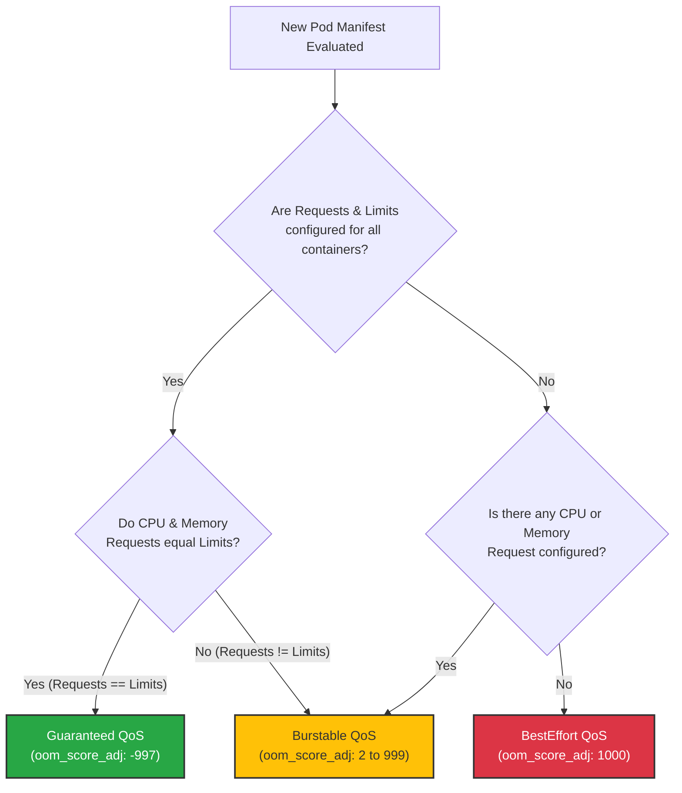

# 🏷️ QoS Classification Flowchart

This decision tree shows the exact classification flow used by Kubelet to determine the Quality of Service (QoS) class of a Pod.

### Explanatory Summary
- **Guaranteed:** Lowest eviction risk. All containers must specify CPU and Memory requests and limits, and they must be equal.
- **Burstable:** Medium eviction risk. At least one container specifies a CPU or Memory request, and they do not match limits (allows bursting above requests).
- **BestEffort:** Highest eviction risk. No resource requests or limits are set in the Pod. These Pods are evicted first under resource pressure.
