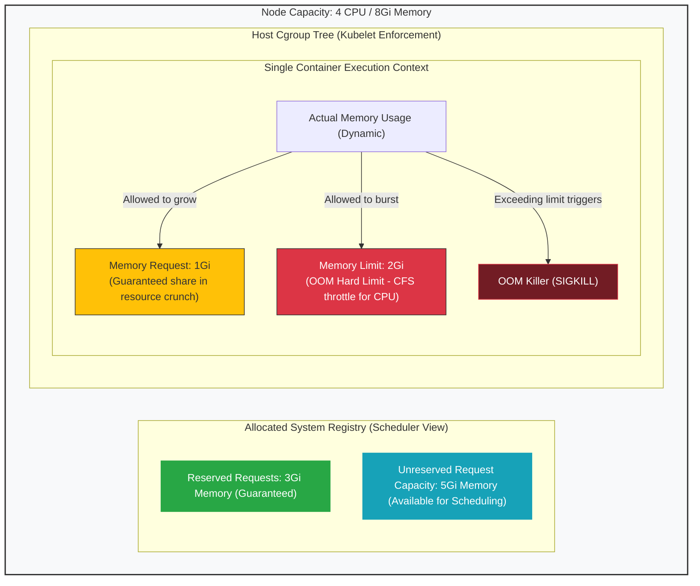

# 📊 Requests vs Limits

This diagram visualizes how Kubernetes handles container allocations (requests) versus hard boundaries (limits) inside a host node.

### Explanatory Summary
- **Scheduler View:** Evaluates node allocatable capacity based purely on the sum of Pod resource **Requests**.
- **Kubelet View:** Enforces actual container usage using cgroups.
- **CPU Limits:** Monitored over 100ms windows; exceeding triggers **CFS Throttling**.
- **Memory Limits:** Exceeding triggers immediate **Out-of-Memory (OOM) termination**.
