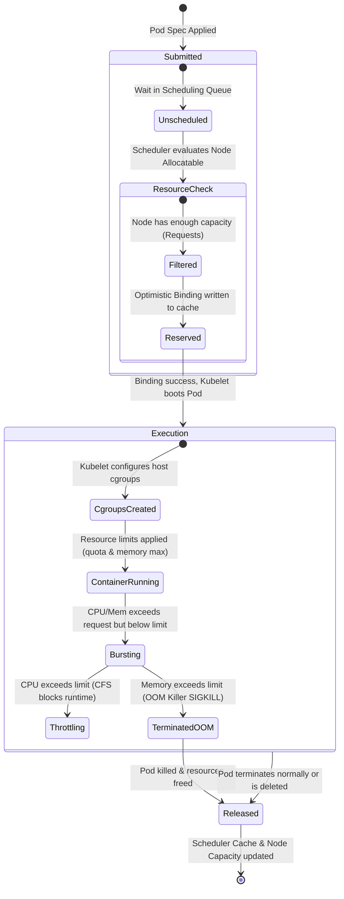

# 🔄 Resource Allocation Lifecycle

This state diagram visualizes the timeline of resource reservation, consumption, and release.

### Explanatory Summary
1. **Unscheduled:** Pod requests are analyzed against the node allocation pools.
2. **Reserved:** The scheduler performs an optimistic booking in its local cache.
3. **Execution:** Cgroups are established on the target host by the Kubelet.
4. **Compression / Termination:** CPU limits trigger throttling; memory limits trigger OOM terminations.
5. **Released:** Upon Pod deletion or termination, the resource allocation ledger is updated to make space for future pods.
