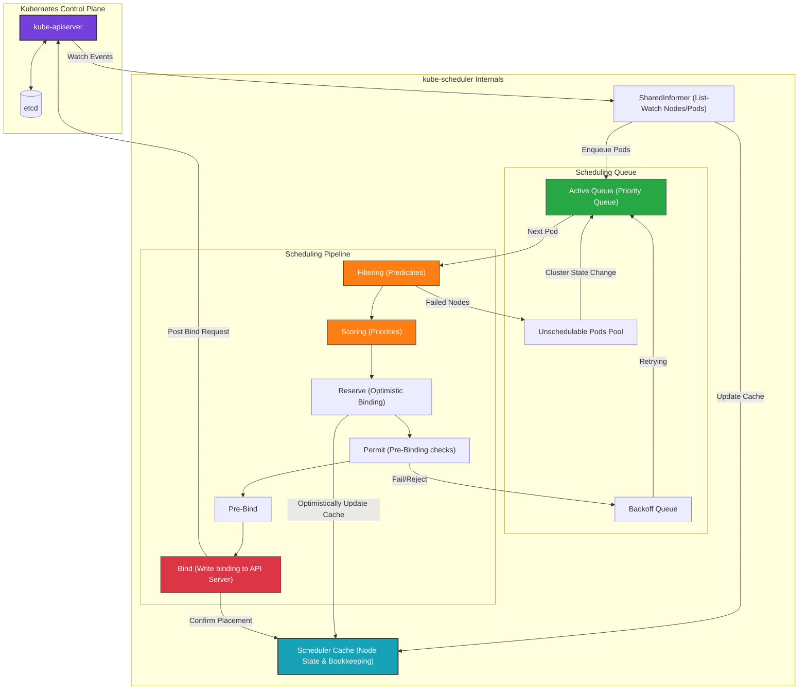

# 🏗️ Scheduler Architecture

This diagram illustrates the internal components of the `kube-scheduler` and how it interacts with the control plane cache and queue.

### Explanatory Summary
1. **SharedInformer:** Watches the API Server for new Pods (with `spec.nodeName` blank) and nodes.
2. **Scheduling Queue:** Pods are kept in an active priority queue. If they fail to schedule, they enter the backoff queue or the unschedulable pool until cluster resources change.
3. **Pipeline Stages:**
   - **Filtering:** Filters out non-viable nodes.
   - **Scoring:** Ranks remaining nodes.
   - **Reserve:** Temporarily claims resources in memory (Scheduler Cache) to prevent race conditions (optimistic scheduling).
   - **Bind:** Submits the binding manifest back to the API Server.
