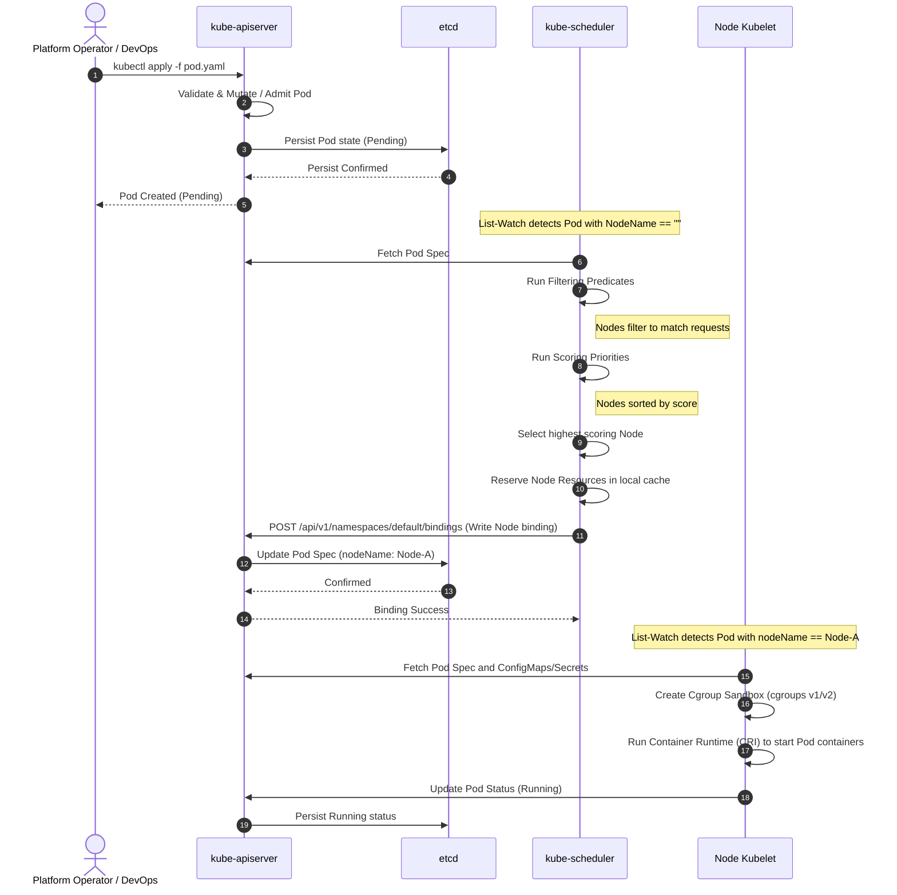

# 🔄 Scheduling Workflow

This sequence diagram illustrates the step-by-step lifecycle of a Pod from the initial user request to the Kubelet starting the containers.

### Explanatory Summary
1. **Admission Control:** The API Server authenticates and validates the Pod manifest.
2. **Detection:** The Scheduler's List-Watch loop discovers the pending Pod.
3. **Filtering & Scoring:** The Scheduler determines the best node based on current cluster resource bookings.
4. **Binding:** The Scheduler writes the chosen node back to the Pod's `spec.nodeName` field.
5. **Execution:** The Kubelet on the selected node watches for Pods with its node name, allocates the local Linux cgroups, pulls images, and runs the container.
