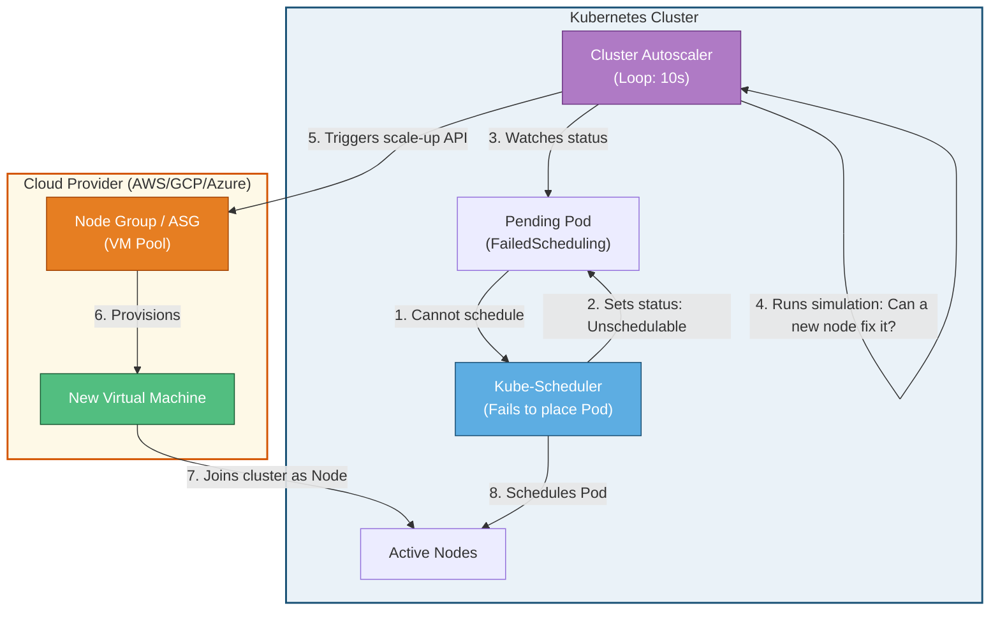

# 📐 Cluster Autoscaler (CA) Architecture

This diagram shows how the Cluster Autoscaler monitors unschedulable pods and triggers infrastructure expansion.

### Explanatory Summary
1. **Unschedulable Detection:** When a pod requests more CPU/memory requests than any single active node can offer, the **Kube-Scheduler** marks the pod status as `Pending` with a `FailedScheduling` event.
2. **Simulation Check:** The **Cluster Autoscaler** loop watches for these unschedulable pods. It executes a local simulation using node-group templates to check if adding a node to one of the groups will satisfy the pod's constraints (e.g., node selectors, taints, tolerations).
3. **Cloud Provisioning:** If a match is found, CA directly calls the cloud provider's API (e.g., AWS EC2 Auto Scaling, GCP Compute Engine Managed Instance Groups) to increment the group size.
4. **Integration:** Once the new VM boots up and runs the kubelet script, it registers itself with the Kubernetes API Server. The `kube-scheduler` immediately schedules the pending pod to this new node.
