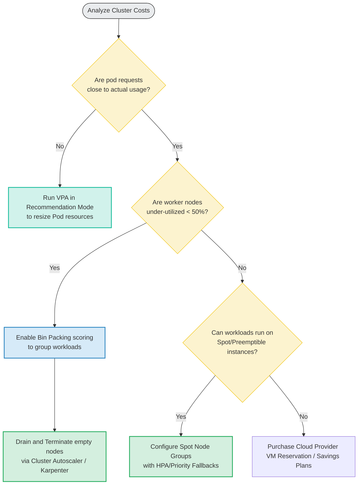

# 📐 Cost Optimization Flow

This flowchart shows the decision path for optimizing Kubernetes cluster run-costs via Autoscaling policies.

### Explanatory Summary
* **Resize Requests First:** The foundation of cluster cost optimization is configuring accurate pod requests. Over-provisioned requests reserve CPU/memory that goes unused, bloating cluster node size. Use VPA recommendations to shrink requests.
* **Consolidate Nodes:** Set scheduler priorities to "Bin Packing" (`NodeResourcesMostAllocated`) to pack pods together, freeing up under-utilized nodes so that the Cluster Autoscaler can terminate them.
* **Spot Instances:** For fault-tolerant microservices, deploy on Spot/Preemptible node pools, saving up to 70-80% compared to on-demand pricing.
