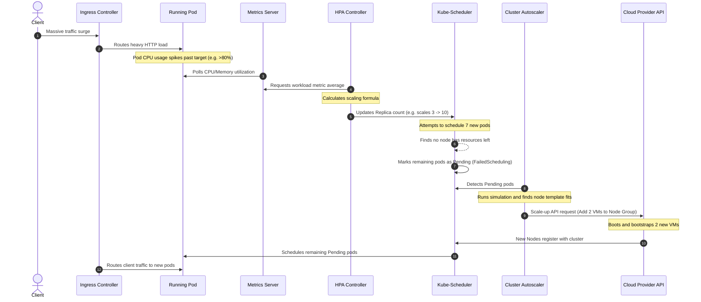

# 📐 End-to-End Scaling Workflow

This sequence diagram details the full, chronologically ordered path of events during a massive traffic spike.

### Explanatory Summary
1. **Workload Ingestion:** High traffic flows through the **Ingress Controller** to the existing pods, triggering elevated CPU utilization.
2. **Workload Scale-up:** The **Metrics Server** grabs these utilization spikes. The **HPA Controller** calculates that the workload requires more replicas and updates the deployment, causing the ReplicaSet controller to generate new pod requests.
3. **Pending Trigger:** The **Scheduler** places as many pods as the existing cluster capacity allows. The remaining pods are marked as `Pending` with a `FailedScheduling` reason.
4. **Infrastructure Scale-up:** The **Cluster Autoscaler** detects these pending pods, calls the **Cloud API** to add VMs, and waits. Once the VMs join the cluster, the Scheduler successfully places the remaining pods, establishing a higher cluster capacity.
