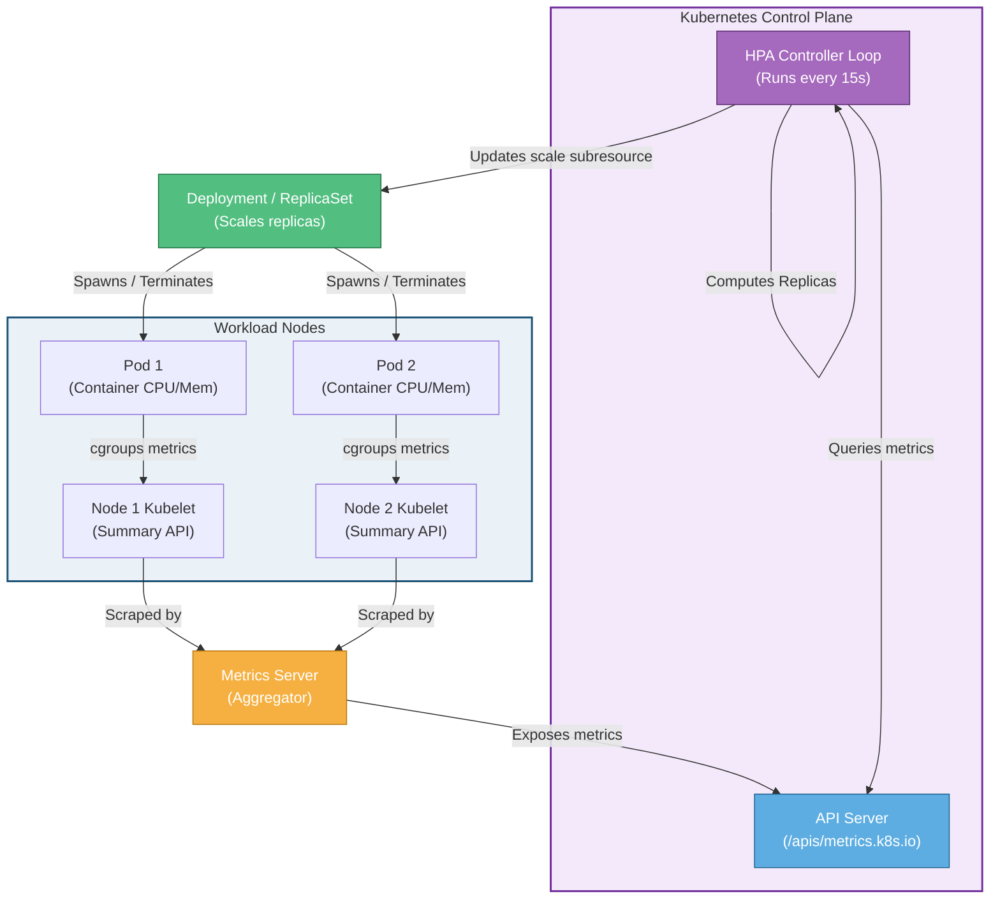

# 📐 Horizontal Pod Autoscaler (HPA) Architecture

This diagram shows the architecture and data flow of the Horizontal Pod Autoscaler (HPA) control loop.

### Explanatory Summary
1. **cgroups Resource Collection:** The containers on each node write resource usage statistics into Linux cgroups. The local **Kubelet** queries this data through the internal Summary API.
2. **Metrics Server Polling:** The **Metrics Server** periodically (usually every 15 seconds) polls the Kubelet endpoints `/stats/summary` to aggregate CPU and memory usage statistics.
3. **API Aggregation Layer:** The Metrics Server registers itself with the main **API Server** under the `/apis/metrics.k8s.io` path, making pod metrics queryable via standard API commands.
4. **HPA Controller Loop:** The **HPA Controller** runs a continuous loop (configured via `--horizontal-pod-autoscaler-sync-period`, default is 15 seconds) querying the API Server for target pod metrics, evaluating the scaling formula, and patching the target workload's `/scale` endpoint if a replica count change is required.
