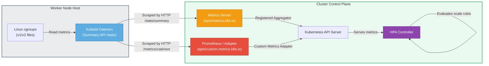

# 📐 Metrics Collection Pipeline

This diagram shows the path that resource metrics take from raw Linux cgroups to the autoscaler control loop.

### Explanatory Summary
1. **Linux kernel Level:** The underlying Linux kernel tracks CPU shares, throttling, and memory resident set size (RSS) via container cgroups.
2. **Kubelet Exposure:** The **Kubelet** consolidates these metrics. It exposes them in two formats:
   * `/stats/summary` (JSON) for `metrics-server`.
   * `/metrics/cadvisor` (Prometheus exposition format) for scraping.
3. **Control Plane Aggregation:** 
   * **Metrics Server** aggregates basic CPU/Memory resource metrics.
   * **Prometheus + Prometheus Adapter** converts application custom metrics (e.g. connections, requests/second) into Kubernetes API queries.
4. **API Registration:** Both endpoints are registered as API Service extensions so that they can be accessed natively through the main API Server.
5. **Autoscaler Consumption:** The HPA queries the API Server directly, bypassing the need to scrape nodes or metrics agents directly.
