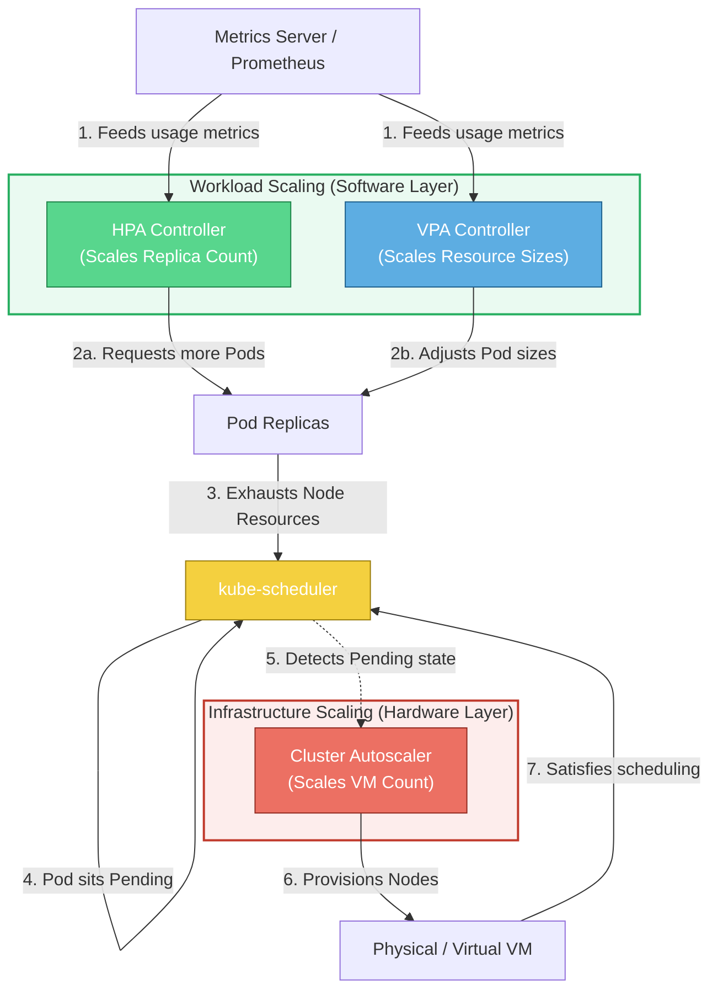

# 📐 Multi-Layer Autoscaling Design

This diagram represents how Pod autoscaling (HPA/VPA) interacts with Node-level autoscaling (Cluster Autoscaler) inside a cluster.

### Explanatory Summary
* **Two-Layer Autoscaling:** Kubernetes scaling must run in two coordinated layers: Workload-level scaling (adds replicas or changes memory/CPU targets) and Node-level scaling (supplies the physical hardware virtual machines).
* **Scheduling Link:** The two layers do not communicate directly. They coordinate asynchronously via the `kube-scheduler`. The workload layer requests more resources, which exhausts node space and triggers pending pods. The infrastructure layer (CA) reads the scheduler's failure states and provisions nodes accordingly.
