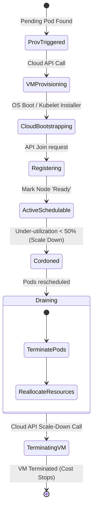

# 📐 Node Scaling Lifecycle

This diagram shows the states a node transitions through from provisioning in the cloud to decommissioning.

### Explanatory Summary
1. **VM Provisioning:** When the Cluster Autoscaler determines a node is needed, it calls the cloud provider's API. The VM transitions through standard hardware/OS setup stages.
2. **Kubelet Bootstrapping:** The VM runs cloud-init scripts, configures system runtimes, installs the Kubelet, and registers with the Kubernetes API Server.
3. **Capacity Decommissioning:** When a node has low utilization, it is marked as `Cordoned` (preventing new pods from scheduling). The Cluster Autoscaler drains it (evicting running pods so they reschedule elsewhere), then signals the Cloud API to terminate the VM.
