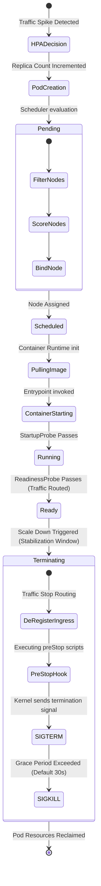

# 📐 Pod Scaling Lifecycle

This state machine diagram visualizes the phases a Pod undergoes during scaling transitions.

### Explanatory Summary
1. **Provisioning Cycle:** Once the HPA decides to scale out, a pod is created. It starts in the `Pending` state while the scheduler filters, scores, and binds it to a node.
2. **Warm-up Cycle:** The node runtime pulls the container images and starts the container. The pod becomes `Running` when its `StartupProbe` passes, and `Ready` (traffic starts routing) when its `ReadinessProbe` passes.
3. **Termination Cycle:** During scale-down, the replica count is reduced. The pod transitions to `Terminating`. Ingress stops routing new connections, the `preStop` hook executes (allowing active connections to drain), a `SIGTERM` signal is dispatched, and if the container fails to exit within the grace period, a `SIGKILL` is sent.
