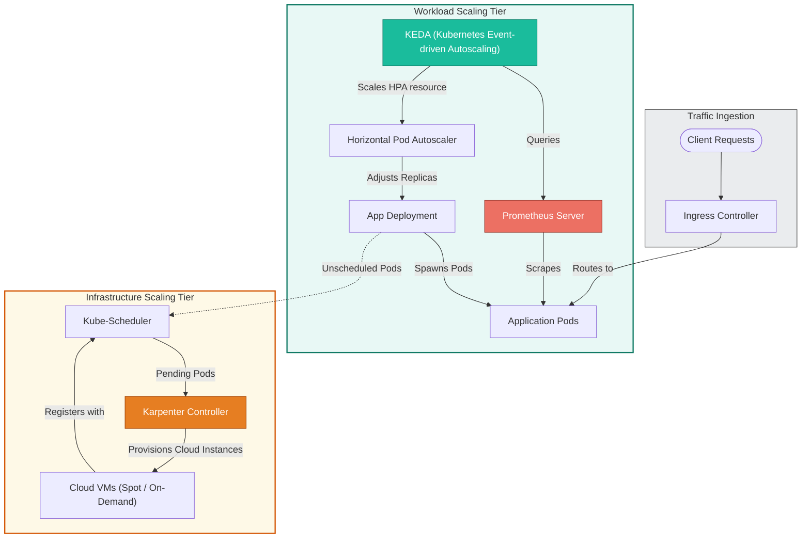

# 📐 Production Autoscaling Architecture

This diagram shows a production-grade, multi-tier autoscaling architecture featuring Prometheus, KEDA, and Karpenter.

### Explanatory Summary
* **KEDA for Custom Scaling:** KEDA (Kubernetes Event-driven Autoscaling) handles external and custom metric integrations (like Prometheus query evaluations or queue lengths) and manages HPA definitions behind the scenes.
* **Karpenter for Fast Node Provisioning:** Instead of AWS ASG-based Cluster Autoscaler, this architecture uses Karpenter. Karpenter bypasses node group controllers, directly creating virtual machines tailored to the unscheduled pods' resource configurations, speeding up node launch times from 3-5 minutes to under 60 seconds.
